# Evidências Semana 2
**Projeto:** TipsBank  
**Objetivo da semana:** Expor o TipsBank ao mundo via Ingress Nginx com TLS, replicar a app no EKS, e aplicar NetworkPolicies zero-trust entre namespaces.
**Data:** 04/05/2026  
**Responsável:** Bruno dos Santos

---

### **Etapa 2.1 Ingress Nginx + múltiplos hosts** 

### Objetivo da Etapa

Implementar o Ingress Nginx Controller para exposição centralizada da aplicação TipsBank utilizando múltiplos hosts:

- `app.tipsbank.local` → frontend (SPA)
- `api.tipsbank.local` → acesso direto às APIs via paths

### 1. Instalação do Ingress Nginx Controller

Foi realizado o deploy do Ingress Nginx Controller no cluster Kubernetes utilizando os manifestos oficiais.

```bash
helm repo add ingress-nginx https://kubernetes.github.io/ingress-nginx
helm repo update

helm upgrade --install ingress-nginx ingress-nginx/ingress-nginx \
  -n ingress-nginx \
  --create-namespace

kubectl get pods -n ingress-nginx
kubectl get svc -n ingress-nginx
kubectl get svc -n ingress-nginx ingress-nginx-controller
```

- 🖼️ Checando o Ingress no K8S: `chek_ingress.png`

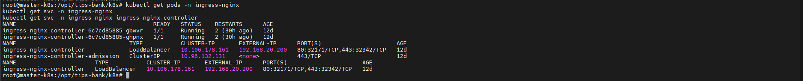

### 2. Configuração dos Hosts Locais

Foi configurado o arquivo `/etc/hosts` da estação local apontando os hosts da aplicação para o IP do Ingress Controller.

### Configuração aplicada:

```txt
192.168.20.200 app.tipsbank.local api.tipsbank.local
```

- 🖼️ Configuração do hosts local: `hosts.png`

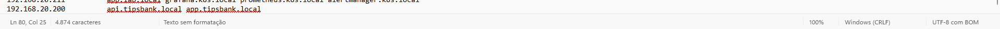

### 3. Configuração dos Recursos Ingress

Foram criados recursos Ingress separados para frontend e APIs.

Frontend
- app.tipsbank.local
    - encaminhando para svc/web
    - namespace: tipsbank-web

APIs
- api.tipsbank.local

Com os seguintes paths:

- /contas/*
    - svc/api-contas
    - namespace: tipsbank-contas
- /transacoes/*
    - svc/api-transacoes
    - namespace: tipsbank-transacoes
- /auditoria/*
    - svc/auditoria
    - namespace: tipsbank-auditoria

- 🖼️ Recursos ingress criados:`ingress.png`

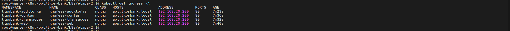

### 4. Validação de Acesso às APIs via Ingress

Foi realizado acesso direto às APIs utilizando o host api.tipsbank.local.

```bash
curl -H 'Host: api.tipsbank.local' \
http://192.168.20.200/contas/contas | jq
```

- 🖼️ Listagem de contas via ingress: `listar-contas-ingress.png`

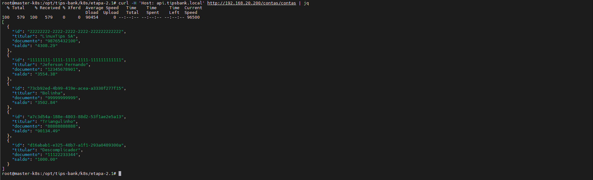

### 5. Validação de Healthcheck

```bash
curl -H 'Host: api.tipsbank.local' \
http://192.168.20.200/contas/health/live

curl -H 'Host: api.tipsbank.local' \
http://192.168.20.200/transacoes/health/live

curl -H 'Host: api.tipsbank.local' \
http://192.168.20.200/auditoria/health/live

curl -H 'Host: app.tipsbank.local' \
http://192.168.20.200/healthz
```

- 🖼️ Healthcheck APIs: `health-check-api.png`

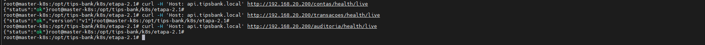

- 🖼️ Healthcheck Web: `health-check-web.png`

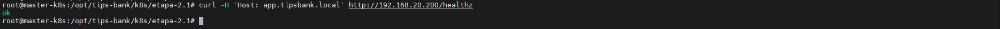

- 🖼️ SPA acessível via Ingress: `web-ingress.png`

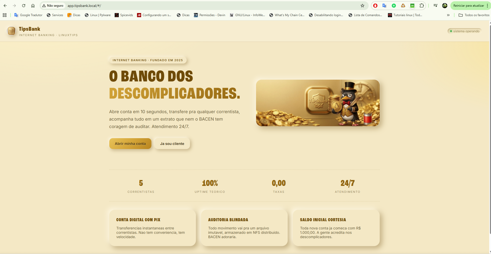

### 7. Referência dos Manifestos Kubernetes (YAML)
- 📄 Ingress WEB: [ingress-web.yaml](../k8s/etapa-2.1/ingress-web.yaml)
- 📄 Ingress API-CONTAS: [ingress-contas.yaml](../k8s/etapa-2.1/ingress-contas.yaml)
- 📄 Ingress API-TRANSAÇOES: [ingress-transacoes.yaml](../k8s/etapa-2.1/ingress-transacoes.yaml)
- 📄 Ingress API-AUDITORIA: [ingress-auditoria.yaml](../k8s/etapa-2.1/ingress-auditoria.yaml)

### Conclusão
- ✔ Ingress Nginx Controller implantado com sucesso no cluster
- ✔ Hosts app.tipsbank.local e api.tipsbank.local configurados e funcionais
- ✔ APIs expostas externamente via paths utilizando Ingress
- ✔ Frontend acessível via host dedicado
- ✔ Comunicação entre frontend e backend validada via Ingress
- ✔ Healthchecks das APIs e frontend funcionando corretamente
- ✔ Resolução local configurada via /etc/hosts

---

### **Etapa 2.2 — TLS com cert-manager + recursos avançados do Ingress**

### Objetivo da Etapa

Implementar HTTPS nos Ingresses utilizando `cert-manager`, além de aplicar recursos avançados do Ingress Nginx:

- TLS para os hosts da aplicação
- Basic Auth na rota administrativa
- Rate limit no frontend
- Affinity Cookie na API de transações

### 1. Instalação do cert-manager

Foi realizada a instalação do `cert-manager` no cluster Kubernetes para gerenciamento automático de certificados TLS.

```bash
helm install cert-manager jetstack/cert-manager \
  --namespace cert-manager \
  --create-namespace \
  --set crds.enabled=true
```

- 🖼️ Instalaçao Certmanager: `install-certmanager.png`

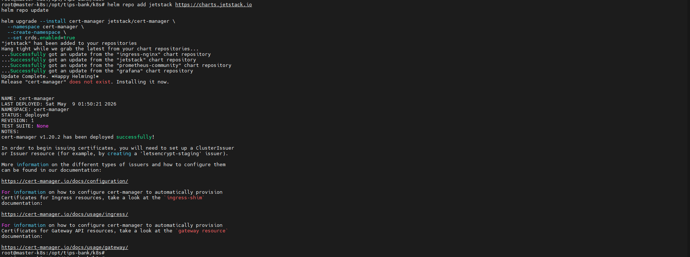

- 🖼️ Cert-manager instalado: `cert-manager-pods.png`

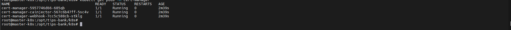

### 2. Criação do ClusterIssuer

Foi criado um ClusterIssuer do tipo self-signed para emissão de certificados no ambiente de laboratório.

- 🖼️ ClusterIssuer criado: clusterissuer.png

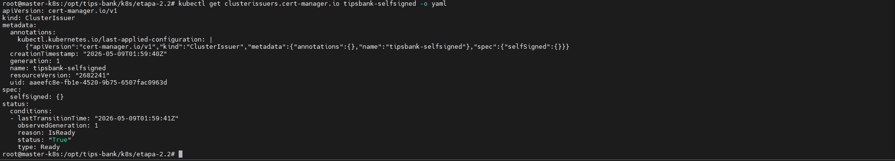

### 3. Configuração de TLS nos Ingresses

Foram adicionadas as configurações de TLS nos Ingresses da aplicação, utilizando o ClusterIssuer criado anteriormente.

Hosts protegidos com HTTPS:
- app.tipsbank.local
- api.tipsbank.local

Configuração aplicada:

```bash
tls:
  - hosts:
      - app.tipsbank.local
    secretName: app-tipsbank-tls

tls:
  - hosts:
        - api.tipsbank.local
    secretName: api-contas-tipsbank-tls
```

- 🖼️ Certificates Certmanager: `certificates.png`

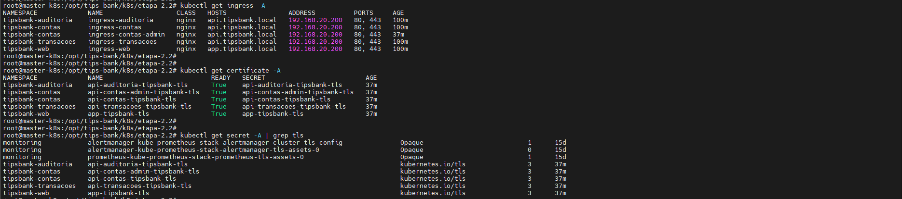

### 4. Validação HTTPS do Frontend

Foi validado o acesso HTTPS ao frontend da aplicação.

Comando executado:
curl -vk https://app.tipsbank.local/

- 🖼️ Check SSL Certmanager: `check-cert-ssl.png`

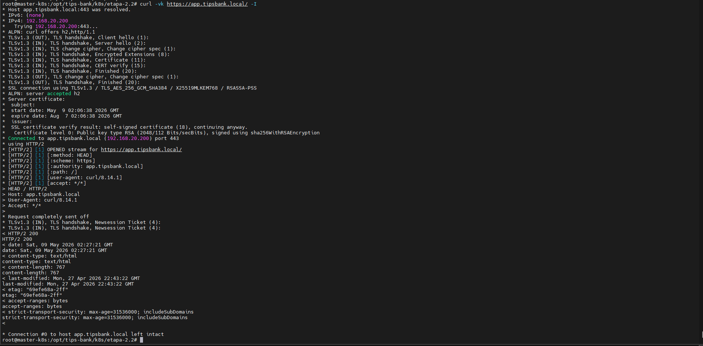

### 5. Configuração de Basic Auth na Rota Administrativa

Foi criada proteção com Basic Auth para a rota administrativa:

```
https://api.tipsbank.local/contas/admin/

htpasswd -bc auth admin admin123

kubectl create secret generic basic-auth \
  --from-file=auth \
  -n tipsbank-contas
```

- 🖼️ Secret Basic Auth:

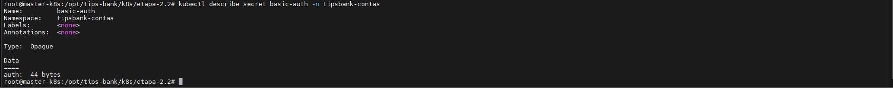

- 🖼️ Ingress protegido com Basic Auth:

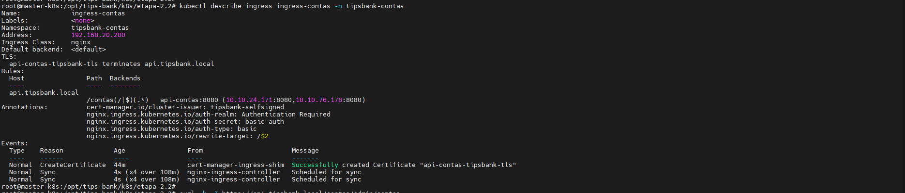

- 🖼️ Teste sem autenticação (401):

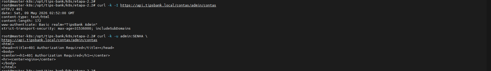

- 🖼️ Teste autenticado (200):

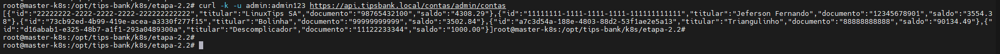


### 6. Configuração de Rate Limit no Frontend

Foi aplicado rate limit global no Ingress do frontend para proteção da entrada principal da aplicação.

Annotation utilizada:

```yaml
nginx.ingress.kubernetes.io/limit-rps: "50"
nginx.ingress.kubernetes.io/limit-burst-multiplier: "1"
```

- 🖼️ Ingress com rate limit: `ingress-rate-limit.png`

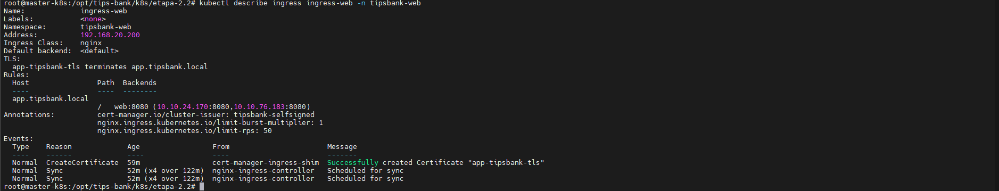

### 7. Validação do Rate Limit

Foi executado teste de carga com rajada de requisições para validar o bloqueio após o limite configurado.

```bash
ab -n 100 -c 100 https://app.tipsbank.local/
```

- 🖼️ Teste de rate limit: `rate-limit-test.png`

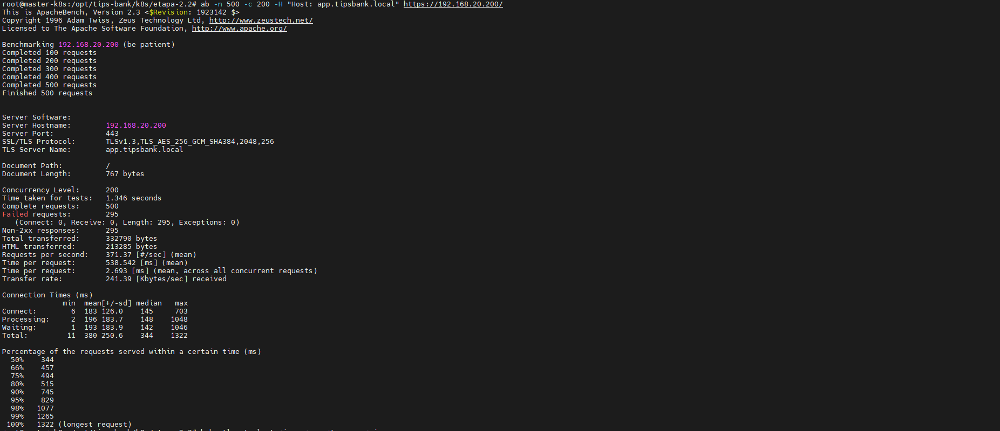

### 8. Configuração de Affinity Cookie em Transações

Foi configurada afinidade por cookie na rota da API de transações.

Annotation utilizada:

```yaml
nginx.ingress.kubernetes.io/affinity: cookie
```

Objetivo:

Garantir que requisições da mesma sessão sejam encaminhadas para o mesmo pod da api-transacoes.

- 🖼️ Ingress transações com affinity: `ingress-affinity-cookie.png`

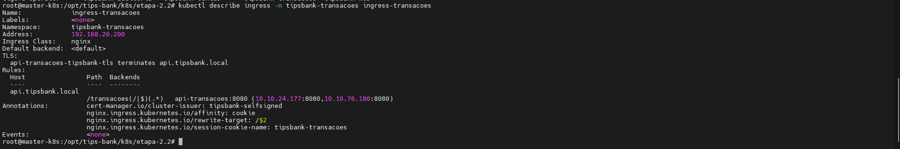

### 9. Validação de Upstream Hashing / Affinity

Foi realizado teste para validar que requisições com o mesmo cookie permanecem direcionadas ao mesmo backend.

- 🖼️ Teste de affinity: `affinity-test.png`

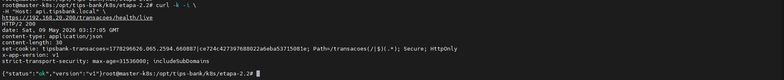

### 10. Referência dos Manifestos Kubernetes (YAML)

Os seguintes manifestos foram utilizados nesta etapa:

- 📄 Cert-manager / ClusterIssuer:[01-clusterissuer-selfsigned.yaml](../k8s/etapa-2.2/01-clusterissuer-selfsigned.yaml)
- 📄 Ingress Web com TLS e Rate Limit:[02-ingress-web-tls-ratelimit.yaml](../k8s/etapa-2.2/02-ingress-web.yaml)
- 📄 Ingress Contas: [03-ingress-contas.yaml](../k8s/etapa-2.2/03-ingress-contas.yaml)
- 📄 Ingress Admin com Basic Auth: [04-ingress-contas-admin.yaml](../k8s/etapa-2.2/04-ingress-contas-admin.yaml)
- 📄 Ingress Transações com Affinity Cookie: [05-ingress-transacoes.yaml](../k8s/etapa-2.2/05-ingress-transacoes.yaml)
- 📄 Ingress Auditoria: [06-ingress-auditoria.yaml](../k8s/etapa-2.2/06-ingress-auditoria.yaml)
- 📄 Config Secret Basic Auth: [07-basic-auth-secret.yaml](../k8s/etapa-2.2/07-basic-auth-secret.yaml)


### Conclusão
- ✔ cert-manager instalado e operacional no cluster
- ✔ ClusterIssuer self-signed configurado para emissão de certificados TLS
- ✔ HTTPS funcional nos hosts app.tipsbank.local e api.tipsbank.local
- ✔ Frontend validado via HTTPS com retorno HTTP 200
- ✔ Rota administrativa protegida com Basic Auth
- ✔ Acesso sem credenciais retornando 401 e acesso autenticado retornando 200
- ✔ Rate limit configurado no frontend com retorno 429 em rajadas acima do limite
- ✔ Affinity Cookie aplicada na rota de transações
- ✔ Upstream hashing / afinidade de sessão validado e documentado

---

### **Etapa 2.3 — Cluster EKS paralelo**

### Objetivo da Etapa

Provisionar um cluster Kubernetes gerenciado na AWS utilizando EKS + EKSCTL e implantar a aplicação TipsBank com:

- Deployments
- Stateful workloads
- Ingress Nginx
- TLS com cert-manager
- DNS público
- HTTPS funcional

### 1. Instalação das Ferramentas AWS

Foram instaladas e configuradas as ferramentas necessárias para administração do ambiente EKS:

- awscli
- eksctl

### 2. Provisionamento do Cluster EKS

```bash
eksctl create cluster \
  --name=eks-cluster-poc \
  --version=1.34 \
  --region=us-east-1 \
  --nodegroup-name=eks-cluster-nodegroup-poc \
  --node-type=t3.medium \
  --nodes=2 \
  --nodes-min=1 \
  --nodes-max=3 \
  --managed
```

- 🖼️ Criação do cluster EKS: 

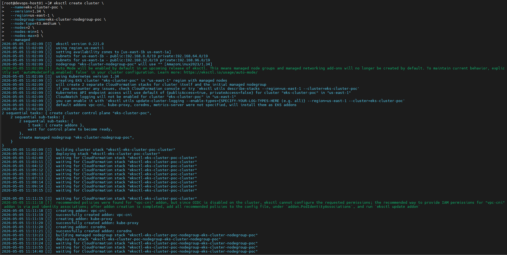
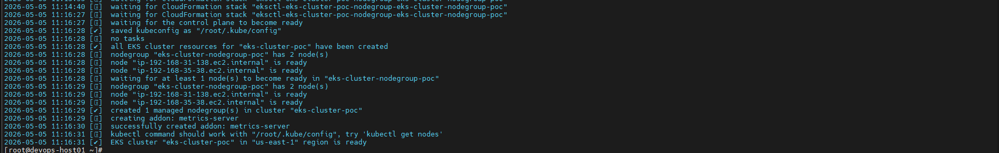

- 🖼️ Validação cluster AWS:

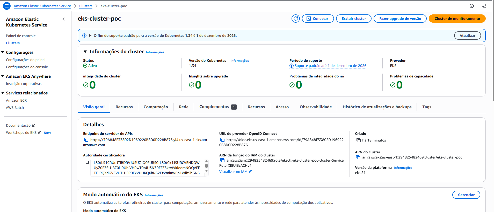

### 3. Configuração de Contextos Kubernetes

Foi realizada a configuração do kubeconfig 

```bash
aws eks update-kubeconfig --region us-east-1 --name eks-cluster-poc
```

- 🖼️ Updade config cluster EKS: 

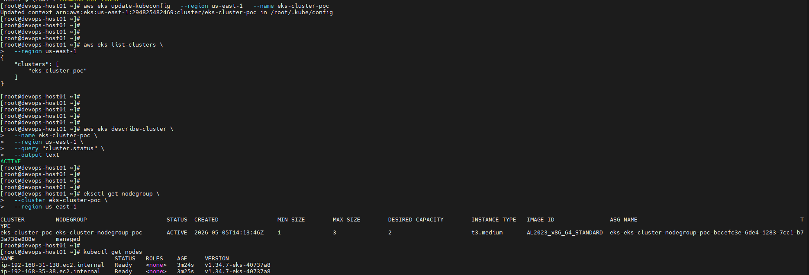

Foram validados os contextos existentes

- 🖼️ Contextos configurados: 

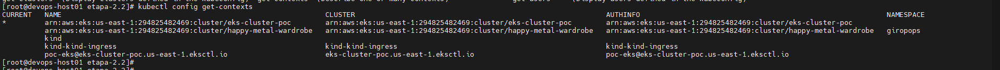

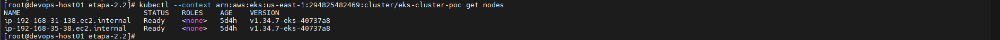

Foi realizado alteração do nome do contexto para eks-tipsbank

- 🖼️ Alteração do Contexto:

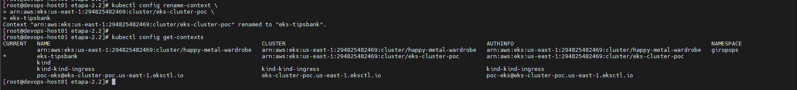

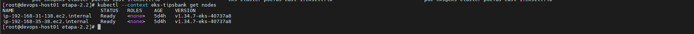

### 4. Instalação do Ingress Nginx no EKS

Foi instalado o Ingress Nginx Controller no cluster EKS.

Durante a instalação, a AWS provisionou automaticamente um Network Load Balancer (NLB).

- 🖼️ Instalação do ingress-nginx:

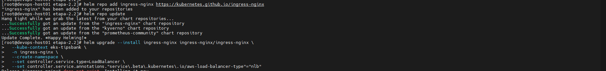
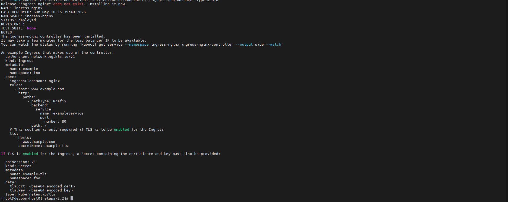

- 🖼️ Load Balancer criado:

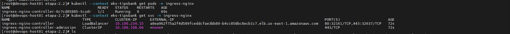

### 5. Aplicação dos Manifestos Kubernetes

Antes de aplicar os manifestos é necessario rodar o script 01-registry-secret para poder baixar as imagens do registry privado

- 🖼️ Execução do script [01-registry-secret.sh](../k8s/etapa-1.4/01-registry-secret.sh):

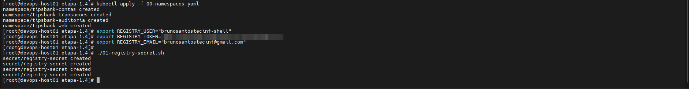

Foram aplicados os manifestos das etapas anteriores adaptados para execução no ambiente AWS/EKS.

Manifestos ajustados para AWS

Os seguintes manifestos precisaram de adequações específicas para funcionamento no EKS:

- 04-postgres.yaml
- 05-api-contas.yaml
- 03-api-transacoes-multicontainer.yaml
- pv-auditoria-nfs.yaml
- auditoria-nfs.yaml
- ingress-auditoria.yaml
- ingress-contas.yaml
- ingress-transacoes.yaml
- ingress-web.yaml
- 01-clusterissuer-letsencrypt.yaml
- 02-ingress-web.yaml
- 03-ingress-contas.yaml
- 04-ingress-contas-admin.yaml
- 05-ingress-transacoes.yaml
- 06-ingress-auditoria.yaml
- 07-basic-auth-secret.yaml
 
Principais ajustes realizados

- Adequação de Storage para EFS/NFS
- Ajustes de ingress e annotations AWS
- Configuração TLS para domínio público bits.tec.br
- Compatibilidade com Load Balancer AWS

- 🖼️ Manifestos aplicados:

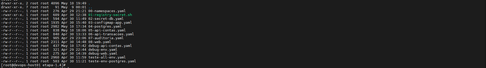
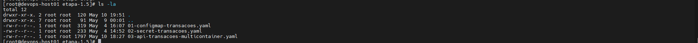
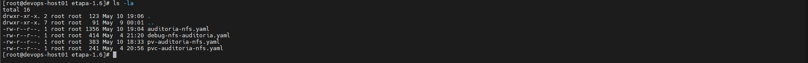
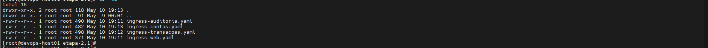
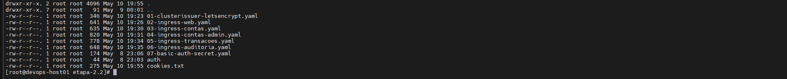

### 6. Instalação de Addons AWS

Durante os testes foi necessário instalar addons adicionais da AWS para compatibilidade e funcionamento adequado do cluster.

Exemplos:
- EBS CSI Driver
- EFS CSI Driver
- Addons de networking

- 🖼️ Instalação addons AWS:

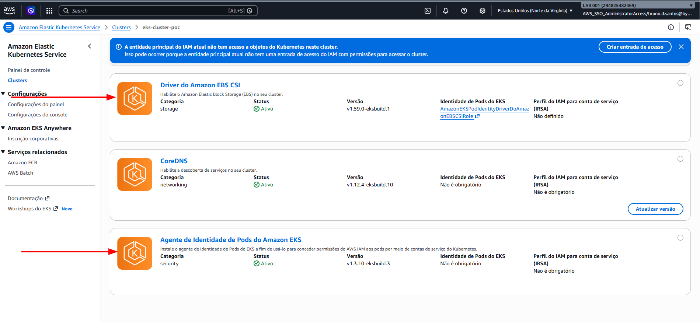

### 7. Configuração de Persistência (PV/PVC - EFS)

Foi realizada integração com armazenamento persistente utilizando EFS.

- 🖼️ EFS AWS

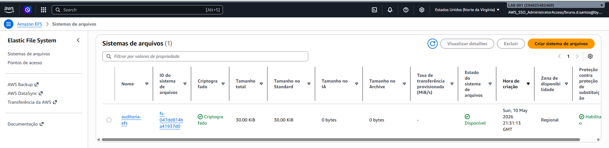

- 🖼️ PV/PVC no EKS:

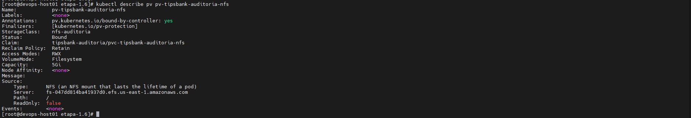

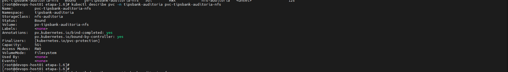

### Observação

No ambiente AWS EKS foi utilizado Amazon EFS para suporte a volumes RWX (ReadWriteMany), permitindo compartilhamento simultâneo entre múltiplos pods da auditoria.

### 8. Ajustes de Segurança e Security Groups

Durante a implantação foi necessário realizar ajustes nas regras de Security Groups da AWS para permitir:

- Comunicação do Load Balancer
- Tráfego HTTP/HTTPS
- Comunicação dos nodes
- Acesso aos serviços internos

- 🖼️ Regras Security Group:

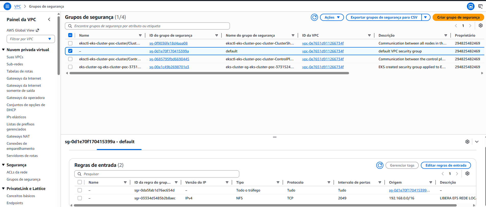

### 9. Configuração TLS e cert-manager

Foi configurado TLS utilizando cert-manager e Let's Encrypt no ambiente EKS.

- 🖼️ Validação Cert Manager e TLS:

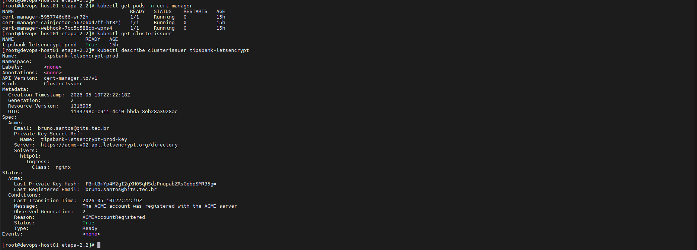

Comandos para validação:

```bash
kubectl get certificates -A

kubectl get clusterissuer

kubectl get secret -A | grep tls
```

### 10. Configuração de DNS Público

Foi configurado DNS público apontando para o Load Balancer da AWS utilizando registros CNAME.

- 🖼️ DNS Cloudflare:

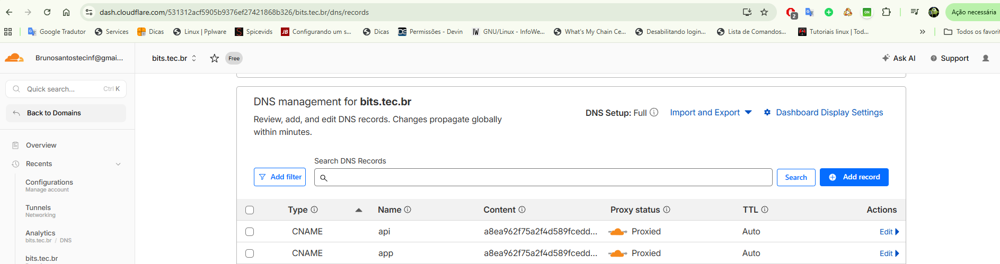

### 11. Validação da Aplicação via HTTPS

- 🖼️ Aplicação acessível via HTTPS:

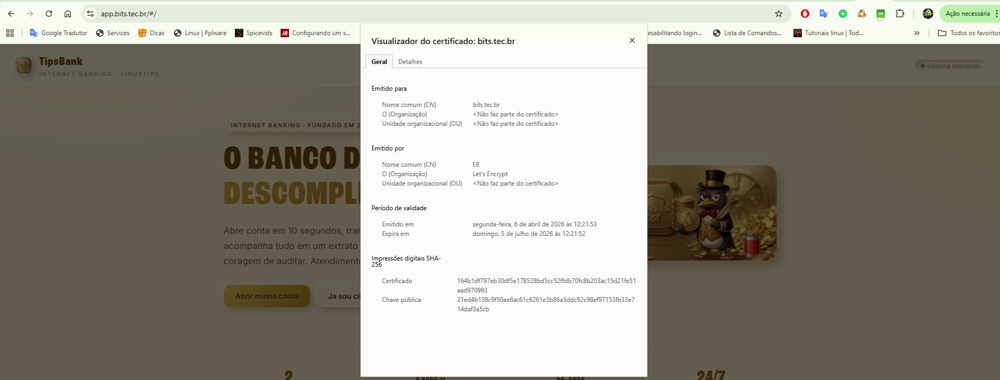

### 12. Configuração de Basic Auth

Foi validada a proteção administrativa utilizando Basic Auth no ambiente EKS.


- 🖼️ Configuração Basic Auth popup:

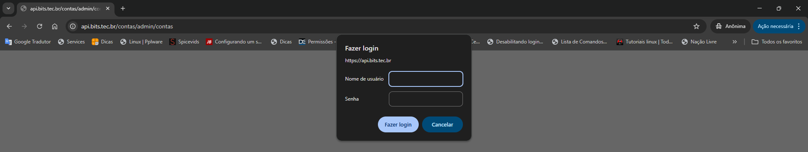

- 🖼️ Configuração Basic Auth autenticado:

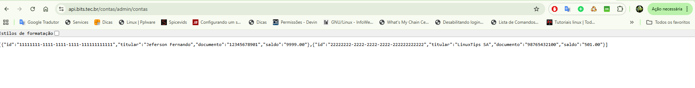

- 🖼️ Configuração Basic Auth Erro:

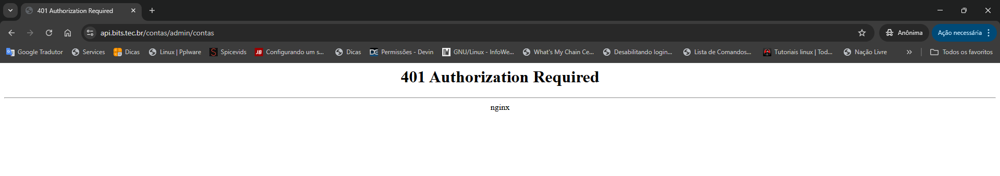

### 13. Considerações Operacionais

Durante a implantação no ambiente AWS foram encontrados desafios relacionados a:

- Provisionamento automático de Load Balancer
- Configuração de Security Groups
- Addons obrigatórios do EKS
- Integração EFS/EBS
- Ajustes específicos de Ingress
- Emissão de certificados públicos

Todos os problemas foram solucionados com ajustes de infraestrutura e adequações dos manifestos Kubernetes.

### 14. Referência dos Manifestos Kubernetes (YAML)

Os seguintes manifestos foram ajustados para execução no EKS:

- 📄 Storage:
  - [04-postgres.yaml](../k8s/etapa-2.3/04-postgres.yaml)
  - [pv-auditoria-nfs.yaml](../k8s/etapa-2.3/pv-auditoria-nfs.yaml)
  - [auditoria-nfs.yaml](../k8s/etapa-2.3/auditoria-nfs.yaml)
- 📄 Deployments:
  - [03-api-transacoes-multicontainer.yaml](../k8s/etapa-2.3/03-api-transacoes-multicontainer.yaml)
- 📄 Ingress:
  - [ingress-auditoria.yaml](../k8s/etapa-2.3/ingress-auditoria.yaml)
  - [ingress-contas.yaml](../k8s/etapa-2.3/ingress-contas.yaml)
  - [ingress-transacoes.yaml](../k8s/etapa-2.3/ingress-transacoes.yaml)
  - [ingress-web.yaml](../k8s/etapa-2.3/ingress-web.yaml)
- 📄 TLS / cert-manager:
  - [01-clusterissuer-letsencrypt.yaml](../k8s/etapa-2.3/01-clusterissuer-letsencrypt.yaml)
- 📄 Ingress avançado:
  - [02-ingress-web.yaml](../k8s/etapa-2.3/02-ingress-web.yaml)
  - [03-ingress-contas.yaml](../k8s/etapa-2.3/03-ingress-contas.yaml)
  - [04-ingress-contas-admin.yaml](../k8s/etapa-2.3/04-ingress-contas-admin.yaml)
  - [05-ingress-transacoes.yaml](../k8s/etapa-2.3/05-ingress-transacoes.yaml)
  - [06-ingress-auditoria.yaml](../k8s/etapa-2.3/06-ingress-auditoria.yaml)
- 📄 Segurança:
  - [07-basic-auth-secret.yaml](../k8s/etapa-2.3/07-basic-auth-secret.yaml)

## 15. Destruição do Cluster (Otimização de Custos)

Após os testes e validações, o cluster EKS foi removido para evitar custos desnecessários na AWS.

```bash
eksctl delete cluster --name tipsbank
```

### Conclusão

- ✔ Cluster EKS provisionado com sucesso utilizando EKSCTL
- ✔ Contextos Kubernetes configurados para múltiplos clusters
- ✔ Ingress Nginx funcional com Network Load Balancer AWS
- ✔ Aplicação TipsBank implantada integralmente no EKS
- ✔ TLS funcional com cert-manager e Let's Encrypt
- ✔ DNS público configurado apontando para o Load Balancer AWS
- ✔ Persistência validada utilizando EFS/PV/PVC
- ✔ Ajustes de Security Groups realizados para funcionamento do ambiente
- ✔ Recursos avançados do Ingress funcionando corretamente
- ✔ Basic Auth operacional no ambiente EKS
- ✔ Aplicação acessível externamente via HTTPS com domínio público
- ✔ Critérios de aceite atendidos integralmente

---

### **Etapa 2.4 — Canary de Transações**

### Objetivo da Etapa

Publicar a versão `v2` da `api-transacoes` e rotear parte do tráfego via Canary Ingress, mantendo a versão `v1` como principal.

O objetivo é validar:

- Deploy paralelo da versão `v2`
- Roteamento gradual via Ingress Canary
- Split aproximado de tráfego entre `v1` e `v2`
- Rollout e rollback funcionais
- Assinatura da imagem com Cosign

### 1. Build, Push e Assinatura da Imagem v2

Foi criada uma nova imagem da `api-transacoes` com a versão `v2.0.0`.

Após o build e push para o registry, a imagem foi assinada utilizando Cosign.

```bash
docker build -t ghcr.io/brunosantostecinf-shell/tipsbank-api-transacoes:v2.0.0 apps/api-transacoes

docker push ghcr.io/brunosantostecinf-shell/tipsbank-api-transacoes:v2.0.0

cosign sign ghcr.io/brunosantostecinf-shell/tipsbank-api-transacoes:v2.0.0
```

- 🖼️ Assinatura da imagem v2:

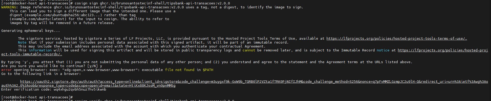

### 2. Verificação da Assinatura com Cosign

Foi realizada a validação da assinatura da imagem v2.0.0.

```bash
cosign verify \
  --certificate-identity "https://github.com/login/oauth" \
  --certificate-oidc-issuer "https://github.com/login/oauth" \
  ghcr.io/brunosantostecinf-shell/tipsbank-api-transacoes:v2.0.0
  
  ```
- 🖼️ Verificação da assinatura:

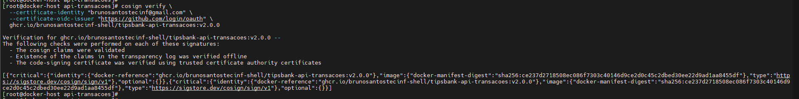

### 3. Deploy da api-transacoes v2

Foi criado um segundo Deployment para a nova versão da aplicação:

- Deployment: api-transacoes-v2
- Namespace: tipsbank-transacoes
- Label: version=v2

A versão v1 permaneceu em execução no Deployment original.

- 🖼️ Pods das versões v1 e v2:


### 4. Criação do Service da versão v2

Foi criado um Service específico para direcionar tráfego aos pods com label version=v2.

### 5. Configuração e Validação do Ingress Canary

Foi criado um Ingress canário apontando para o Service da versão `v2` da aplicação `api-transacoes`.

### Annotations aplicadas:

```yaml
nginx.ingress.kubernetes.io/canary: "true"
nginx.ingress.kubernetes.io/canary-weight: "10"
```
O Ingress canário utiliza o mesmo host da API principal:

- api.tipsbank.local

Após a configuração, foram disparadas 1000 requisições para validar a distribuição de tráfego entre as versões v1 e v2.

```bash
for i in $(seq 1 1000); do
  curl -sk https://api.tipsbank.local/transacoes/health/live | jq -r .version
done | sort | uniq -c
```

- 🖼️ Ingress principal e canário e Distribuição de Trafego:


Observação

A distribuição observada não ficou próxima do esperado 90/10, indicando necessidade de ajuste fino na configuração do Ingress Canary, especialmente considerando possíveis impactos de:

- Affinity Cookie
- Múltiplos Ingresses
- Cache de sessão
- Sticky sessions

### 6. Validação Manual das Versões

Foram executadas chamadas manuais ao endpoint /transacoes/health/live para validar o retorno das versões.

```bash
curl -sk https://api.tipsbank.local/transacoes/health/live
```

- 🖼️ Retorno alternando entre v1 e v2:


### 7. Validação de Rollout e Rollback

```bash
kubectl rollout history deployment/api-transacoes -n tipsbank-transacoes

kubectl rollout history deployment/api-transacoes-v2 -n tipsbank-transacoes

kubectl rollout status deployment/api-transacoes -n tipsbank-transacoes

kubectl rollout status deployment/api-transacoes-v2 -n tipsbank-transacoes
```

- 🖼️ Rollout dos Deployments:


### 8. Validação dos Pods e Labels

Foi validado que os pods das versões v1 e v2 possuem labels distintas, permitindo roteamento correto pelos Services.

```bash
kubectl get pods -n tipsbank-transacoes -o wide --show-labels
NAME                                 READY   STATUS    RESTARTS   AGE    IP             NODE            NOMINATED NODE   READINESS GATES   LABELS
api-transacoes-6549f6cff4-8s2rs      2/2     Running   0          169m   10.10.76.149   worker-k8s-02   <none>           <none>            app=api-transacoes,pod-template-hash=6549f6cff4
api-transacoes-6549f6cff4-jggpf      2/2     Running   0          169m   10.10.24.135   worker-k8s-01   <none>           <none>            app=api-transacoes,pod-template-hash=6549f6cff4
api-transacoes-v2-84b756b4fb-fmcq6   2/2     Running   0          159m   10.10.76.154   worker-k8s-02   <none>           <none>            app=api-transacoes,pod-template-hash=84b756b4fb,version=v2
api-transacoes-v2-84b756b4fb-nddx4   2/2     Running   0          158m   10.10.24.139   worker-k8s-01   <none>           <none>            app=api-transacoes,pod-template-hash=84b756b4fb,version=v2
root@master-k8s:/opt/tips-bank/k8s/etapa-2.4#
```

### 9. Referência dos Manifestos Kubernetes (YAML)

Os seguintes manifestos foram utilizados nesta etapa:

- 📄 Deployment v2: [api-transacoes-v2.yaml](../k8s/etapa-2.4/deployment-api-transacoes-v2.yaml)
- 📄 Service v2: [svc-api-transacoes-v2.yaml](../k8s/etapa-2.4/svc-api-transacoes-v2.yaml)
- 📄 Ingress Canary: [ingress-transacoes-canary.yaml](../k8s/etapa-2.4/ingress-transacoes-canary.yaml)

### Conclusão
- ✔ Imagem api-transacoes:v2.0.0 criada, publicada e assinada com Cosign
- ✔ Assinatura da imagem v2 validada com cosign verify
- ✔ Deployment api-transacoes-v2 criado em paralelo ao Deployment - original
- ✔ Service exclusivo para a versão v2 configurado por label
- ✔ Ingress Canary criado utilizando o mesmo host da API principal
- ✔ Canary configurado com peso de 10% para a versão v2
- ✔ Endpoint /transacoes/health/live retornando versões v1 e v2
- ✔ Rollout status e rollout history validados nos Deployments
- ✔ Rollback possível via kubectl rollout undo

---

### **Etapa 2.5 — NetworkPolicy Zero-Trust**

### Objetivo da Etapa

Implementar políticas de segurança de rede utilizando `NetworkPolicy`, aplicando o conceito de Zero-Trust entre os namespaces da aplicação TipsBank.

O objetivo foi:

- Bloquear todo tráfego por padrão
- Liberar apenas comunicações estritamente necessárias
- Restringir comunicação entre aplicações
- Validar isolamento entre namespaces
- Restringir saída para IPs externos não autorizados

### 1. Pré-requisos do Ambiente (CNI com suporte a NetworkPolicy)

Foi validado o uso de um CNI compatível com `NetworkPolicy`.

O ambiente utiliza Calico, permitindo aplicação de políticas de segurança de rede no cluster Kubernetes.

### 2. Instalação do Kyverno

Foi instalado o Kyverno para gerenciamento e validação de políticas no cluster.

```bash
helm repo add kyverno https://kyverno.github.io/kyverno/

helm repo update

helm install kyverno kyverno/kyverno -n kyverno --create-namespace
```

- 🖼️ Adição do repositório Kyverno:


- 🖼️ Instalação do Kyverno:


- 🖼️ Pods do Kyverno em execução:


### 3. Aplicação das NetworkPolicies Default-Deny

Foram aplicadas políticas default-deny em todos os namespaces:

- tipsbank-contas
- tipsbank-transacoes
- tipsbank-auditoria
- tipsbank-web

As políticas bloquearam:

- Todo tráfego ingress
- Todo tráfego egress

Posteriormente foram criadas exceções específicas para comunicação necessária entre os serviços.

### 4. Liberação de DNS (kube-dns)

Foi liberado tráfego DNS TCP/UDP porta 53 para resolução de nomes internos do cluster.

### 5. Liberação de Comunicação Entre Serviços

Foram liberadas apenas as comunicações necessárias:

- Ingress Controller → aplicações
- api-transacoes → api-contas
- api-transacoes → auditoria
- api-contas → postgres
- auditoria → nfs-server

### 6. Validação das NetworkPolicies Aplicadas

Foi realizada validação das políticas aplicadas no cluster.

```bash
kubectl get netpol -A
```

- 🖼️ NetworkPolicies aplicadas:


### 7. Validação de Comunicação Permitida

Foi validado que api-transacoes consegue acessar api-contas.

```bash
kubectl run debug-transacoes \
  -n tipsbank-transacoes \
  --rm -it \
  --image=curlimages/curl \
  --restart=Never \
  --labels app=api-transacoes \
  --command -- sh
curl -m 5 http://api-contas.tipsbank-contas:8080/health/live
```

- 🖼️ Comunicação permitida:


### 8. Validação de Comunicação Bloqueada

Foi validado que auditoria NÃO consegue acessar api-contas, conforme esperado pela política Zero-Trust.

```bash
curl -m 5 http://api-contas.tipsbank-contas:8080
```

- 🖼️ Comunicação bloqueada:


### 9. Validação de Bloqueio de Saída Externa

Foi validado bloqueio de saída para IPs externos não autorizados.

```bash
curl -m 5 http://1.1.1.1

curl -m 5 http://169.254.169.254
```

- 🖼️ Bloqueio de saída externa:


### 10. Validação do DNS Interno

Foi validado funcionamento do DNS interno do cluster após aplicação das policies.

```bash
kubectl run debug-dns -n tipsbank-transacoes --rm -it --image=curlimages/curl --restart=Never --command -- nslookup api-contas.tipsbank-contas.svc.cluster.local
```

- 🖼️ DNS interno funcionando:


### 11. Validação de Acesso ao NFS

Foi validado acesso do namespace auditoria ao servidor NFS.

Também foi validado que outros namespaces NÃO possuem acesso ao NFS.

```bash
#Teste de SUCESSO no NFS
kubectl run debug-auditoria \
  -n tipsbank-auditoria \
  --rm -it \
  --image=nicolaka/netshoot \
  --restart=Never \
  --labels app=auditoria \
  --command -- bash
nc -vz 192.168.20.100 2049
```

- 🖼️ Acesso permitido ao NFS:


```bash
#Teste de BLOQUEIO a partir de outro namespace
kubectl run debug-transacoes \
  -n tipsbank-transacoes \
  --rm -it \
  --image=nicolaka/netshoot \
  --restart=Never \
  --labels app=api-transacoes \
  --command -- bash
nc -vz -w 5 192.168.20.100 2049
```

- 🖼️ Acesso bloqueado ao NFS:


### 12. Referência dos Manifestos Kubernetes (YAML)

Os seguintes manifestos foram utilizados na implementação das políticas Zero-Trust desta etapa:

- 📄 [01-default-deny-all.yaml](../k8s/etapa-2.5/01-default-deny-all.yaml)
- 📄 [02-allow-dns-all-namespaces.yaml](../k8s/etapa-2.5/02-allow-dns-all-namespaces.yaml)
- 📄 [03-allow-ingress-controller-to-all-apps.yaml](../k8s/etapa-2.5/03-allow-ingress-controller-to-all-apps.yaml)
- 📄 [04-allow-transacoes-to-contas.yaml](../k8s/etapa-2.5/04-allow-transacoes-to-contas.yaml)
- 📄 [05-allow-transacoes-to-auditoria.yaml](../k8s/etapa-2.5/05-allow-transacoes-to-auditoria.yaml)
- 📄 [06-allow-contas-to-postgres.yaml](../k8s/etapa-2.5/06-allow-contas-to-postgres.yaml)
- 📄 [07-allow-auditoria-to-nfs.yaml](../k8s/etapa-2.5/07-allow-auditoria-to-nfs.yaml)
- 📄 [08-allow-ingress.yaml](../k8s/etapa-2.5/08-allow-ingress.yaml)
- 📄 [09-allow-web-to-apis.yaml](../k8s/etapa-2.5/09-allow-web-to-apis.yaml)

### Conclusão

- ✔ Estratégia Zero-Trust implementada com sucesso
- ✔ Policies default-deny aplicadas em todos os namespaces
- ✔ Comunicação entre serviços restrita apenas ao necessário
- ✔ Resolução DNS preservada após aplicação das policies
- ✔ Bloqueio de tráfego não autorizado validado
- ✔ Bloqueio de saída externa funcionando corretamente
- ✔ Segmentação entre namespaces validada
- ✔ Acesso ao NFS restrito apenas ao namespace autorizado
- ✔ Comunicação permitida entre APIs funcionando corretamente
- ✔ Ambiente protegido utilizando NetworkPolicies com Calico

---

### Checkpoint — Semana 2
- ✔ Ingress NGINX configurado com múltiplos hosts e HTTPS válido
  - TLS funcional com certificados aplicados
  - Roteamento por host e path funcionando corretamente
  - Publicação segura dos serviços da aplicação
- ✔ Recursos avançados de tráfego e autenticação implementados
  - Rate limit configurado no Ingress NGINX
  - Autenticação aplicada em endpoints protegidos
  - Session Affinity via cookie funcionando corretamente
- ✔ Cluster Amazon EKS provisionado paralelamente
  - Aplicação implantada no ambiente AWS
  - Comunicação e serviços validados no cluster gerenciado
  - Compatibilidade da aplicação validada em ambiente cloud-native
- ✔ Estratégia de Canary Release implementada no serviço de transações
  - Deploy separado entre versões v1 e v2
  - Distribuição de tráfego aproximada em 90/10
  - Rollback funcional utilizando kubectl rollout undo
  - Canary adicional via header X-Canary: true
- ✔ Segurança de rede aplicada com modelo Zero-Trust
  - NetworkPolicy default-deny configurada
  - Controle explícito de ingress e egress entre namespaces
  - Comunicação liberada apenas para serviços autorizados
  - Bloqueio de tráfego não permitido validado em testes práticos
- ✔ Namespaces protegidos por políticas de isolamento
  - tipsbank-contas
  - tipsbank-transacoes
  - tipsbank-auditoria

  Seguir para documentação: [EVIDENCIAS-3](EVIDENCIAS-3.md) 