# Evidências Semana 2
**Projeto:** TipsBank  
**Objetivo da semana**: tornar o TipsBank resiliente (probes, affinity) e observável (kube-prometheus), com HPA escalando sob carga gerada pelo Locust.**Data:** 16/05/2026  
**Responsável:** Bruno dos Santos

---

### **Etapa 3.1 — Probes completas**

### Objetivo da Etapa

Configurar probes completas nos componentes da aplicação TipsBank, garantindo validação de saúde, disponibilidade e inicialização correta dos containers.

Foram aplicadas:

- `livenessProbe`
- `readinessProbe`
- `startupProbe`
- Probes customizadas para Postgres com `pg_isready`
- Probes no frontend web via `/healthz`

### 1. Configuração das Probes nas APIs

Foram configuradas 3 probes nas APIs da aplicação:

- `livenessProbe` → `/health/live`
- `readinessProbe` → `/health/ready`
- `startupProbe` → `/health/startup`

A `startupProbe` foi configurada com parâmetros mais permissivos para permitir tempo suficiente de inicialização da aplicação.

#### Configuração aplicada

```yaml
startupProbe:
  httpGet:
    path: /health/startup
    port: 8080
  periodSeconds: 5
  failureThreshold: 30

livenessProbe:
  httpGet:
    path: /health/live
    port: 8080
  periodSeconds: 10

readinessProbe:
  httpGet:
    path: /health/ready
    port: 8080
  periodSeconds: 5
```

Foi utilizado kubectl describe pod para validar se as probes foram aplicadas corretamente nos containers.

```bash
kubectl describe pod -n tipsbank-contas -l app=api-contas | grep -A5 "Liveness\|Readiness\|Startup"

kubectl describe pod -n tipsbank-transacoes -l app=api-transacoes | grep -A5 "Liveness\|Readiness\|Startup"

kubectl describe pod -n tipsbank-auditoria -l app=auditoria | grep -A5 "Liveness\|Readiness\|Startup"

kubectl describe pod -n tipsbank-web -l app=web | grep -A5 "Liveness\|Readiness\|Startup"
```


- 🖼️ Probes da API Contas: 

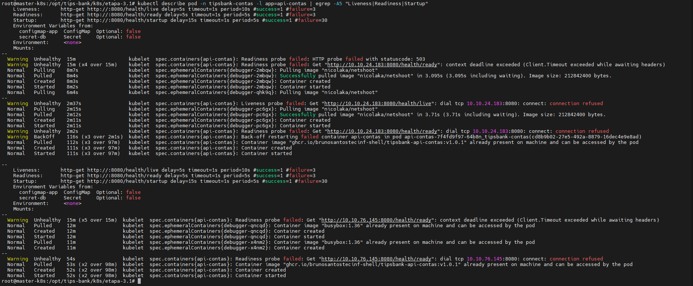

- 🖼️ Probes da API Transações: 

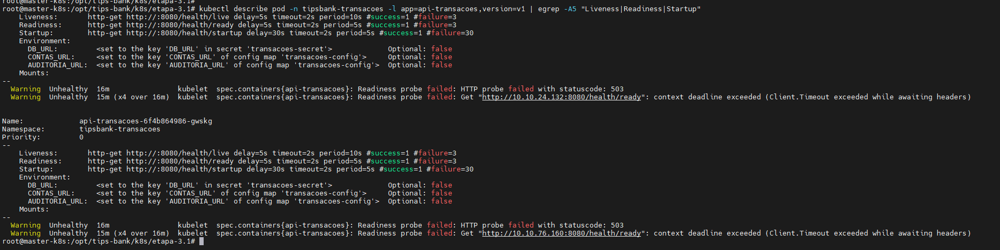

- 🖼️ Probes da Auditoria: 

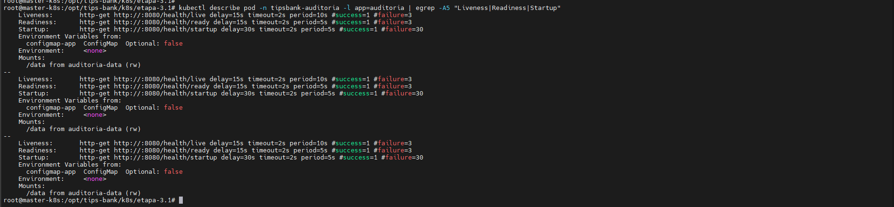

O serviço web também recebeu probes de saúde utilizando o endpoint exposto pelo nginx:

- /healthz

Foram configuradas:

- livenessProbe
- readinessProbe

- 🖼️ Probes Web: 

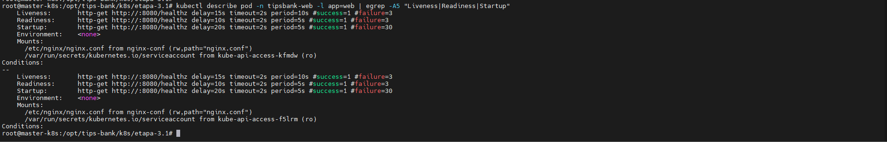

O Postgres recebeu probes customizadas utilizando pg_isready.

- `livenessProbe`
- `readinessProbe`

```yaml
exec:
  command:
    - sh
    - -c
    - pg_isready -U "$POSTGRES_USER" -d "$POSTGRES_DB"
```

- 🖼️ Probes Postgres: 

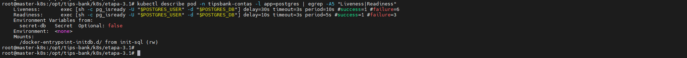

### 2. Teste de Falha Manual do Container

Foi realizado teste de falha manual para validar o comportamento da livenessProbe.

Como as imagens da aplicação são minimalistas/Chainguard e não possuem shell completo, foi utilizado container de debug para inspeção e apoio no teste.

```bash
POD=$(kubectl get pod -n tipsbank-contas -l app=api-contas -o jsonpath='{.items[0].metadata.name}')

kubectl debug -it -n tipsbank-contas pod/$POD \
  --target=api-contas \
  --image=nicolaka/netshoot \
  -- bash
```

Também foi utilizada a listagem dos processos do container alvo para identificar o processo principal da aplicação.

- 🖼️ Debug container e processo da aplicação: 

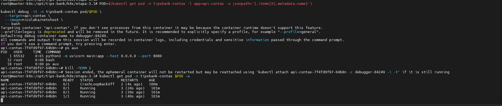

Após o teste de falha, foram consultados os eventos do Kubernetes para validar o comportamento das probes.

```bash
kubectl get events -n tipsbank-contas --sort-by=.lastTimestamp | egrep "Killing|Started|api-contas"
```

- 🖼️ Eventos Killing e Started: 

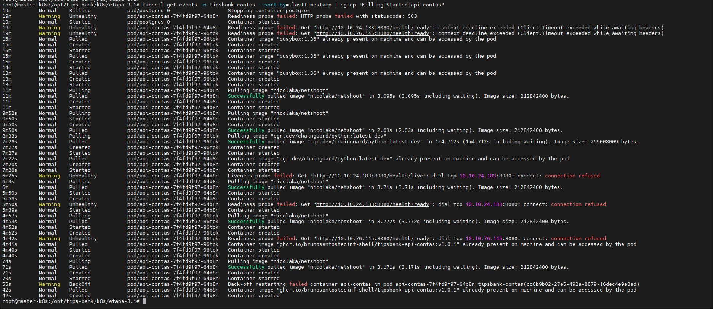

Foi validado que os pods permaneceram em estado saudável após aplicação das probes e testes de falha.

```bash
kubectl get pods -A | grep tipsbank
```

- 🖼️ Pods Running após validação: 

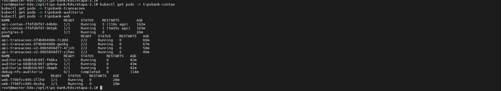


Foi validado o rollout dos Deployments após aplicação das probes.

```bash
for i in $(kubectl get ns -o jsonpath='{.items[*].metadata.name}' | tr ' ' '\n' | grep tips); do
  kubectl rollout status deployment -n $i
done
```

- 🖼️ Rollout concluído:

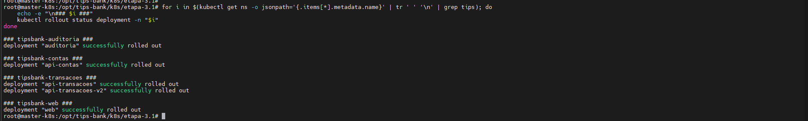

### 3. Referência dos Manifestos Kubernetes (YAML)

Os seguintes manifestos foram utilizados nesta etapa:

- 📄 [01-api-contas-probes.yaml](../k8s/etapa-3.1/01-api-contas-probes.yaml)
- 📄 [02-api-transacoes-v1-probes.yaml](../k8s/etapa-3.1/02-api-transacoes-v1-probes.yaml)
- 📄 [03-allow-transacoesv2-to-postgres.yaml](../k8s/etapa-3.1/03-allow-transacoesv2-to-postgres.yaml)
- 📄 [03-api-transacoes-v2-probes.yaml](../k8s/etapa-3.1/03-api-transacoes-v2-probes.yaml)
- 📄 [04-auditoria-probes.yaml](../k8s/etapa-3.1/04-auditoria-probes.yaml)
- 📄 [05-web-probes.yaml](../k8s/etapa-3.1/05-web-probes.yaml)
- 📄 [06-postgres-probes.yaml](../k8s/etapa-3.1/06-postgres-probes.yaml)

### Conclusão

- ✔ APIs configuradas com `livenessProbe`, `readinessProbe` e `startupProbe`
- ✔ Startup probe configurada para evitar reinícios prematuros durante inicialização
- ✔ Frontend web configurado com probes no endpoint /healthz
- ✔ Postgres configurado com probes customizadas utilizando pg_isready
- ✔ Configuração validada via kubectl describe pod
- ✔ Teste de falha manual realizado para validar reinício automático
- ✔ Eventos Killing e Started registrados pelo kubelet
- ✔ Nenhuma API entrou em CrashLoopBackOff durante o deploy
- ✔ Rollout dos Deployments concluído com sucesso

---

### **Etapa 3.2 — Rollout strategy e rollback**

### Objetivo da Etapa

Configurar estratégia de rollout no Deployment `api-transacoes`, definindo parâmetros explícitos para atualização controlada e validando rollback em cenário de falha.

O objetivo foi garantir que uma versão quebrada não derrube o serviço em produção.

### 1. Configuração da estratégia de Rollout

Foi configurada a estratégia `RollingUpdate` no Deployment `api-transacoes`.

### Parâmetros aplicados

```yaml
strategy:
  type: RollingUpdate
  rollingUpdate:
    maxSurge: 1
    maxUnavailable: 0
revisionHistoryLimit: 5
```
Essa configuração garante que:

- maxSurge: 1 permite criar 1 pod extra durante o rollout
- maxUnavailable: 0 impede indisponibilidade durante a atualização
- revisionHistoryLimit: 5 mantém histórico suficiente para rollback

Foi realizado deploy propositalmente quebrado da imagem api-transacoes:v1.9.9 para validar o comportamento do rollout.

```bash
kubectl set image deployment/api-transacoes \
  -n tipsbank-transacoes \
  api-transacoes=ghcr.io/brunosantostecinf-shell/tipsbank-api-transacoes:v1.9.9

kubectl annotate deployment/api-transacoes \
  -n tipsbank-transacoes \
  kubernetes.io/change-cause="Etapa 3.2 - deploy quebrado v1.9.9" \
  --overwrite
```

Foi validado que o rollout da versão quebrada não concluiu, mantendo os pods antigos saudáveis em execução.

```bash
kubectl rollout status deployment/api-transacoes \
  -n tipsbank-transacoes \
  --timeout=60s

kubectl get pods -n tipsbank-transacoes -l app=api-transacoes -o wide
```

Durante o rollout quebrado, foi realizado teste HTTP para confirmar que a aplicação continuava respondendo.

```bash
curl -k -H "Host: api.tipsbank.local" \
https://192.168.20.200/transacoes/health/live
```

Após validar a falha controlada, foi executado rollback do Deployment api-transacoes.

```bash
kubectl rollout undo deployment/api-transacoes \
  -n tipsbank-transacoes
```

Foi validado o status do rollout e a imagem ativa após o rollback.

```bash
kubectl rollout status deployment/api-transacoes \
  -n tipsbank-transacoes

kubectl get deployment api-transacoes \
  -n tipsbank-transacoes \
  -o jsonpath='{.spec.template.spec.containers[?(@.name=="api-transacoes")].image}'; echo
```

Foi validado o histórico de revisões do Deployment.

```bash
kubectl rollout history deployment/api-transacoes \
  -n tipsbank-transacoes
```

- 🖼️ Testes Rollout strategy e rollback:


### 2. Referência dos Manifestos Kubernetes (YAML)

Os seguintes manifestos foram utilizados nesta etapa:

- [01-api-transacoes-rollout.yaml](../k8s/etapa-3.2/01-api-transacoes-rollout.yaml)

### Conclusão

- ✔ Estratégia RollingUpdate configurada no Deployment api-transacoes
- ✔ maxSurge=1 e maxUnavailable=0 aplicados com sucesso
- ✔ revisionHistoryLimit=5 configurado para manter histórico de rollback
- ✔ Deploy de versão quebrada v1.9.9 validado em ambiente controlado
- ✔ Rollout quebrado não derrubou o tráfego da aplicação
- ✔ Pods antigos permaneceram saudáveis enquanto a nova versão falhava
- ✔ API continuou respondendo durante a falha
- ✔ Rollback executado com kubectl rollout undo
- ✔ Deployment retornou para versão funcional e pods ficaram Ready
- ✔ Histórico de rollout apresentou múltiplas revisões

---

### **Etapa 3.3 — Affinity, AntiAffinity, Taints e Tolerations**

### Objetivo da Etapa

Garantir distribuição inteligente dos workloads no cluster Kubernetes, evitando concentração de réplicas no mesmo node e isolando cargas críticas do banco de dados utilizando Affinity, AntiAffinity, Taints e Tolerations.

Foram implementados:

- `podAntiAffinity` para distribuir réplicas das APIs
- AntiAffinity obrigatória entre Postgres Primary e Replica
- Taint em node dedicado
- Tolerations apenas para workloads do Postgres
- Isolamento de aplicações críticas

---

### 1. Configuração do Node Dedicado para Banco

Foi criado um node dedicado para workloads do banco de dados utilizando labels e taints.

Aplicação da label:

```bash
kubectl label node worker-k8s-02 compliance=strict --overwrite
```

Aplicação do taint:

```bash
kubectl taint nodes worker-k8s-02 compliance=strict:NoSchedule
```

Validação:

```bash
kubectl describe node worker-k8s-02 | grep -i Taints

kubectl get node worker-k8s-02 --show-labels | grep compliance
```
- 🖼️ Node configurado com taint: 

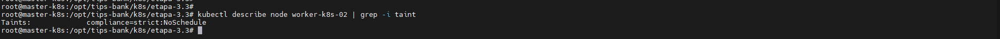

- 🖼️ Label aplicada no node: 

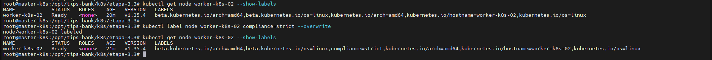

### 2. Configuração do Postgres Primary e Replica

Foi criado um segundo StatefulSet do banco (postgres-replica) para validação de separação entre workloads críticos.

Configuração aplicada:

- Replica dedicada
- Tolerations habilitadas
- AntiAffinity obrigatória

Garantir que postgres-primary e postgres-replica nunca executem no mesmo node.

```bash
kubectl get pods -o wide -n tipsbank-contas | grep postgres
```

- 🖼️ Postgres distribuídos entre nodes:

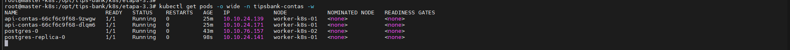

### 3. Configuração de Tolerations no Postgres

Foram adicionadas tolerations exclusivamente aos StatefulSets do banco.

```bash
kubectl get statefulset postgres \
-n tipsbank-contas -o yaml | grep -A8 tolerations

kubectl get statefulset postgres-replica \
-n tipsbank-contas -o yaml | grep -A8 tolerations
```

- 🖼️ Tolerations Postgres Replica: 

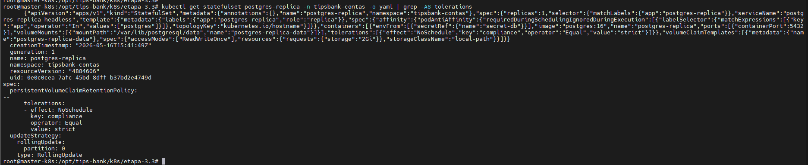

### 4. Validação de ausência de Tolerations nas APIs

Foi validado que workloads de aplicação não receberam tolerations.

```bash
kubectl get deployment api-contas \
-n tipsbank-contas -o yaml | grep -A8 tolerations

kubectl get deployment api-transacoes \
-n tipsbank-transacoes -o yaml | grep -A8 tolerations

kubectl get deployment auditoria \
-n tipsbank-auditoria -o yaml | grep -A8 tolerations

kubectl get deployment web \
-n tipsbank-web -o yaml | grep -A8 tolerations
```

- 🖼️ APIs sem tolerations: 

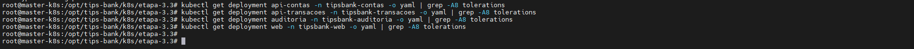

### 5. Configuração de PodAntiAffinity nos Deployments

Foi configurado preferredDuringSchedulingIgnoredDuringExecution para evitar concentração de réplicas no mesmo node.

```bash
kubectl get deployment api-contas \
-n tipsbank-contas -o yaml | grep -A10 affinity

kubectl get deployment api-transacoes \
-n tipsbank-transacoes -o yaml | grep -A10 affinity

kubectl get deployment auditoria \
-n tipsbank-auditoria -o yaml | grep -A10 affinity

kubectl get deployment web \
-n tipsbank-web -o yaml | grep -A10 affinity
```

- 🖼️ AntiAffinity API Contas: 

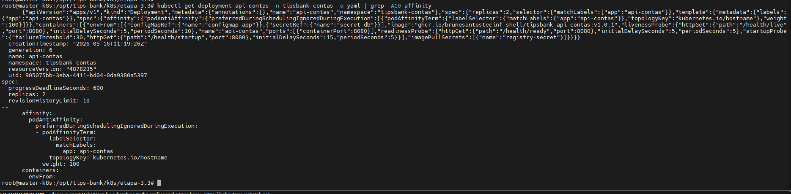

- 🖼️ AntiAffinity API Transações: 

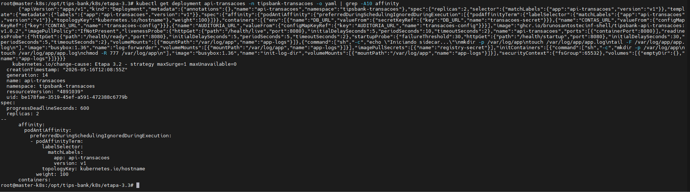

- 🖼️ AntiAffinity Auditoria: 

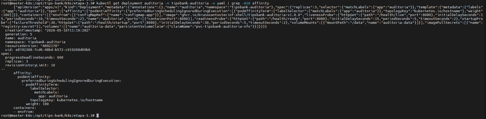

- 🖼️ AntiAffinity Web:

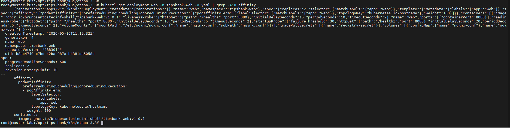

### 6. Validação do AntiAffinity obrigatório entre Primary e Replica

Foi aplicado:

```yaml
requiredDuringSchedulingIgnoredDuringExecution
```

garantindo que workloads do banco não compartilhem o mesmo node.

```bash
kubectl get statefulset postgres-replica \
-n tipsbank-contas -o yaml | grep -A10 affinity
```

- 🖼️ Postgres required AntiAffinity: 

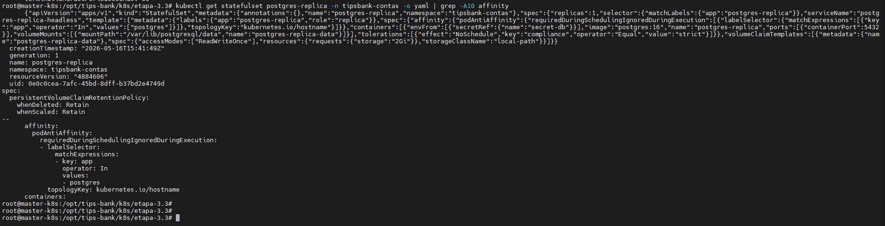

### 7. Distribuição Final dos Pods

Foi validado o posicionamento dos workloads após aplicação das políticas.

```bash
kubectl get pods -o wide -A | egrep \
"api-contas|api-transacoes|auditoria|web"
```
Nenhuma API executando no node isolado (worker-k8s-02).

- 🖼️ Distribuição final workloads: pods-distribuicao-final.png

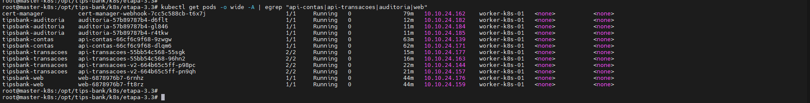

Apos  finalizado foi necessario remover a taint do worker

```bash
kubectl taint nodes worker-k8s-02 compliance=strict:NoSchedule-
```

### 8. Referência dos Manifestos Kubernetes (YAML)

Os seguintes manifestos foram utilizados nesta etapa:

- 📄 [01-api-contas-affinity.yaml](../k8s/etapa-3.3/01-api-contas-affinity.yaml)
- 📄 [02-api-transacoes-affinity.yaml](../k8s/etapa-3.3/02-api-transacoes-affinity.yaml)
- 📄 [04-auditoria-affinity.yaml](../k8s/etapa-3.3/04-auditoria-affinity.yaml)
- 📄 [05-web-affinity.yaml](../k8s/etapa-3.3/05-web-affinity.yaml)
- 📄 [06-postgres-affinity.yaml](../k8s/etapa-3.3/06-postgres-affinity.yaml)

### Conclusão

- ✔ `podAntiAffinity` configurado em todos os Deployments com múltiplas réplicas
- ✔ `postgres-primary` e `postgres-replica` distribuídos em nodes distintos
- ✔ Node dedicado configurado utilizando `taints`
- ✔ Apenas workloads críticos receberam `tolerations`
- ✔ APIs e frontend impedidos de executar no node isolado
- ✔ Estratégia de isolamento validada
- ✔ Distribuição automática dos workloads funcionando

---

### **Etapa 3.4 — Resources, Limits e QoS**

### Objetivo da Etapa

Configurar `resources.requests` e `resources.limits` em 100% dos containers da aplicação TipsBank, garantindo classes de QoS previsíveis e evitando pods sem controle de consumo de CPU e memória.

Foram configurados recursos para:

- APIs
- Frontend web
- Postgres
- Sidecar `log-forwarder`

### 1. Configuração de Resources nas APIs

Foram configurados `requests` e `limits` nos containers das APIs.

```yaml
resources:
  requests:
    cpu: 100m
    memory: 128Mi
  limits:
    cpu: 500m
    memory: 256Mi
```

Workloads contemplados:

- api-contas
- api-transacoes
- api-transacoes-v2
- auditoria

- 🖼️ Resources API Contas: 

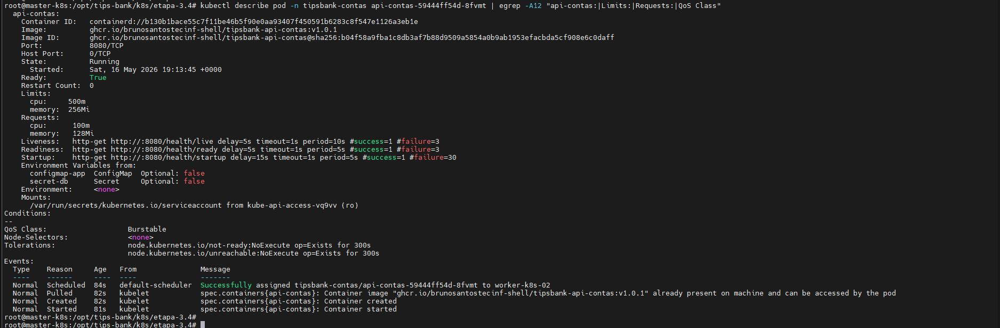

- 🖼️ Resources API Transações: 

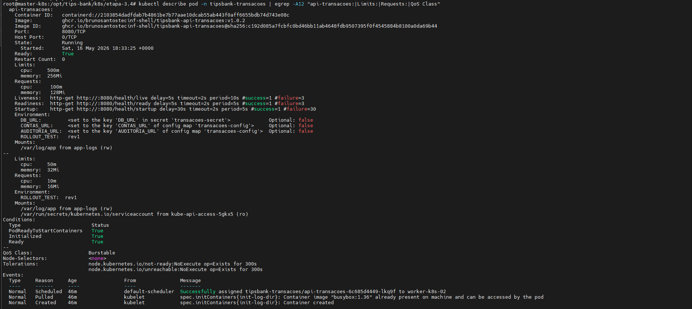

- 🖼️ Resources Auditoria: 

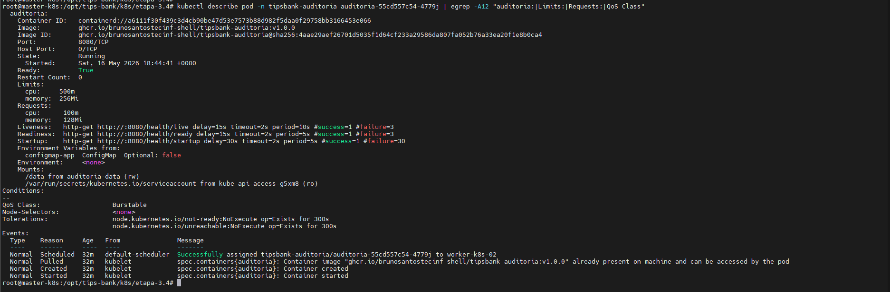

### 2. Configuração de Resources no Frontend Web

Foi configurado requests e limits no container do frontend web.

```yaml
resources:
  requests:
    cpu: 100m
    memory: 128Mi
  limits:
    cpu: 500m
    memory: 256Mi
```

- 🖼️ Resources Web: 

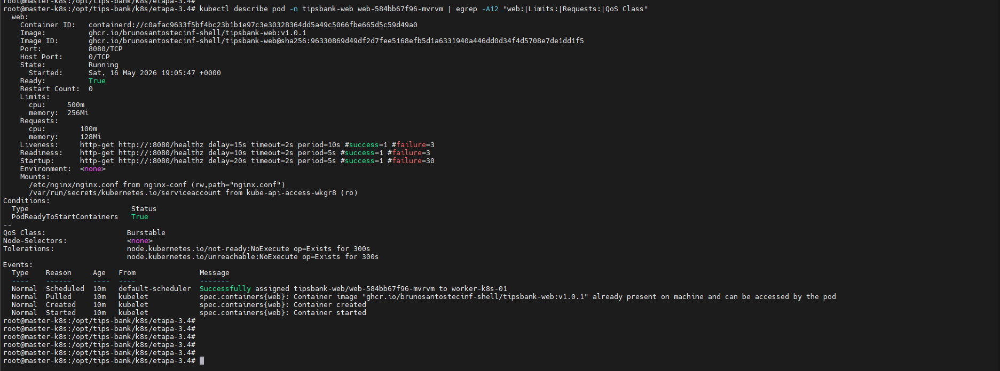

### 3. Configuração de Resources no Postgres

Foram configurados recursos específicos para o banco de dados Postgres.

```yaml
resources:
  requests:
    cpu: 250m
    memory: 512Mi
  limits:
    cpu: "1"
    memory: 1Gi
```

- 🖼️ Resources Postgres: 

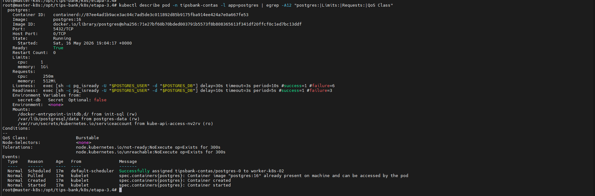

### 4. Configuração de Resources no Sidecar Log Forwarder

O container sidecar log-forwarder também recebeu configuração de recursos.

```yaml
resources:
  requests:
    cpu: 10m
    memory: 16Mi
  limits:
    cpu: 50m
    memory: 32Mi
```

- 🖼️ Resources Sidecar Log Forwarder: 

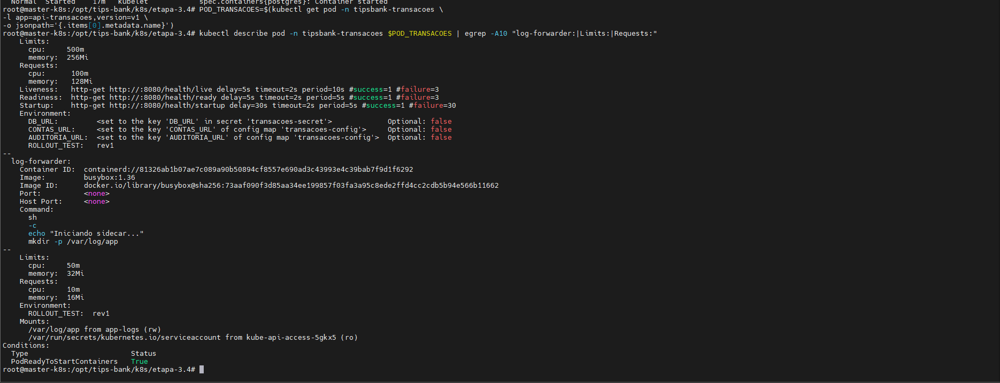

### 5. Validação das Classes de QoS

Foi validado que os pods passaram a utilizar QoS previsível e nenhum workload ficou como BestEffort.

```bash
kubectl get pods -A \
-o custom-columns="NAMESPACE:.metadata.namespace,POD:.metadata.name,QOS:.status.qosClass" \
| grep tipsbank
```

- 🖼️ QoS dos pods TipsBank: 

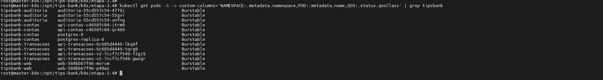


### 6. Validação de Consumo Atual dos Pods

Foi realizada validação do consumo atual dos pods com kubectl top pod.

```bash
kubectl top pod -A | grep tipsbank
```

- 🖼️ Uso atual dos pods: 

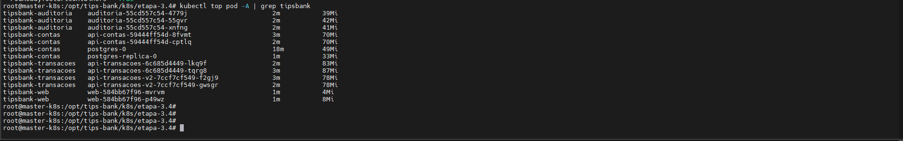

### 7. Referência dos Manifestos Kubernetes (YAML)

Os seguintes manifestos foram utilizados nesta etapa:

- 📄 [01-api-contas-resources.yaml](../k8s/etapa-3.4/01-api-contas-resources.yaml)
- 📄 [02-api-transacoes-resources.yaml](../k8s/etapa-3.4/02-api-transacoes-resources.yaml)
- 📄 [03-api-transacoes-v2-resources.yaml](../k8s/etapa-3.4/03-api-transacoes-v2-resources.yaml)
- 📄 [04-auditoria-resources.yaml](../k8s/etapa-3.4/04-auditoria-resources.yaml)
- 📄 [05-web-resources.yaml](../k8s/etapa-3.4/05-web-resources.yaml)
- 📄 [06-postgres-resources.yaml](../k8s/etapa-3.4/06-postgres-resources.yaml)
- 📄 [07-postgres-replica-resources.yaml](../k8s/etapa-3.4/07-postgres-replica-resources.yaml)

### 8. Considerações sobre Classes de QoS (Quality of Service)

O Kubernetes classifica os pods em categorias de QoS (Quality of Service) com base na configuração de `requests` e `limits` de CPU e memória. Essa classificação influencia a prioridade de desalocação em cenários de pressão de recursos no cluster.

- **BestEffort**
  - Não possui `requests` nem `limits`
  - Menor prioridade
  - Primeiros pods a serem encerrados em situações de falta de recursos

- **Burstable**
  - Possui `requests` e/ou `limits`, porém com valores diferentes
  - Permite consumo acima do mínimo reservado até o limite configurado
  - Equilíbrio entre previsibilidade e flexibilidade

- **Guaranteed**
  - `requests` e `limits` possuem exatamente os mesmos valores
  - Maior prioridade no cluster
  - Menor chance de sofrer eviction

Nesta implementação do TipsBank, os workloads foram classificados principalmente como **Burstable**, permitindo flexibilidade de consumo com controle explícito de recursos, evitando pods `BestEffort` sem restrições.

### Conclusão

- ✔ resources.requests e resources.limits configurados em todos os containers
- ✔ APIs, frontend, Postgres e sidecar contemplados
- ✔ Nenhum pod classificado como BestEffort
- ✔ Pods classificados como Burstable, garantindo QoS previsível
- ✔ Scheduler passou a ter informações explícitas de CPU e memória
- ✔ Consumo real validado com kubectl top pod

---

### **Etapa 3.5 — Observabilidade com kube-prometheus-stack**

### Objetivo da Etapa

Implantar uma stack completa de observabilidade no cluster Kubernetes utilizando `kube-prometheus-stack`, contemplando:

- Prometheus
- Grafana
- Alertmanager
- ServiceMonitor para as APIs
- Ingress com TLS para acesso às interfaces
- Dashboard com métricas reais da aplicação TipsBank

O objetivo foi garantir visibilidade sobre disponibilidade, tráfego HTTP, latência, status code e consumo de CPU/Memória dos pods.


### 1. Instalação do kube-prometheus-stack

Foi realizada a instalação da stack oficial utilizando Helm.


```bash
helm repo add prometheus-community https://prometheus-community.github.io/helm-charts

helm repo update

helm install prometheus-stack prometheus-community/kube-prometheus-stack \
-n tipsbank-monitoring --create-namespace
```

- 🖼️ Instalação do kube-prometheus-stack:

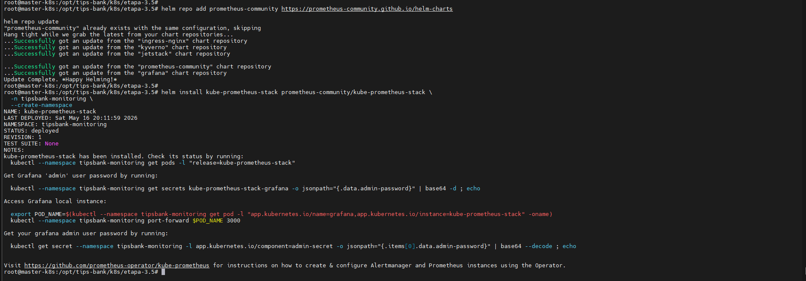

### 2. Exposição das Interfaces via Ingress com TLS

Foram criados recursos Ingress para exposição segura das interfaces administrativas.

#### Hosts configurados

- `grafana.tipsbank.local`
- `prometheus.tipsbank.local`
- `alertmanager.tipsbank.local`

### 3. Validação do Grafana via Ingress

Foi validado o acesso ao Grafana através do host configurado.

- 🖼️ Grafana acessível:

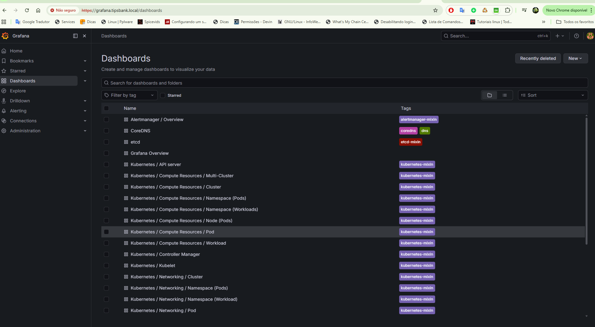

### 4. Criação dos ServiceMonitors

Foram criados ServiceMonitors para as APIs do TipsBank.

#### APIs monitoradas

- api-contas
- api-transacoes
- auditoria

#### Endpoint monitorado

```text
/metrics
```

Porta:

```text
8080
```

- 🖼️ ServiceMonitors:

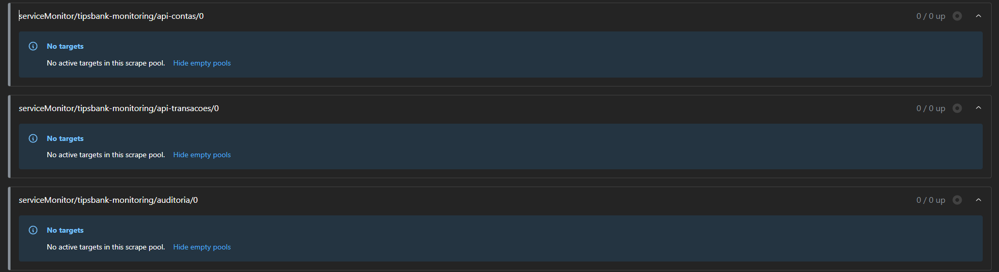

### 5. Ajuste das Labels dos ServiceMonitors

Inicialmente os ServiceMonitors não eram descobertos pelo Prometheus.

Foi necessário ajustar labels compatíveis com os selectors do Prometheus.

```bash
kubectl get prometheus -n tipsbank-monitoring -o yaml | grep -A20 serviceMonitor
```

- 🖼️ Selector Prometheus:

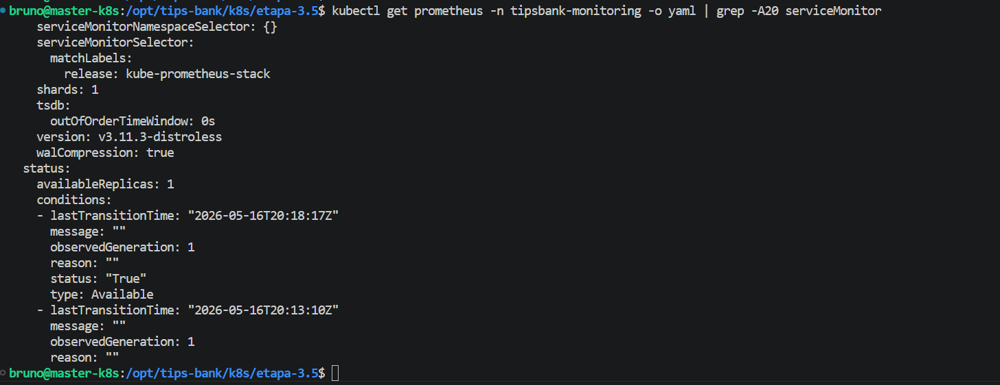


### 6. Ajuste das NetworkPolicies

Após implementação do modelo Zero Trust foi necessário liberar explicitamente a comunicação entre o namespace de monitoramento e as APIs monitoradas, pois os targets do Prometheus estavam inacessíveis devido às regras de isolamento impostas pelas NetworkPolicies.

- 🖼️ Erro de target no Prometheus:

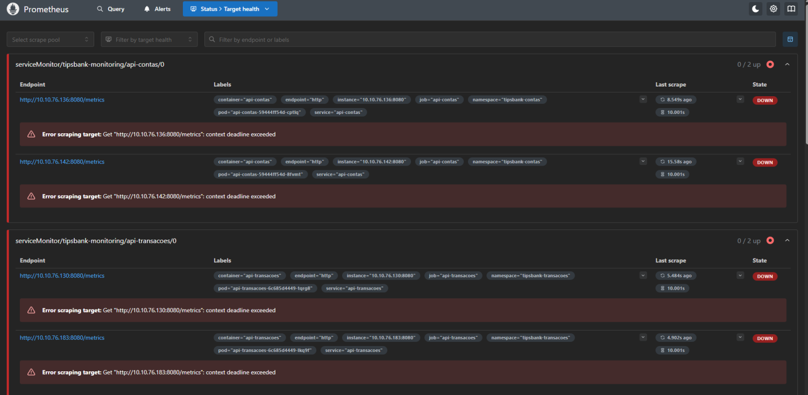

#### Fluxos liberados

Namespace:

```text
tipsbank-monitoring
```

Destino:

- tipsbank-contas
- tipsbank-transacoes
- tipsbank-auditoria

Endpoint:

```text
/metrics
```

### 7. Validação dos Targets no Prometheus

Foi validado o status dos endpoints na interface do Prometheus.

🖼️ Targets em estado UP:

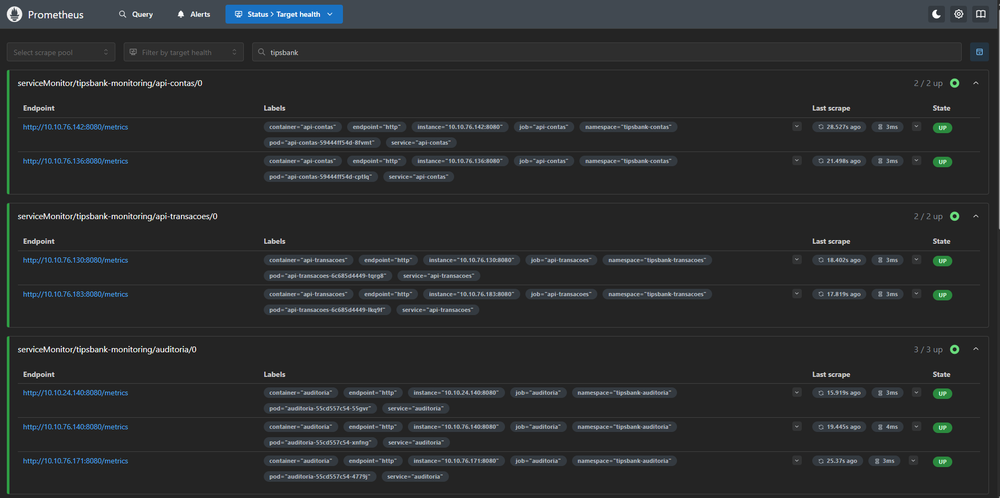

### 8. Validação do Alertmanager

Foi validado o acesso à interface do Alertmanager.

Mesmo sem alertas configurados nesta etapa, a funcionalidade foi validada.

- 🖼️ Alertmanager:

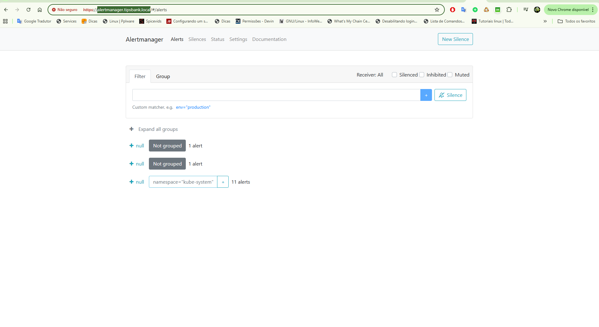

### 9. Geração de Tráfego para Popular Métricas

Para geração de dados reais foi executada uma carga artificial nas APIs.

#### Script utilizado

```bash
for i in {1..10000}; do
  curl -k -H "Host: app.tipsbank.local" \
  https://192.168.20.200/api/contas/health/live >/dev/null

  curl -k -H "Host: app.tipsbank.local" \
  https://192.168.20.200/api/transacoes/health/live >/dev/null

  curl -k -H "Host: app.tipsbank.local" \
  https://192.168.20.200/api/auditoria/health/live >/dev/null
done
```

- 🖼️ Geração de tráfego:

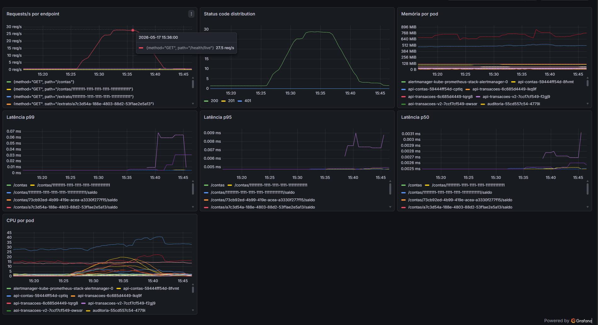

### 10. Consideração sobre PodMonitor do Sidecar

Foi avaliada a utilização de PodMonitor para o sidecar `log-forwarder`.

O sidecar utilizado possui apenas a função:

```bash
tail -F /var/log/app/app.log
```

Como não existe endpoint `/metrics`, não foi criado PodMonitor.


### 11. Consideração sobre Métricas do Frontend Web

O `nginx-unprivileged` não expõe métricas Prometheus nativamente.

Para futuras implementações seria necessário:

- habilitar `stub_status`
- adicionar `nginx-prometheus-exporter`
- criar ServiceMonitor dedicado


### 12. Referência dos Manifestos Kubernetes (YAML)

Manifestos utilizados:

- 📄 [01-api-contas-service-monitor-fix.yaml](../k8s/etapa-3.5/01-api-contas-service-monitor-fix.yaml)
- 📄 [01-grafana-ingress.yaml](../k8s/etapa-3.5/01-grafana-ingress.yaml) 
- 📄 [02-api-transacoes-service-monitor-fix.yaml](../k8s/etapa-3.5/02-api-transacoes-service-monitor-fix.yaml) 
- 📄 [02-prometheus-ingress.yaml](../k8s/etapa-3.5/02-prometheus-ingress.yaml) 
- 📄 [03-alertmanager-ingress.yaml](../k8s/etapa-3.5/03-alertmanager-ingress.yaml) 
- 📄 [03-auditoria-service-monitor-fix.yaml](../k8s/etapa-3.5/03-auditoria-service-monitor-fix.yaml) 
- 📄 [04-servicemonitor-api-contas.yaml](../k8s/etapa-3.5/04-servicemonitor-api-contas.yaml) 
- 📄 [05-servicemonitor-api-transacoes.yaml](../k8s/etapa-3.5/05-servicemonitor-api-transacoes.yaml) 
- 📄 [06-servicemonitor-auditoria.yaml](../k8s/etapa-3.5/06-servicemonitor-auditoria.yaml) 
- 📄 [allow-prometheus-to-api.yaml](../k8s/etapa-3.5/allow-prometheus-to-api.yaml)

### Conclusão

- ✔ kube-prometheus-stack instalado com sucesso
- ✔ Grafana, Prometheus e Alertmanager operacionais
- ✔ Interfaces expostas via Ingress + TLS
- ✔ ServiceMonitor configurado para as três APIs
- ✔ Ajuste de labels realizado para descoberta automática
- ✔ NetworkPolicies adaptadas ao monitoramento
- ✔ Targets das APIs validados em estado UP
- ✔ Dashboards renderizando métricas reais
- ✔ Geração artificial de carga executada
