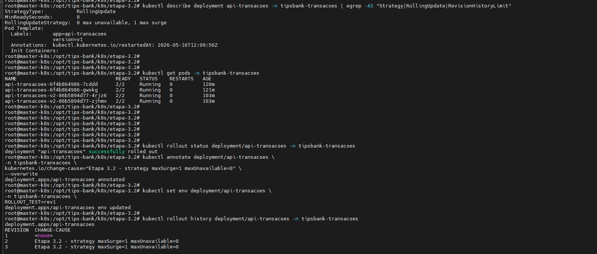
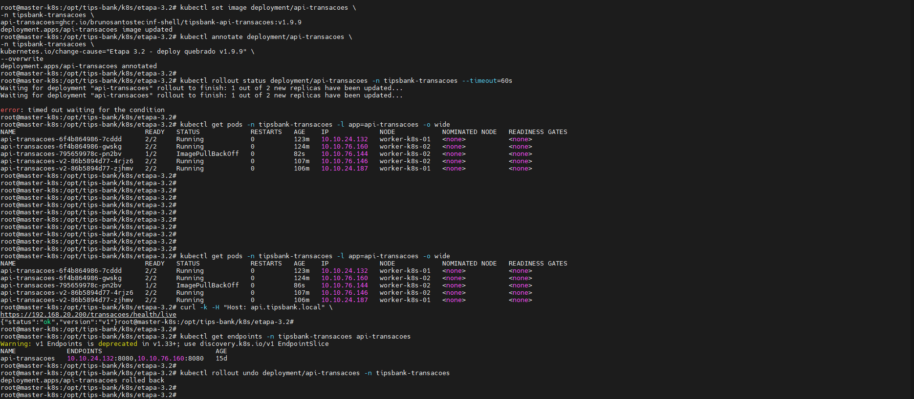
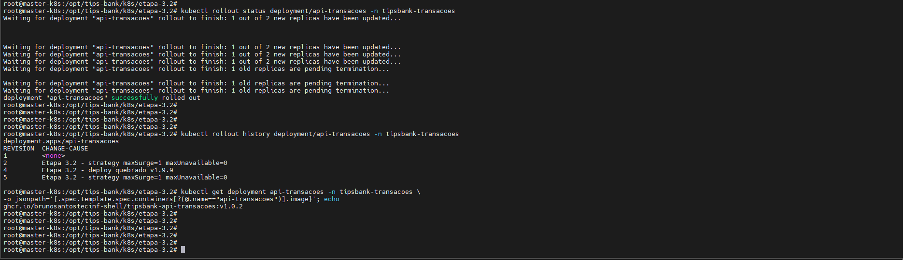

# Evidências Semana 2
**Projeto:** TipsBank  
**Objetivo da semana**: tornar o TipsBank resiliente (probes, affinity) e observável (kube-prometheus), com HPA escalando sob carga gerada pelo Locust.**Data:** 16/05/2026  
**Responsável:** Bruno dos Santos

---

### **Etapa 3.1 — Probes completas**

### Objetivo da Etapa

Configurar probes completas nos componentes da aplicação TipsBank, garantindo validação de saúde, disponibilidade e inicialização correta dos containers.

Foram aplicadas:

- `livenessProbe`
- `readinessProbe`
- `startupProbe`
- Probes customizadas para Postgres com `pg_isready`
- Probes no frontend web via `/healthz`

### 1. Configuração das Probes nas APIs

Foram configuradas 3 probes nas APIs da aplicação:

- `livenessProbe` → `/health/live`
- `readinessProbe` → `/health/ready`
- `startupProbe` → `/health/startup`

A `startupProbe` foi configurada com parâmetros mais permissivos para permitir tempo suficiente de inicialização da aplicação.

### Configuração aplicada

```yaml
startupProbe:
  httpGet:
    path: /health/startup
    port: 8080
  periodSeconds: 5
  failureThreshold: 30

livenessProbe:
  httpGet:
    path: /health/live
    port: 8080
  periodSeconds: 10

readinessProbe:
  httpGet:
    path: /health/ready
    port: 8080
  periodSeconds: 5
```

Foi utilizado kubectl describe pod para validar se as probes foram aplicadas corretamente nos containers.

```bash
kubectl describe pod -n tipsbank-contas -l app=api-contas | grep -A5 "Liveness\|Readiness\|Startup"

kubectl describe pod -n tipsbank-transacoes -l app=api-transacoes | grep -A5 "Liveness\|Readiness\|Startup"

kubectl describe pod -n tipsbank-auditoria -l app=auditoria | grep -A5 "Liveness\|Readiness\|Startup"

kubectl describe pod -n tipsbank-web -l app=web | grep -A5 "Liveness\|Readiness\|Startup"
```


- 🖼️ Probes da API Contas: 


- 🖼️ Probes da API Transações: 


- 🖼️ Probes da Auditoria: 


O serviço web também recebeu probes de saúde utilizando o endpoint exposto pelo nginx:

- /healthz

Foram configuradas:

- livenessProbe
- readinessProbe

- 🖼️ Probes Web: 


O Postgres recebeu probes customizadas utilizando pg_isready.

- `livenessProbe`
- `readinessProbe`

```yaml
exec:
  command:
    - sh
    - -c
    - pg_isready -U "$POSTGRES_USER" -d "$POSTGRES_DB"
```

- 🖼️ Probes Postgres: 


### 2. Teste de Falha Manual do Container

Foi realizado teste de falha manual para validar o comportamento da livenessProbe.

Como as imagens da aplicação são minimalistas/Chainguard e não possuem shell completo, foi utilizado container de debug para inspeção e apoio no teste.

```bash
POD=$(kubectl get pod -n tipsbank-contas -l app=api-contas -o jsonpath='{.items[0].metadata.name}')

kubectl debug -it -n tipsbank-contas pod/$POD \
  --target=api-contas \
  --image=nicolaka/netshoot \
  -- bash
```

Também foi utilizada a listagem dos processos do container alvo para identificar o processo principal da aplicação.

- 🖼️ Debug container e processo da aplicação: 


Após o teste de falha, foram consultados os eventos do Kubernetes para validar o comportamento das probes.

```bash
kubectl get events -n tipsbank-contas --sort-by=.lastTimestamp | egrep "Killing|Started|api-contas"
```

- 🖼️ Eventos Killing e Started: 


Foi validado que os pods permaneceram em estado saudável após aplicação das probes e testes de falha.

```bash
kubectl get pods -A | grep tipsbank
```

- 🖼️ Pods Running após validação: 


Foi validado o rollout dos Deployments após aplicação das probes.

```bash
for i in $(kubectl get ns -o jsonpath='{.items[*].metadata.name}' | tr ' ' '\n' | grep tips); do
  kubectl rollout status deployment -n $i
done
```

- 🖼️ Rollout concluído:


### 3. Referência dos Manifestos Kubernetes (YAML)

Os seguintes manifestos foram utilizados nesta etapa:

- 📄 [01-api-contas-probes.yaml](../k8s/etapa-3.1/01-api-contas-probes.yaml)
- 📄 [02-api-transacoes-v1-probes.yaml](../k8s/etapa-3.1/02-api-transacoes-v1-probes.yaml)
- 📄 [03-allow-transacoesv2-to-postgres.yaml](../k8s/etapa-3.1/03-allow-transacoesv2-to-postgres.yaml)
- 📄 [03-api-transacoes-v2-probes.yaml](../k8s/etapa-3.1/03-api-transacoes-v2-probes.yaml)
- 📄 [04-auditoria-probes.yaml](../k8s/etapa-3.1/04-auditoria-probes.yaml)
- 📄 [05-web-probes.yaml](../k8s/etapa-3.1/05-web-probes.yaml)
- 📄 [06-postgres-probes.yaml](../k8s/etapa-3.1/06-postgres-probes.yaml)

### Conclusão

- ✔ APIs configuradas com `livenessProbe`, `readinessProbe` e `startupProbe`
- ✔ Startup probe configurada para evitar reinícios prematuros durante inicialização
- ✔ Frontend web configurado com probes no endpoint /healthz
- ✔ Postgres configurado com probes customizadas utilizando pg_isready
- ✔ Configuração validada via kubectl describe pod
- ✔ Teste de falha manual realizado para validar reinício automático
- ✔ Eventos Killing e Started registrados pelo kubelet
- ✔ Nenhuma API entrou em CrashLoopBackOff durante o deploy
- ✔ Rollout dos Deployments concluído com sucesso

### **Etapa 3.2 — Rollout strategy e rollback**

## Objetivo da Etapa

Configurar estratégia de rollout no Deployment `api-transacoes`, definindo parâmetros explícitos para atualização controlada e validando rollback em cenário de falha.

O objetivo foi garantir que uma versão quebrada não derrube o serviço em produção.

---

### 1. Configuração da estratégia de Rollout

Foi configurada a estratégia `RollingUpdate` no Deployment `api-transacoes`.

### Parâmetros aplicados

```yaml
strategy:
  type: RollingUpdate
  rollingUpdate:
    maxSurge: 1
    maxUnavailable: 0
revisionHistoryLimit: 5
```
Essa configuração garante que:

- maxSurge: 1 permite criar 1 pod extra durante o rollout
- maxUnavailable: 0 impede indisponibilidade durante a atualização
- revisionHistoryLimit: 5 mantém histórico suficiente para rollback

Foi realizado deploy propositalmente quebrado da imagem api-transacoes:v1.9.9 para validar o comportamento do rollout.

```bash
kubectl set image deployment/api-transacoes \
  -n tipsbank-transacoes \
  api-transacoes=ghcr.io/brunosantostecinf-shell/tipsbank-api-transacoes:v1.9.9

kubectl annotate deployment/api-transacoes \
  -n tipsbank-transacoes \
  kubernetes.io/change-cause="Etapa 3.2 - deploy quebrado v1.9.9" \
  --overwrite
```

Foi validado que o rollout da versão quebrada não concluiu, mantendo os pods antigos saudáveis em execução.

```bash
kubectl rollout status deployment/api-transacoes \
  -n tipsbank-transacoes \
  --timeout=60s

kubectl get pods -n tipsbank-transacoes -l app=api-transacoes -o wide
```

Durante o rollout quebrado, foi realizado teste HTTP para confirmar que a aplicação continuava respondendo.

```bash
curl -k -H "Host: api.tipsbank.local" \
https://192.168.20.200/transacoes/health/live
```

Após validar a falha controlada, foi executado rollback do Deployment api-transacoes.

```bash
kubectl rollout undo deployment/api-transacoes \
  -n tipsbank-transacoes
```

Foi validado o status do rollout e a imagem ativa após o rollback.

```bash
kubectl rollout status deployment/api-transacoes \
  -n tipsbank-transacoes

kubectl get deployment api-transacoes \
  -n tipsbank-transacoes \
  -o jsonpath='{.spec.template.spec.containers[?(@.name=="api-transacoes")].image}'; echo
```

Foi validado o histórico de revisões do Deployment.

```bash
kubectl rollout history deployment/api-transacoes \
  -n tipsbank-transacoes
```

- 🖼️ Testes Rollout strategy e rollback:





### 2. Referência dos Manifestos Kubernetes (YAML)

Os seguintes manifestos foram utilizados nesta etapa:

- 01-api-transacoes-rollout.yaml

### Conclusão
- ✔ Estratégia RollingUpdate configurada no Deployment api-transacoes
- ✔ maxSurge=1 e maxUnavailable=0 aplicados com sucesso
- ✔ revisionHistoryLimit=5 configurado para manter histórico de rollback
- ✔ Deploy de versão quebrada v1.9.9 validado em ambiente controlado
- ✔ Rollout quebrado não derrubou o tráfego da aplicação
- ✔ Pods antigos permaneceram saudáveis enquanto a nova versão falhava
- ✔ API continuou respondendo durante a falha
- ✔ Rollback executado com kubectl rollout undo
- ✔ Deployment retornou para versão funcional e pods ficaram Ready
- ✔ Histórico de rollout apresentou múltiplas revisões

---
