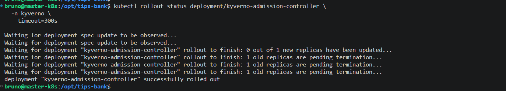
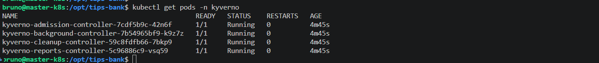
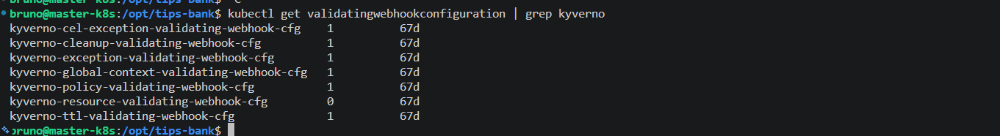
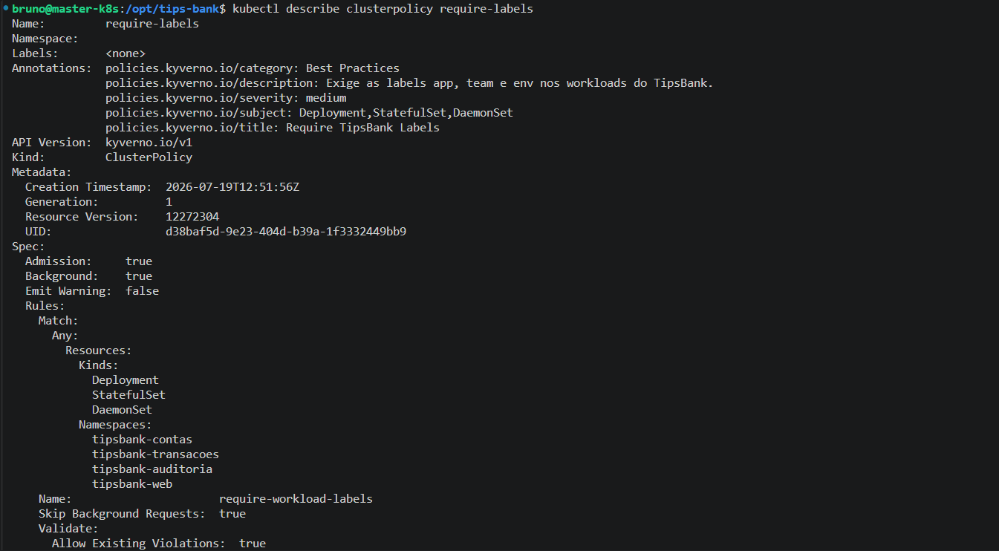
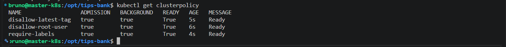
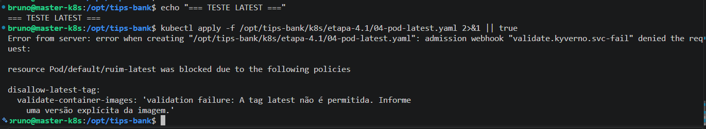
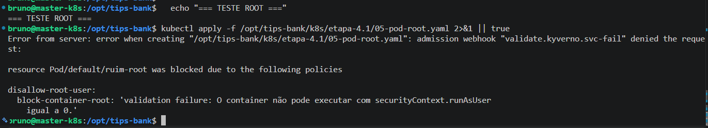
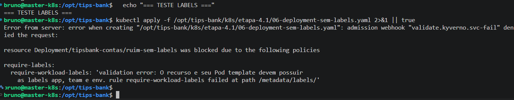

# Evidências Semana 4
**Projeto:** TipsBank  
**Objetivo da semana:** aplicar compliance de banco via Kyverno, segregar acessos com RBAC (certificados + SA/Token), empacotar TUDO num Helm Chart umbrella  
**Data:** 23/05/2026  
**Responsável:** Bruno dos Santos

---

### **Etapa 4.1 — Kyverno: Validate (Proibir Root e Tag Latest)**

### Objetivo da Etapa

Implementar políticas de validação utilizando **Kyverno** para aumentar a segurança do cluster Kubernetes, impedindo a criação de workloads que não estejam em conformidade com os padrões definidos.

Nesta etapa foram implementadas políticas para:

- Proibir containers executando como usuário root (`runAsUser: 0`)
- Proibir imagens utilizando a tag `latest`
- Exigir labels obrigatórias em Deployments, StatefulSets e DaemonSets

Todas as políticas foram configuradas em modo **Enforce**, impedindo a criação de recursos que violem as regras.

---

### 1. Instalação do Kyverno

Foi realizada a instalação do Kyverno utilizando Helm.

### Comandos utilizados

```bash
helm repo add kyverno https://kyverno.github.io/kyverno

helm repo update

helm install kyverno kyverno/kyverno \
-n kyverno \
--create-namespace
```

Validação:

```bash
kubectl rollout status deployment \
-n kyverno
```

### Evidência

🖼️ Rollout do Kyverno concluído:



### Resultado

- ✔ Kyverno instalado com sucesso
- ✔ Controladores iniciados
- ✔ Admission Controller operacional

---

### 2. Validação dos Pods do Kyverno

Foi validado que todos os componentes do Kyverno encontram-se em execução.

### Comando utilizado

```bash
kubectl get pods -n kyverno
```

### Evidência

🖼️ Pods do Kyverno:



### Resultado

- ✔ Todos os pods em estado Running
- ✔ Componentes operacionais

---

### 3. Validação do Admission Webhook

Foi validado que o Admission Webhook responsável pela aplicação das políticas foi criado corretamente.

### Comando utilizado

```bash
kubectl get validatingwebhookconfiguration
```

### Evidência

🖼️ Validating Webhook:



### Resultado

- ✔ Admission Webhook registrado
- ✔ Políticas sendo interceptadas durante criação dos recursos

---

### 4. Criação da ClusterPolicy — Disallow Root User

Foi criada uma política para impedir a criação de workloads executando como usuário root.

Modo utilizado:

```text
Enforce
```

Objetivo:

Impedir configurações contendo:

```yaml
securityContext:
  runAsUser: 0
```

Validação:

```bash
kubectl describe clusterpolicy disallow-root-user
```

### Evidência

🖼️ Policy disallow-root-user:


### Resultado

- ✔ Política criada
- ✔ Status Ready=True
- ✔ Modo Enforce habilitado

---

### 5. Criação da ClusterPolicy — Disallow Latest Tag

Foi criada uma política para impedir utilização de imagens utilizando a tag `latest`.

Objetivo:

Evitar implantações sem versionamento definido.

Exemplo bloqueado:

```yaml
image: nginx:latest
```

Validação:

```bash
kubectl describe clusterpolicy disallow-latest-tag
```

### Evidência

🖼️ Policy disallow-latest-tag:


### Resultado

- ✔ Política criada
- ✔ Status Ready=True
- ✔ Modo Enforce habilitado

---

### 6. Criação da ClusterPolicy — Require Labels

Foi criada uma política exigindo a presença das labels obrigatórias em todos os Deployments, StatefulSets e DaemonSets.

Labels obrigatórias:

- app
- team
- env

Validação:

```bash
kubectl describe clusterpolicy require-labels
```

### Evidência

🖼️ Policy require-labels:



### Resultado

- ✔ Política criada
- ✔ Labels obrigatórias definidas
- ✔ Status Ready=True

---

### 7. Validação das ClusterPolicies

Foi validado que todas as políticas encontram-se ativas.

### Comando utilizado

```bash
kubectl get cpol
```

### Evidência

🖼️ ClusterPolicies:



### Resultado

- ✔ disallow-root-user
- ✔ disallow-latest-tag
- ✔ require-labels

Todas apresentando:

```text
READY=True
```

---

### 8. Teste da Política Disallow Latest

Foi realizada tentativa de criação de um Pod utilizando imagem com tag `latest`.

Comando executado:

```bash
kubectl run ruim \
--image=nginx:latest
```

Resultado esperado:

```text
Error from server

admission webhook denied the request
```

### Evidência

🖼️ Política bloqueando imagem latest:



### Resultado

- ✔ Criação bloqueada
- ✔ Política funcionando corretamente

---

### 9. Teste da Política Disallow Root User

Foi realizada tentativa de criação de workload executando como usuário root.

Exemplo:

```yaml
securityContext:
  runAsUser: 0
```

Resultado esperado:

```text
admission webhook denied the request
```

### Evidência

🖼️ Política bloqueando Root User:



### Resultado

- ✔ Recurso rejeitado
- ✔ Execução como root bloqueada

---

### 10. Teste da Política Require Labels

Foi realizada tentativa de criação de Deployment sem as labels obrigatórias.

Resultado esperado:

```text
admission webhook denied the request
```

### Evidência

🖼️ Política Require Labels:



### Resultado

- ✔ Deployment rejeitado
- ✔ Obrigatoriedade de labels validada

---

### 11. Validação das Aplicações Existentes

Após aplicação das políticas foi validado que todos os workloads existentes do TipsBank permaneciam em conformidade.

Foram verificadas:

- labels obrigatórias
- execução non-root
- imagens versionadas

Validação:

```bash
kubectl get pods -A

kubectl get deploy,statefulset,daemonset -A --show-labels
```

### Resultado

- ✔ Nenhum workload existente foi bloqueado
- ✔ Ambiente permaneceu operacional
- ✔ Aplicações compatíveis com as políticas

---

### 12. Referência dos Manifestos Kubernetes (YAML)

Manifestos utilizados nesta etapa:

- 📄 [01-disallow-root-user.yaml](../k8s/etapa-4.1/01-disallow-root-user.yaml)
- 📄 [02-disallow-latest-tag.yaml](../k8s/etapa-4.1/02-disallow-latest-tag.yaml)
- 📄 [03-require-labels.yaml](../k8s/etapa-4.1/03-require-labels.yaml)

---

## Conclusão

- ✔ Kyverno instalado com sucesso utilizando Helm
- ✔ Admission Webhook operacional no cluster
- ✔ ClusterPolicies criadas em modo **Enforce**
- ✔ Política bloqueando containers executando como root
- ✔ Política impedindo utilização de imagens com tag `latest`
- ✔ Política exigindo labels obrigatórias em Deployments, StatefulSets e DaemonSets
- ✔ Três cenários de violação testados e corretamente rejeitados
- ✔ Todas as ClusterPolicies em estado **READY=True**

---
