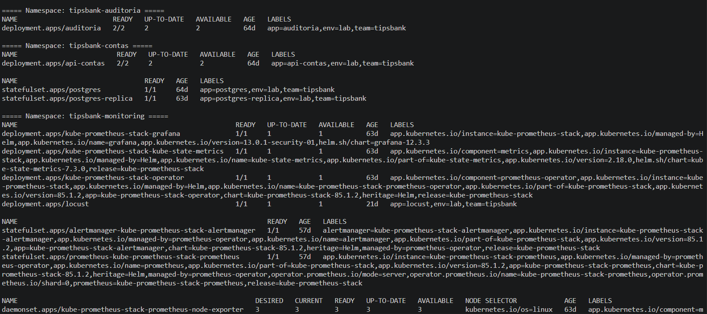
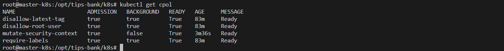
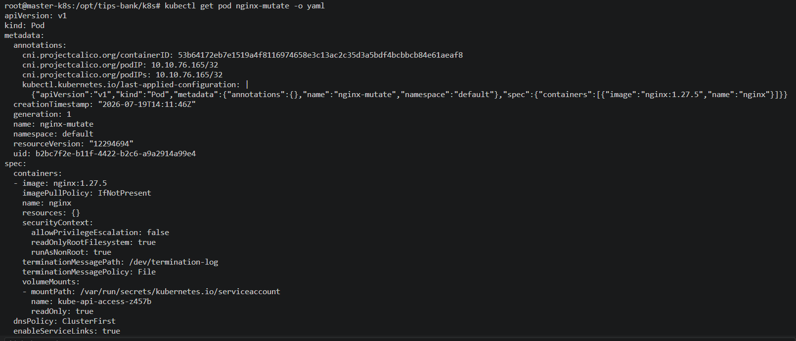
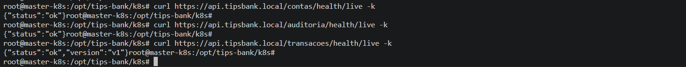
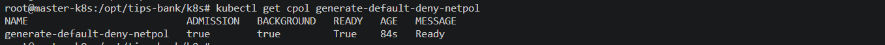
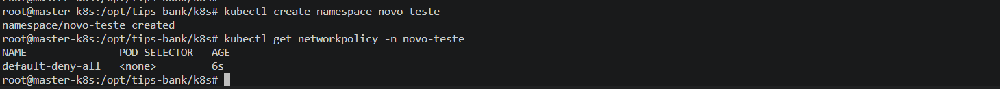
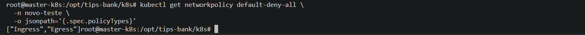
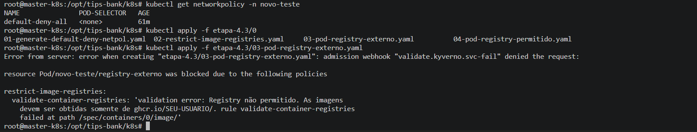
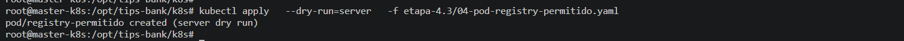

# Evidências Semana 4
**Projeto:** TipsBank  
**Objetivo da semana:** aplicar compliance de banco via Kyverno, segregar acessos com RBAC (certificados + SA/Token), empacotar TUDO num Helm Chart umbrella  
**Data:** 23/05/2026  
**Responsável:** Bruno dos Santos

---

### **Etapa 4.1 — Kyverno: Validate (Proibir Root e Tag Latest)**

### Objetivo da Etapa

Implementar políticas de validação utilizando **Kyverno** para aumentar a segurança do cluster Kubernetes, impedindo a criação de workloads que não estejam em conformidade com os padrões definidos.

Nesta etapa foram implementadas políticas para:

- Proibir containers executando como usuário root (`runAsUser: 0`)
- Proibir imagens utilizando a tag `latest`
- Exigir labels obrigatórias em Deployments, StatefulSets e DaemonSets

Todas as políticas foram configuradas em modo **Enforce**, impedindo a criação de recursos que violem as regras.

### 1. Instalação do Kyverno

Foi realizada a instalação do Kyverno utilizando Helm.

### Comandos utilizados

```bash
helm repo add kyverno https://kyverno.github.io/kyverno

helm repo update

helm install kyverno kyverno/kyverno \
-n kyverno \
--create-namespace
```

Validação:

```bash
kubectl rollout status deployment \
-n kyverno
```

### Evidência

🖼️ Rollout do Kyverno concluído:


### Resultado

- ✔ Kyverno instalado com sucesso
- ✔ Controladores iniciados
- ✔ Admission Controller operacional

### 2. Validação dos Pods do Kyverno

Foi validado que todos os componentes do Kyverno encontram-se em execução.

### Comando utilizado

```bash
kubectl get pods -n kyverno
```

### Evidência

🖼️ Pods do Kyverno:


### Resultado

- ✔ Todos os pods em estado Running
- ✔ Componentes operacionais

### 3. Validação do Admission Webhook

Foi validado que o Admission Webhook responsável pela aplicação das políticas foi criado corretamente.

### Comando utilizado

```bash
kubectl get validatingwebhookconfiguration
```

### Evidência

🖼️ Validating Webhook:


### Resultado

- ✔ Admission Webhook registrado
- ✔ Políticas sendo interceptadas durante criação dos recursos

### 4. Criação da ClusterPolicy — Disallow Root User

Foi criada uma política para impedir a criação de workloads executando como usuário root.

Modo utilizado:

```text
Enforce
```

Objetivo:

Impedir configurações contendo:

```yaml
securityContext:
  runAsUser: 0
```

Validação:

```bash
kubectl describe clusterpolicy disallow-root-user
```

### Evidência

🖼️ Policy disallow-root-user:


### Resultado

- ✔ Política criada
- ✔ Status Ready=True
- ✔ Modo Enforce habilitado

### 5. Criação da ClusterPolicy — Disallow Latest Tag

Foi criada uma política para impedir utilização de imagens utilizando a tag `latest`.

Objetivo:

Evitar implantações sem versionamento definido.

Exemplo bloqueado:

```yaml
image: nginx:latest
```

Validação:

```bash
kubectl describe clusterpolicy disallow-latest-tag
```

### Evidência

🖼️ Policy disallow-latest-tag:


### Resultado

- ✔ Política criada
- ✔ Status Ready=True
- ✔ Modo Enforce habilitado

### 6. Criação da ClusterPolicy — Require Labels

Foi criada uma política exigindo a presença das labels obrigatórias em todos os Deployments, StatefulSets e DaemonSets.

Labels obrigatórias:

- app
- team
- env

Validação:

```bash
kubectl describe clusterpolicy require-labels
```

### Evidência

🖼️ Policy require-labels:


### Resultado

- ✔ Política criada
- ✔ Labels obrigatórias definidas
- ✔ Status Ready=True

### 7. Validação das ClusterPolicies

Foi validado que todas as políticas encontram-se ativas.

### Comando utilizado

```bash
kubectl get cpol
```

### Evidência

🖼️ ClusterPolicies:


### Resultado

- ✔ disallow-root-user
- ✔ disallow-latest-tag
- ✔ require-labels

Todas apresentando:

```text
READY=True
```

### 8. Teste da Política Disallow Latest

Foi realizada tentativa de criação de um Pod utilizando imagem com tag `latest`.

Comando executado:

```bash
kubectl run ruim \
--image=nginx:latest
```

Resultado esperado:

```text
Error from server

admission webhook denied the request
```

### Evidência

🖼️ Política bloqueando imagem latest:


### Resultado

- ✔ Criação bloqueada
- ✔ Política funcionando corretamente

### 9. Teste da Política Disallow Root User

Foi realizada tentativa de criação de workload executando como usuário root.

Exemplo:

```yaml
securityContext:
  runAsUser: 0
```

Resultado esperado:

```text
admission webhook denied the request
```

### Evidência

🖼️ Política bloqueando Root User:


### Resultado

- ✔ Recurso rejeitado
- ✔ Execução como root bloqueada

### 10. Teste da Política Require Labels

Foi realizada tentativa de criação de Deployment sem as labels obrigatórias.

Resultado esperado:

```text
admission webhook denied the request
```

### Evidência

🖼️ Política Require Labels:


### Resultado

- ✔ Deployment rejeitado
- ✔ Obrigatoriedade de labels validada

### 11. Adequação dos Workloads do TipsBank

Após a criação da ClusterPolicy `require-labels`, foi identificada a necessidade de adequar os workloads já existentes da aplicação TipsBank, adicionando as labels obrigatórias exigidas pela política.

As labels obrigatórias definidas foram:

- `app`
- `team`
- `env`

Para evitar a recriação dos recursos, as labels foram adicionadas diretamente aos objetos em execução utilizando o comando `kubectl label`.

### Comandos utilizados

```bash
kubectl label deployment auditoria \
  -n tipsbank-auditoria \
  app=auditoria team=tipsbank env=lab --overwrite

kubectl label deployment api-contas \
  -n tipsbank-contas \
  app=api-contas team=tipsbank env=lab --overwrite

kubectl label statefulset postgres \
  -n tipsbank-contas \
  app=postgres team=tipsbank env=lab --overwrite

kubectl label statefulset postgres-replica \
  -n tipsbank-contas \
  app=postgres-replica team=tipsbank env=lab --overwrite

kubectl label deployment api-transacoes \
  -n tipsbank-transacoes \
  app=api-transacoes team=tipsbank env=lab --overwrite

kubectl label deployment api-transacoes-v2 \
  -n tipsbank-transacoes \
  app=api-transacoes-v2 team=tipsbank env=lab --overwrite

kubectl label deployment web \
  -n tipsbank-web \
  app=web team=tipsbank env=lab --overwrite

kubectl label deployment locust \
  -n tipsbank-monitoring \
  app=locust team=tipsbank env=lab --overwrite

kubectl label daemonset node-logger \
  -n tipsbank-monitoring \
  app=node-logger team=tipsbank env=lab --overwrite
```

### Resultado

- ✔ Labels adicionadas com sucesso aos workloads do TipsBank
- ✔ Nenhum recurso precisou ser recriado
- ✔ Nenhum pod da aplicação sofreu indisponibilidade durante a alteração
- ✔ Todos os recursos passaram a atender aos requisitos da ClusterPolicy `require-labels`

---

### 12. Validação das Labels Aplicadas

Após a adequação dos workloads, foi realizada a validação das labels configuradas em todos os Deployments, StatefulSets e DaemonSets pertencentes ao projeto TipsBank.

### Comando utilizado

```bash
for ns in \
  tipsbank-auditoria \
  tipsbank-contas \
  tipsbank-monitoring \
  tipsbank-transacoes \
  tipsbank-web
do
  echo
  echo "===== Namespace: $ns ====="

  kubectl get deployment,statefulset,daemonset \
    -n "$ns" \
    --show-labels
done
```

### Evidência

🖼️ Validação das labels dos workloads do TipsBank:



### Resultado

Foi validado que todos os workloads próprios da aplicação TipsBank possuem as labels obrigatórias definidas pela política:

```text
app=<nome-do-componente>
team=tipsbank
env=lab
```

Os seguintes recursos foram verificados:

- Deployment `auditoria`
- Deployment `api-contas`
- Deployment `api-transacoes`
- Deployment `api-transacoes-v2`
- Deployment `web`
- Deployment `locust`
- StatefulSet `postgres`
- StatefulSet `postgres-replica`
- DaemonSet `node-logger`

### Resultado da validação

- ✔ Todos os Deployments do TipsBank possuem as labels obrigatórias
- ✔ Todos os StatefulSets do TipsBank possuem as labels obrigatórias
- ✔ Todos os DaemonSets do TipsBank possuem as labels obrigatórias
- ✔ Os workloads permaneceram disponíveis durante toda a adequação
- ✔ Os recursos próprios do TipsBank encontram-se em conformidade com a ClusterPolicy `require-labels`


### 13. Referência dos Manifestos Kubernetes (YAML)

Manifestos utilizados nesta etapa:

- 📄 [01-disallow-root-user.yaml](../k8s/etapa-4.1/01-disallow-root-user.yaml)
- 📄 [02-disallow-latest-tag.yaml](../k8s/etapa-4.1/02-disallow-latest-tag.yaml)
- 📄 [03-require-labels.yaml](../k8s/etapa-4.1/03-require-labels.yaml)

- 📄 [04-pod-latest.yaml](../k8s/etapa-4.1/04-pod-latest.yaml) 
- 📄 [05-pod-root.yaml](../k8s/etapa-4.1/05-pod-root.yaml) 
- 📄 [06-deployment-sem-labels.yaml](../k8s/etapa-4.1/06-deployment-sem-labels.yaml)

### Conclusão

- ✔ Kyverno instalado com sucesso utilizando Helm
- ✔ Admission Webhook operacional no cluster
- ✔ ClusterPolicies criadas em modo **Enforce**
- ✔ Política bloqueando containers executando como root
- ✔ Política impedindo utilização de imagens com tag `latest`
- ✔ Política exigindo labels obrigatórias em Deployments, StatefulSets e DaemonSets
- ✔ Três cenários de violação testados e corretamente rejeitados
- ✔ Todas as ClusterPolicies em estado **READY=True**

---

### **Etapa 4.2 — Kyverno: Mutate — Injeção de SecurityContext**

### Objetivo da Etapa

Implementar uma política do tipo **Mutate** utilizando Kyverno para adicionar automaticamente configurações de segurança aos containers de novos Pods criados no cluster.

A política foi configurada para injetar os seguintes parâmetros:

```yaml
securityContext:
  runAsNonRoot: true
  readOnlyRootFilesystem: true
  allowPrivilegeEscalation: false
```

Com essa configuração, workloads criados sem um `securityContext` explícito passam a receber automaticamente controles mínimos de segurança.

### 1. Criação da ClusterPolicy Mutate

Foi criada a ClusterPolicy:

```text
mutate-security-context
```

A política utiliza uma regra do tipo `mutate` para modificar novos Pods durante o processo de admissão no cluster.

A mutação é realizada antes da persistência do recurso no Kubernetes, permitindo que os campos obrigatórios sejam adicionados automaticamente.

### Configurações injetadas

```yaml
securityContext:
  runAsNonRoot: true
  readOnlyRootFilesystem: true
  allowPrivilegeEscalation: false
```

### Resultado esperado

Todo novo Pod criado sem essas configurações deve recebê-las automaticamente por meio do Admission Controller do Kyverno.

### 2. Aplicação da ClusterPolicy

A política foi aplicada no cluster utilizando o manifesto:

```text
01-mutate-security-context.yaml
```

### Comando utilizado

```bash
kubectl apply -f 01-mutate-security-context.yaml
```

### Validação da ClusterPolicy

```bash
kubectl get cpol
```

Para validar especificamente a política criada:

```bash
kubectl get clusterpolicy mutate-security-context
```

Também pode ser utilizada a inspeção detalhada:

```bash
kubectl describe clusterpolicy mutate-security-context
```

### Evidência

🖼️ ClusterPolicy de mutação criada e ativa:



### Resultado

- ✔ ClusterPolicy `mutate-security-context` criada
- ✔ Política reconhecida pelo Kyverno
- ✔ Regra de mutação ativa no Admission Controller
- ✔ Política pronta para modificar novos Pods

### 3. Criação do Pod de Teste

Para validar o funcionamento da política, foi criado um Pod NGINX sem configuração explícita de `securityContext`.

O recurso foi criado por meio do manifesto:

```text
02-nginx-teste.yaml
```

### Exemplo simplificado do manifesto

```yaml
apiVersion: v1
kind: Pod
metadata:
  name: nginx-mutate
  namespace: default
  labels:
    app: nginx-mutate
    team: tipsbank
    env: lab
spec:
  containers:
    - name: nginx
      image: nginx:1.27-alpine
```

O manifesto não possui os campos abaixo definidos manualmente:

```yaml
runAsNonRoot: true
readOnlyRootFilesystem: true
allowPrivilegeEscalation: false
```

Dessa forma, os valores encontrados posteriormente no Pod comprovam que foram adicionados pelo Kyverno.

### Comando utilizado

```bash
kubectl apply -f 02-nginx-teste.yaml
```

### Validação inicial

```bash
kubectl get pod nginx-mutate
```

Caso o nome definido no manifesto seja apenas `nginx`, utilizar:

```bash
kubectl get pod nginx
```

### Resultado

- ✔ Pod criado a partir de manifesto sem `securityContext`
- ✔ Recurso admitido pelo cluster
- ✔ Política de mutação acionada durante a criação

### 4. Validação do SecurityContext Injetado

Após a criação do Pod, foi realizada a inspeção do recurso armazenado no Kubernetes.

### Comando utilizado

```bash
kubectl get pod nginx-mutate -o yaml
```

Caso o Pod tenha sido criado com o nome `nginx`:

```bash
kubectl get pod nginx -o yaml
```

Para exibir apenas o trecho do `securityContext`:

```bash
kubectl get pod nginx-mutate -o yaml | grep -A10 securityContext
```

Outra forma de validar diretamente os valores:

```bash
kubectl get pod nginx-mutate \
  -o jsonpath='{range .spec.containers[*]}Container: {.name}{"\n"}runAsNonRoot: {.securityContext.runAsNonRoot}{"\n"}readOnlyRootFilesystem: {.securityContext.readOnlyRootFilesystem}{"\n"}allowPrivilegeEscalation: {.securityContext.allowPrivilegeEscalation}{"\n\n"}{end}'
```

### Resultado esperado

```text
Container: nginx
runAsNonRoot: true
readOnlyRootFilesystem: true
allowPrivilegeEscalation: false
```

No YAML do Pod deve constar:

```yaml
securityContext:
  allowPrivilegeEscalation: false
  readOnlyRootFilesystem: true
  runAsNonRoot: true
```

### Evidência

🖼️ Pod NGINX com `securityContext` injetado pelo Kyverno:



### Resultado

- ✔ Pod originalmente criado sem `securityContext`
- ✔ `runAsNonRoot: true` injetado automaticamente
- ✔ `readOnlyRootFilesystem: true` injetado automaticamente
- ✔ `allowPrivilegeEscalation: false` injetado automaticamente
- ✔ Mutação realizada com sucesso pelo Kyverno

### 5. Considerações sobre Execução Non-Root

As imagens Distroless utilizadas nas APIs do TipsBank já executam por padrão com usuário não privilegiado.

O UID utilizado pelas imagens é:

```text
65532
```

Esse comportamento é compatível com:

```yaml
runAsNonRoot: true
```

A configuração impede que o container seja iniciado como usuário root, aumentando a segurança do workload.

### Validação opcional

```bash
kubectl get pod \
  -n tipsbank-contas \
  -l app=api-contas \
  -o jsonpath='{range .items[*]}{.metadata.name}{" => "}{range .spec.containers[*]}{.name}{": runAsNonRoot="}{.securityContext.runAsNonRoot}{"\n"}{end}{end}'
```

Também é possível validar o UID configurado no Pod:

```bash
kubectl get pod \
  -n tipsbank-contas \
  -l app=api-contas \
  -o yaml | grep -A10 securityContext
```

### Resultado

- ✔ Imagens Distroless compatíveis com execução non-root
- ✔ UID não privilegiado utilizado pelas APIs
- ✔ Política compatível com o padrão de segurança das imagens

### 6. Considerações sobre Read-Only Root Filesystem

A configuração:

```yaml
readOnlyRootFilesystem: true
```

impede que o processo do container escreva no filesystem da imagem.

Essa proteção reduz o risco de:

- alteração de arquivos internos da aplicação
- persistência de arquivos maliciosos
- modificação de binários
- escrita em diretórios inesperados
- abuso do filesystem durante uma eventual exploração

Entretanto, aplicações que precisam gravar arquivos temporários ou logs podem apresentar falhas quando o filesystem raiz é somente leitura.

### Diretórios que podem exigir escrita

Exemplos comuns:

```text
/tmp
/var/run
/var/cache
/var/log
/data
```

Para esses casos, devem ser utilizados volumes graváveis, como `emptyDir`.

### Exemplo de configuração

```yaml
spec:
  containers:
    - name: aplicacao
      volumeMounts:
        - name: tmp
          mountPath: /tmp

        - name: cache
          mountPath: /var/cache

  volumes:
    - name: tmp
      emptyDir: {}

    - name: cache
      emptyDir: {}
```

Dessa forma, o filesystem da imagem permanece protegido, enquanto somente os diretórios necessários recebem permissão de escrita.

---

### 7. Adequação das APIs do TipsBank

Após a aplicação da política, foi necessário garantir que as três APIs do TipsBank permanecessem compatíveis com o filesystem raiz em modo somente leitura.

Foram consideradas as seguintes APIs:

- `api-contas`
- `api-transacoes`
- `auditoria`

A API de transações possui também a versão:

```text
api-transacoes-v2
```

Os workloads que necessitam escrita devem utilizar volumes próprios para os diretórios graváveis.

### API de transações

A API de transações já utiliza um volume compartilhado para gravação de logs:

```yaml
volumes:
  - name: app-logs
    emptyDir: {}
```

Exemplo de montagem:

```yaml
volumeMounts:
  - name: app-logs
    mountPath: /var/log/app
```

Essa configuração permite que:

- o container principal grave o log
- o sidecar leia o mesmo arquivo
- o filesystem raiz permaneça somente leitura

### Auditoria

A aplicação de auditoria utiliza volume persistente para armazenamento dos eventos.

Exemplo:

```yaml
volumeMounts:
  - name: auditoria-data
    mountPath: /data
```

A escrita deve permanecer limitada ao volume montado em `/data`.

### API de contas

A API de contas deve realizar escrita apenas em diretórios explicitamente montados ou no banco PostgreSQL, sem necessidade de escrita no filesystem raiz da imagem.

### Resultado

- ✔ APIs compatíveis com execução non-root
- ✔ Diretórios de escrita tratados por volumes
- ✔ Filesystem raiz mantido em modo somente leitura
- ✔ Persistência de dados realizada fora da camada gravável da imagem


### 8. Validação das APIs do TipsBank

Após a aplicação da política e a adequação dos volumes, foram realizados testes de acesso às APIs.

### Verificação dos Pods

```bash
kubectl get pods \
  -n tipsbank-contas \
  -n tipsbank-transacoes \
  -n tipsbank-auditoria
```

Como o `kubectl` normalmente considera somente um namespace por comando, a forma recomendada é:

```bash
for ns in \
  tipsbank-contas \
  tipsbank-transacoes \
  tipsbank-auditoria
do
  echo
  echo "===== Namespace: $ns ====="
  kubectl get pods -n "$ns"
done
```

### Testes de saúde das APIs

```bash
curl -k \
  -H "Host: api.tipsbank.local" \
  https://192.168.20.200/contas/health/live
```

```bash
curl -k \
  -H "Host: api.tipsbank.local" \
  https://192.168.20.200/transacoes/health/live
```

```bash
curl -k \
  -H "Host: api.tipsbank.local" \
  https://192.168.20.200/auditoria/health/live
```

Também podem ser validados os endpoints de prontidão:

```bash
curl -k \
  -H "Host: api.tipsbank.local" \
  https://192.168.20.200/contas/health/ready
```

```bash
curl -k \
  -H "Host: api.tipsbank.local" \
  https://192.168.20.200/transacoes/health/ready
```

```bash
curl -k \
  -H "Host: api.tipsbank.local" \
  https://192.168.20.200/auditoria/health/ready
```

### Resultado esperado

```text
HTTP/1.1 200 OK
```

ou resposta equivalente indicando que a aplicação está saudável.

### Evidência

🖼️ Validação das APIs após aplicação do filesystem read-only:



### Resultado

- ✔ API de contas respondendo corretamente
- ✔ API de transações respondendo corretamente
- ✔ API de auditoria respondendo corretamente
- ✔ Endpoints de saúde retornando sucesso
- ✔ Aplicações permaneceram operacionais após a aplicação das configurações de segurança

### 9. Referência dos Manifestos Kubernetes

Manifestos utilizados nesta etapa:

- 📄 [01-mutate-security-context.yaml](../k8s/etapa-4.2/01-mutate-security-context.yaml)
- 📄 [02-nginx-teste.yaml](../k8s/etapa-4.2/02-nginx-teste.yaml)

### Conclusão

- ✔ ClusterPolicy `mutate-security-context` implementada com sucesso
- ✔ SecurityContext injetado automaticamente em novos Pods
- ✔ Execução non-root aplicada automaticamente
- ✔ Escalonamento de privilégios bloqueado
- ✔ Root filesystem protegido em modo somente leitura
- ✔ APIs do TipsBank permaneceram funcionais após a aplicação da política

---

### **Etapa 4.3 — Kyverno: Generate — NetworkPolicy Automática por Namespace**

### Objetivo da Etapa

Implementar políticas Kyverno para:

1. Criar automaticamente uma `NetworkPolicy` do tipo `default-deny` sempre que um novo namespace for criado.
2. Restringir a utilização de imagens de containers, permitindo somente imagens provenientes do registry autorizado do projeto.

Com essas políticas, novos namespaces passam a receber automaticamente uma camada mínima de isolamento de rede, enquanto imagens provenientes de registries não confiáveis são bloqueadas pelo Admission Controller.

### 1. Criação da ClusterPolicy Generate

Foi criada a ClusterPolicy:

```text
generate-default-deny-netpol
```

A política utiliza uma regra do tipo `generate` para criar automaticamente uma `NetworkPolicy` dentro de cada novo namespace criado no cluster.

A política gerada bloqueia, por padrão:

- todo tráfego de entrada;
- todo tráfego de saída.

### Estrutura esperada da NetworkPolicy

```yaml
apiVersion: networking.k8s.io/v1
kind: NetworkPolicy
metadata:
  name: default-deny-all
spec:
  podSelector: {}
  policyTypes:
    - Ingress
    - Egress
```

O seletor vazio:

```yaml
podSelector: {}
```

faz com que a política seja aplicada a todos os Pods do namespace.

### 2. Aplicação da ClusterPolicy

A política foi aplicada utilizando o manifesto:

```text
01-generate-default-deny-netpol.yaml
```

### Comando utilizado

```bash
kubectl apply -f 01-generate-default-deny-netpol.yaml
```

### Validação da ClusterPolicy

```bash
kubectl get cpol
```

Para consultar especificamente a política:

```bash
kubectl get clusterpolicy generate-default-deny-netpol
```

Para visualizar informações detalhadas:

```bash
kubectl describe clusterpolicy generate-default-deny-netpol
```

### Evidência

🖼️ ClusterPolicy `generate-default-deny-netpol` criada e ativa:



### Resultado

- ✔ ClusterPolicy criada com sucesso
- ✔ Regra do tipo `generate` reconhecida pelo Kyverno
- ✔ Política pronta para gerar recursos em novos namespaces
- ✔ Admission Controller operando corretamente

### 3. Criação do Namespace de Teste

Para validar a geração automática da `NetworkPolicy`, foi criado um novo namespace.

### Comando utilizado

```bash
kubectl create namespace novo-teste
```

Também pode ser utilizada a forma abreviada:

```bash
kubectl create ns novo-teste
```

### Validação do namespace

```bash
kubectl get namespace novo-teste
```

### Resultado esperado

```text
NAME         STATUS   AGE
novo-teste   Active   ...
```

### Resultado

- ✔ Namespace `novo-teste` criado
- ✔ Evento de criação processado pelo Kyverno
- ✔ Regra `generate` executada automaticamente

### 4. Validação da NetworkPolicy Gerada

Após a criação do namespace, foi verificada a existência da `NetworkPolicy` gerada automaticamente.

### Comando utilizado

```bash
kubectl get networkpolicy -n novo-teste
```

Forma abreviada:

```bash
kubectl get netpol -n novo-teste
```

### Resultado esperado

```text
NAME               POD-SELECTOR   AGE
default-deny-all   <none>         ...
```

### Evidência

🖼️ NetworkPolicy criada automaticamente no namespace `novo-teste`:



### Resultado

- ✔ NetworkPolicy criada sem aplicação manual de manifesto
- ✔ Recurso gerado automaticamente pelo Kyverno
- ✔ Política criada dentro do namespace correto
- ✔ Todos os Pods do namespace abrangidos pelo seletor

### 5. Inspeção da NetworkPolicy Default-Deny

Para validar o conteúdo da política gerada, foi realizada a inspeção completa do recurso.

### Comando utilizado

```bash
kubectl get networkpolicy default-deny-all \
  -n novo-teste \
  -o yaml
```

Também pode ser utilizado:

```bash
kubectl describe networkpolicy default-deny-all \
  -n novo-teste
```

### Configuração validada

```yaml
spec:
  podSelector: {}
  policyTypes:
    - Ingress
    - Egress
```

A ausência de regras `ingress` e `egress` permite que a política bloqueie todo o tráfego por padrão.

### Evidência

🖼️ Conteúdo da NetworkPolicy `default-deny-all`:



### Resultado

- ✔ Tráfego de entrada bloqueado por padrão
- ✔ Tráfego de saída bloqueado por padrão
- ✔ Política aplicada a todos os Pods do namespace
- ✔ Isolamento inicial implementado automaticamente

### 6. Política de Restrição de Registries

Também foi criada uma ClusterPolicy para impedir a utilização de imagens provenientes de registries não autorizados.

A política foi aplicada utilizando o manifesto:

```text
02-restrict-image-registries.yaml
```

### Registry autorizado

A política permite somente imagens que correspondam ao padrão:

```text
ghcr.io/seu-user/*
```

O valor `seu-user` deve corresponder ao usuário ou organização real utilizado no GitHub Container Registry.

Exemplo:

```text
ghcr.io/vilson7/api-contas:v1.0.0
```

### Registries externos bloqueados

Exemplos que devem ser rejeitados:

```text
docker.io/nginx
nginx:latest
quay.io/exemplo/aplicacao
registry.k8s.io/exemplo
```

Quando o registry não é informado explicitamente, o Kubernetes normalmente utiliza o Docker Hub como origem padrão.

Por exemplo:

```text
nginx:1.27
```

equivale à utilização de uma imagem externa do Docker Hub.

### 7. Aplicação da Política de Registry

### Comando utilizado

```bash
kubectl apply -f 02-restrict-image-registries.yaml
```

### Validação da política

```bash
kubectl get clusterpolicy restrict-image-registries
```

Para consultar detalhes:

```bash
kubectl describe clusterpolicy restrict-image-registries
```

Também pode ser utilizado:

```bash
kubectl get cpol
```

### Resultado

- ✔ ClusterPolicy de restrição criada
- ✔ Registry autorizado configurado
- ✔ Política operando em modo de bloqueio
- ✔ Imagens externas sujeitas à validação do Admission Controller

### 8. Teste com Registry Externo

Para validar o bloqueio, foi utilizado o manifesto:

```text
03-pod-registry-externo.yaml
```

O Pod utiliza uma imagem proveniente de registry não autorizado.

### Exemplo

```yaml
apiVersion: v1
kind: Pod
metadata:
  name: teste-registry-externo
  namespace: novo-teste
  labels:
    app: teste-registry-externo
    team: tipsbank
    env: lab
spec:
  containers:
    - name: nginx
      image: docker.io/library/nginx:1.27-alpine
```

### Comando utilizado

```bash
kubectl apply -f 03-pod-registry-externo.yaml
```

### Resultado esperado

A criação do Pod deve ser rejeitada pelo Admission Controller.

Exemplo de retorno:

```text
Error from server:

admission webhook "validate.kyverno.svc-fail" denied the request
```

A mensagem também deve indicar que a imagem não pertence ao registry autorizado.

### Evidência

🖼️ Tentativa de criação utilizando registry externo rejeitada:



### Resultado

- ✔ Imagem externa identificada
- ✔ Criação do Pod rejeitada
- ✔ Docker Hub não autorizado pela política
- ✔ Restrição aplicada pelo Kyverno

### 9. Teste com Registry Autorizado

Para validar a permissão, foi utilizado o manifesto:

```text
04-pod-registry-permitido.yaml
```

O Pod utiliza uma imagem armazenada no registry autorizado.

### Exemplo

```yaml
apiVersion: v1
kind: Pod
metadata:
  name: teste-registry-permitido
  namespace: novo-teste
  labels:
    app: teste-registry-permitido
    team: tipsbank
    env: lab
spec:
  containers:
    - name: aplicacao
      image: ghcr.io/seu-user/api-contas:v1.0.0
```

### Comando utilizado

```bash
kubectl apply -f 04-pod-registry-permitido.yaml
```

### Validação

```bash
kubectl get pod teste-registry-permitido \
  -n novo-teste
```

### Resultado esperado

```text
NAME                         READY   STATUS    RESTARTS   AGE
teste-registry-permitido     1/1     Running   0          ...
```

Caso a imagem exista, mas o registry seja privado, pode ser necessário configurar um `imagePullSecret`.

A validação da política pode ser considerada bem-sucedida mesmo se o Pod apresentar:

```text
ImagePullBackOff
```

desde que o recurso tenha sido aceito pelo Admission Controller. Nesse caso, a falha está relacionada ao acesso ou à existência da imagem, não à policy de registry.

### Evidência

🖼️ Imagem proveniente do registry autorizado aceita:



### Resultado

- ✔ Imagem do registry autorizado aceita
- ✔ Recurso admitido pelo Kyverno
- ✔ Padrão `ghcr.io/seu-user/*` validado
- ✔ Restrição não bloqueou imagens confiáveis

### 10. Validação Consolidada das ClusterPolicies

Para visualizar as políticas implementadas:

```bash
kubectl get cpol
```

Resultado esperado:

```text
NAME                            READY
generate-default-deny-netpol    True
restrict-image-registries       True
```

Também podem aparecer as políticas implementadas nas etapas anteriores:

```text
disallow-root-user
disallow-latest-tag
require-labels
mutate-security-context
generate-default-deny-netpol
restrict-image-registries
```

### Validação detalhada

```bash
kubectl get cpol \
  generate-default-deny-netpol \
  restrict-image-registries
```

### Resultado

- ✔ Política Generate pronta e ativa
- ✔ Política Validate de registry pronta e ativa
- ✔ ClusterPolicies reconhecidas pelo Kyverno
- ✔ Regras aplicadas durante a admissão de recursos

### 11. Considerações sobre NetworkPolicy Default-Deny

A `NetworkPolicy` gerada bloqueia todo o tráfego do namespace.

Após sua criação, aplicações implantadas no namespace podem precisar de políticas adicionais para permitir comunicações específicas.

Exemplos:

- acesso ao DNS do cluster;
- comunicação entre aplicações;
- acesso ao banco de dados;
- comunicação com o Ingress Controller;
- acesso a serviços externos autorizados;
- comunicação com ferramentas de monitoramento.

Uma liberação comum é o acesso ao DNS:

```yaml
apiVersion: networking.k8s.io/v1
kind: NetworkPolicy
metadata:
  name: allow-dns-egress
  namespace: novo-teste
spec:
  podSelector: {}
  policyTypes:
    - Egress
  egress:
    - to:
        - namespaceSelector:
            matchLabels:
              kubernetes.io/metadata.name: kube-system
      ports:
        - protocol: UDP
          port: 53
        - protocol: TCP
          port: 53
```

A política `default-deny-all` não deve ser removida. As permissões necessárias devem ser implementadas por meio de políticas adicionais e específicas.

### 12. Limpeza do Ambiente de Teste

Após a coleta das evidências, os recursos de teste podem ser removidos.

### Remover o namespace

```bash
kubectl delete namespace novo-teste
```

A exclusão do namespace também remove:

- Pods de teste;
- NetworkPolicies;
- demais recursos existentes dentro dele.

Para remover somente os Pods:

```bash
kubectl delete pod teste-registry-externo \
  teste-registry-permitido \
  -n novo-teste \
  --ignore-not-found
```

### Resultado

- ✔ Recursos temporários removidos
- ✔ Políticas Kyverno mantidas no cluster
- ✔ Ambiente preparado para novos testes

### 13. Referência dos Manifestos Kubernetes

- 📄 [01-generate-default-deny-netpol.yaml](../k8s/etapa-4.3/01-generate-default-deny-netpol.yaml)
- 📄 [02-restrict-image-registries.yaml](../k8s/etapa-4.3/02-restrict-image-registries.yaml)
- 📄 [03-pod-registry-externo.yaml](../k8s/etapa-4.3/03-pod-registry-externo.yaml)
- 📄 [04-pod-registry-permitido.yaml](../k8s/etapa-4.3/04-pod-registry-permitido.yaml)

### Conclusão

- ✔ Kyverno configurado para gerar automaticamente recursos Kubernetes
- ✔ Novos namespaces recebem uma NetworkPolicy `default-deny`
- ✔ Isolamento de rede aplicado desde a criação do namespace
- ✔ Registries externos bloqueados pelo Admission Controller
- ✔ Somente imagens do registry autorizado são permitidas
- ✔ Políticas de segurança aplicadas de maneira automática e centralizada

---

### **Etapa 4.4 — RBAC: Perfis com Certificados X.509**

### Objetivo da Etapa

Implementar controle de acesso baseado em funções no Kubernetes utilizando RBAC e autenticação por certificados X.509.

Foram criados quatro usuários humanos, cada um com:

- chave privada própria;
- Certificate Signing Request — CSR;
- certificado de cliente aprovado pela CA do cluster;
- kubeconfig individual;
- permissões específicas de acordo com sua função.

Também foram criados dois ServiceAccounts para utilização pelas APIs do TipsBank.

### 1. Perfis Implementados

| Usuário | Tipo de acesso | Escopo | Permissões |
|---|---|---|---|
| `operador-contas` | Role | `tipsbank-contas` | `get`, `list` e `watch` em Pods e logs |
| `operador-transacoes` | Role | `tipsbank-transacoes` | `get`, `list` e `watch` em Pods, logs e `exec` |
| `auditor-global` | ClusterRole | Todos os namespaces | `get`, `list` e `watch` em Pods e logs |
| `sre` | ClusterRoleBinding | Cluster inteiro | `cluster-admin` |

O princípio do menor privilégio foi utilizado para limitar cada usuário somente às ações necessárias para sua função.

### 2. Criação das Roles e RoleBindings

As permissões dos operadores foram configuradas por meio do manifesto:

```text
01-rbac-operadores.yaml
```

### Comando utilizado

```bash
kubectl apply -f 01-rbac-operadores.yaml
```

### Resultado

```text
role.rbac.authorization.k8s.io/operador-contas created
rolebinding.rbac.authorization.k8s.io/operador-contas created
role.rbac.authorization.k8s.io/operador-transacoes created
rolebinding.rbac.authorization.k8s.io/operador-transacoes created
```

### Recursos criados

No namespace `tipsbank-contas`:

- Role `operador-contas`;
- RoleBinding `operador-contas`.

No namespace `tipsbank-transacoes`:

- Role `operador-transacoes`;
- RoleBinding `operador-transacoes`.

### Resultado da etapa

- ✔ Role do operador de contas criada
- ✔ RoleBinding do operador de contas criado
- ✔ Role do operador de transações criada
- ✔ RoleBinding do operador de transações criado
- ✔ Permissões limitadas aos respectivos namespaces

### 3. Criação do Perfil Auditor Global

O perfil de auditoria foi configurado pelo manifesto:

```text
02-rbac-auditor.yaml
```

### Comando utilizado

```bash
kubectl apply -f 02-rbac-auditor.yaml
```

### Resultado

```text
clusterrole.rbac.authorization.k8s.io/auditor-global created
clusterrolebinding.rbac.authorization.k8s.io/auditor-global created
```

O usuário `auditor-global` recebeu acesso de leitura sobre Pods e logs em todos os namespaces.

### Permissões esperadas

```yaml
verbs:
  - get
  - list
  - watch
```

O perfil não possui permissão para:

- criar recursos;
- alterar recursos;
- excluir recursos;
- executar comandos nos containers.

### Resultado da etapa

- ✔ ClusterRole `auditor-global` criada
- ✔ ClusterRoleBinding criado
- ✔ Acesso de leitura global configurado
- ✔ Operações destrutivas não concedidas

### 4. Criação do Perfil SRE

O perfil SRE foi associado à ClusterRole padrão:

```text
cluster-admin
```

A configuração foi aplicada por meio do manifesto:

```text
03-rbac-sre.yaml
```

### Comando utilizado

```bash
kubectl apply -f 03-rbac-sre.yaml
```

### Resultado

```text
clusterrolebinding.rbac.authorization.k8s.io/sre-cluster-admin created
```

O perfil `sre` recebeu acesso administrativo completo ao cluster.

> O perfil `cluster-admin` deve ser utilizado com cuidado, pois permite executar qualquer ação e acessar todos os recursos do cluster.

### Resultado da etapa

- ✔ ClusterRoleBinding do SRE criado
- ✔ Usuário associado à ClusterRole `cluster-admin`
- ✔ Acesso administrativo total configurado

### 5. Criação dos ServiceAccounts

Foram criados dois ServiceAccounts para as APIs do TipsBank:

| ServiceAccount | Namespace | Workload |
|---|---|---|
| `sa-api-contas` | `tipsbank-contas` | API de contas |
| `sa-api-transacoes` | `tipsbank-transacoes` | APIs de transações |

Os recursos foram configurados por meio do manifesto:

```text
04-serviceaccounts.yaml
```

### Comando utilizado

```bash
kubectl apply -f 04-serviceaccounts.yaml
```

### Resultado

```text
serviceaccount/sa-api-contas created
role.rbac.authorization.k8s.io/api-contas-pod-reader created
rolebinding.rbac.authorization.k8s.io/api-contas-pod-reader created
serviceaccount/sa-api-transacoes created
role.rbac.authorization.k8s.io/api-transacoes-pod-reader created
rolebinding.rbac.authorization.k8s.io/api-transacoes-pod-reader created
```

### Validação

```bash
kubectl get serviceaccount \
  -n tipsbank-contas \
  sa-api-contas

kubectl get serviceaccount \
  -n tipsbank-transacoes \
  sa-api-transacoes
```

### Resultado obtido

```text
NAME            AGE
sa-api-contas   5m38s
```

```text
NAME                AGE
sa-api-transacoes   5m37s
```

### Resultado da etapa

- ✔ ServiceAccount da API de contas criado
- ✔ ServiceAccount da API de transações criado
- ✔ Roles específicas criadas
- ✔ RoleBindings associados aos ServiceAccounts

### 6. Associação dos ServiceAccounts aos Deployments

O ServiceAccount `sa-api-contas` foi associado ao Deployment `api-contas`.

### Comando utilizado

```bash
kubectl patch deployment api-contas \
  -n tipsbank-contas \
  --type=merge \
  -p '{
    "spec": {
      "template": {
        "spec": {
          "serviceAccountName": "sa-api-contas"
        }
      }
    }
  }'
```

O ServiceAccount `sa-api-transacoes` foi associado aos Deployments de transações.

### API de transações

```bash
kubectl patch deployment api-transacoes \
  -n tipsbank-transacoes \
  --type=merge \
  -p '{
    "spec": {
      "template": {
        "spec": {
          "serviceAccountName": "sa-api-transacoes"
        }
      }
    }
  }'
```

### API de transações v2

```bash
kubectl patch deployment api-transacoes-v2 \
  -n tipsbank-transacoes \
  --type=merge \
  -p '{
    "spec": {
      "template": {
        "spec": {
          "serviceAccountName": "sa-api-transacoes"
        }
      }
    }
  }'
```

### Validação

```bash
kubectl get deployment api-contas \
  -n tipsbank-contas \
  -o jsonpath='{.spec.template.spec.serviceAccountName}{"\n"}'

kubectl get deployment api-transacoes \
  -n tipsbank-transacoes \
  -o jsonpath='{.spec.template.spec.serviceAccountName}{"\n"}'

kubectl get deployment api-transacoes-v2 \
  -n tipsbank-transacoes \
  -o jsonpath='{.spec.template.spec.serviceAccountName}{"\n"}'
```

### Resultado obtido

```text
sa-api-contas
sa-api-transacoes
sa-api-transacoes
```

### Resultado da etapa

- ✔ API de contas associada ao ServiceAccount correto
- ✔ API de transações associada ao ServiceAccount correto
- ✔ API de transações v2 associada ao ServiceAccount correto

> A alteração deve também ser incorporada aos manifestos originais dos Deployments. Caso contrário, uma futura execução de `kubectl apply` poderá remover o `serviceAccountName`.

### 7. Geração das Chaves, CSRs e Certificados

A geração dos certificados foi automatizada por meio do script:

```text
05-gerar-certificados.sh
```

### Preparação do script

```bash
chmod +x 05-gerar-certificados.sh
```

### Execução

```bash
./05-gerar-certificados.sh
```

O script realizou, para cada usuário:

1. geração da chave privada;
2. criação do CSR;
3. envio do CSR ao Kubernetes;
4. aprovação do CSR;
5. obtenção do certificado assinado;
6. gravação do certificado no diretório de evidências.

### Certificados gerados

- `operador-contas.crt`
- `operador-transacoes.crt`
- `auditor-global.crt`
- `sre.crt`

### Validação dos CSRs

```bash
kubectl get csr
```

### Resultado obtido

```text
NAME                  SIGNERNAME                            REQUESTEDDURATION   CONDITION
auditor-global        kubernetes.io/kube-apiserver-client   365d                Approved,Issued
operador-contas       kubernetes.io/kube-apiserver-client   365d                Approved,Issued
operador-transacoes   kubernetes.io/kube-apiserver-client   365d                Approved,Issued
sre                   kubernetes.io/kube-apiserver-client   365d                Approved,Issued
```

### Resultado da etapa

- ✔ Quatro CSRs criados
- ✔ Quatro CSRs aprovados
- ✔ Certificados emitidos pela CA do cluster
- ✔ Validade de 365 dias configurada
- ✔ Todos os CSRs com estado `Approved,Issued`

### 8. Validação do Certificado X.509

Foi realizada a inspeção do certificado do usuário `operador-contas`.

### Comando utilizado

```bash
openssl x509 \
  -in evidencias/certificados/operador-contas.crt \
  -noout \
  -subject \
  -issuer \
  -dates
```

### Resultado obtido

```text
subject=O=tipsbank-users, CN=operador-contas
issuer=CN=kubernetes
notBefore=Jul 19 17:41:51 2026 GMT
notAfter=Jul 19 17:41:51 2027 GMT
```

### Informações validadas

- `CN=operador-contas`: identidade utilizada pelo RBAC;
- `O=tipsbank-users`: grupo associado ao certificado;
- `issuer=CN=kubernetes`: certificado emitido pela CA do cluster;
- validade de um ano.

### Resultado da etapa

- ✔ Identidade presente no campo Common Name
- ✔ Grupo presente no campo Organization
- ✔ Certificado emitido pela CA Kubernetes
- ✔ Período de validade confirmado

### 9. Geração dos Kubeconfigs

Os kubeconfigs individuais foram gerados pelo script:

```text
06-gerar-kubeconfigs.sh
```

### Preparação

```bash
chmod +x 06-gerar-kubeconfigs.sh
```

### Execução

```bash
./06-gerar-kubeconfigs.sh
```

### Arquivos gerados

```text
evidencias/kubeconfigs/op-contas.kubeconfig
evidencias/kubeconfigs/op-transacoes.kubeconfig
evidencias/kubeconfigs/auditor.kubeconfig
evidencias/kubeconfigs/sre.kubeconfig
```

### Permissões dos arquivos

```text
-rw------- auditor.kubeconfig
-rw------- op-contas.kubeconfig
-rw------- op-transacoes.kubeconfig
-rw------- sre.kubeconfig
```

As permissões `600` garantem que apenas o proprietário tenha acesso ao conteúdo.

### Resultado da etapa

- ✔ Kubeconfig do operador de contas criado
- ✔ Kubeconfig do operador de transações criado
- ✔ Kubeconfig do auditor criado
- ✔ Kubeconfig do SRE criado
- ✔ Arquivos protegidos com permissão restrita

### 10. Validação da Autenticação X.509

A identidade do operador de contas foi validada por meio do próprio kubeconfig.

### Comando utilizado

```bash
kubectl \
  --kubeconfig=evidencias/kubeconfigs/op-contas.kubeconfig \
  auth whoami
```

### Resultado obtido

```text
Username   operador-contas
Groups     [tipsbank-users system:authenticated]
```

A autenticação também apresentou um identificador da credencial X.509:

```text
authentication.kubernetes.io/credential-id
```

### Resultado da etapa

- ✔ Kubeconfig autenticando com certificado próprio
- ✔ Usuário identificado como `operador-contas`
- ✔ Grupo `tipsbank-users` identificado
- ✔ Usuário reconhecido como autenticado pelo Kubernetes

### 11. Validação do Operador de Contas

### Acesso permitido no namespace de contas

```bash
kubectl \
  --kubeconfig=evidencias/kubeconfigs/op-contas.kubeconfig \
  get pods \
  -n tipsbank-contas
```

### Resultado obtido

```text
NAME                         READY   STATUS    RESTARTS
api-contas-f95565b95-2ctlw   1/1     Running   0
api-contas-f95565b95-wt2s7   1/1     Running   0
postgres-0                   1/1     Running   3
postgres-replica-0           1/1     Running   3
```

### Acesso negado no namespace de transações

```bash
kubectl \
  --kubeconfig=evidencias/kubeconfigs/op-contas.kubeconfig \
  get pods \
  -n tipsbank-transacoes
```

### Resultado obtido

```text
Error from server (Forbidden): pods is forbidden:
User "operador-contas" cannot list resource "pods"
in API group "" in the namespace "tipsbank-transacoes"
```

### Validação complementar

```bash
kubectl auth can-i get pods \
  -n tipsbank-contas \
  --as=operador-contas

kubectl auth can-i get pods \
  -n tipsbank-transacoes \
  --as=operador-contas

kubectl auth can-i get pods/log \
  -n tipsbank-contas \
  --as=operador-contas

kubectl auth can-i delete pods \
  -n tipsbank-contas \
  --as=operador-contas
```

### Resultado obtido

```text
yes
no
yes
no
```

### Resultado da etapa

- ✔ Listagem de Pods permitida em `tipsbank-contas`
- ✔ Consulta de logs permitida em `tipsbank-contas`
- ✔ Acesso a `tipsbank-transacoes` negado
- ✔ Exclusão de Pods negada
- ✔ Isolamento de namespace funcionando

### 12. Validação do Auditor Global

### Acesso de leitura global

```bash
kubectl \
  --kubeconfig=evidencias/kubeconfigs/auditor.kubeconfig \
  get pods \
  -A
```

O comando listou Pods de todos os namespaces do cluster.

### Validação com `auth can-i`

```bash
kubectl auth can-i list pods \
  --all-namespaces \
  --as=auditor-global

kubectl auth can-i get pods/log \
  --all-namespaces \
  --as=auditor-global

kubectl auth can-i delete pods \
  --all-namespaces \
  --as=auditor-global
```

### Resultado obtido

```text
yes
yes
no
```

### Teste de exclusão

```bash
kubectl \
  --kubeconfig=evidencias/kubeconfigs/auditor.kubeconfig \
  delete pod api-contas-f95565b95-2ctlw \
  -n tipsbank-contas
```

### Resultado obtido

```text
Error from server (Forbidden): pods "api-contas-f95565b95-2ctlw" is forbidden:
User "auditor-global" cannot delete resource "pods"
in API group "" in the namespace "tipsbank-contas"
```

### Resultado da etapa

- ✔ Auditor consegue listar Pods de todos os namespaces
- ✔ Auditor consegue consultar logs
- ✔ Auditor não consegue excluir Pods
- ✔ Perfil configurado como somente leitura

### 13. Validação do Perfil SRE

O perfil SRE foi testado com acesso irrestrito.

### Comando utilizado

```bash
kubectl auth can-i '*' '*' \
  --all-namespaces \
  --as=sre
```

### Resultado obtido

```text
yes
```

### Resultado da etapa

- ✔ Perfil SRE possui acesso administrativo total
- ✔ ClusterRole `cluster-admin` associada corretamente
- ✔ Acesso disponível em todos os namespaces

### 14. Validação do Operador de Transações

O perfil `operador-transacoes` deve possuir permissão para:

- consultar Pods;
- listar Pods;
- acompanhar alterações;
- consultar logs;
- executar comandos em containers por meio de `pods/exec`.

### Validação esperada

```bash
kubectl auth can-i create pods/exec \
  -n tipsbank-transacoes \
  --as=operador-transacoes
```

### Resultado obtido no teste atual

```text
no
```

Esse resultado indica que a permissão de execução ainda não está concedida corretamente.

Para `kubectl exec`, a subresource `pods/exec` normalmente precisa da permissão:

```yaml
apiGroups:
  - ""
resources:
  - pods/exec
verbs:
  - create
```

### Ajuste recomendado na Role

```yaml
- apiGroups:
    - ""
  resources:
    - pods/exec
  verbs:
    - create
```

Após alterar o manifesto:

```bash
kubectl apply -f 01-rbac-operadores.yaml
```

### Nova validação

```bash
kubectl auth can-i create pods/exec \
  -n tipsbank-transacoes \
  --as=operador-transacoes
```

### Resultado esperado

```text
yes
```

Também deve ser realizado um teste com o kubeconfig real:

```bash
POD=$(kubectl get pods \
  -n tipsbank-transacoes \
  -l app=api-transacoes \
  -o jsonpath='{.items[0].metadata.name}')

kubectl \
  --kubeconfig=evidencias/kubeconfigs/op-transacoes.kubeconfig \
  exec \
  -n tipsbank-transacoes \
  "$POD" \
  -c api-transacoes \
  -- id
```

> Como as imagens Distroless podem não possuir shell ou o binário `id`, o teste pode falhar por ausência do comando dentro da imagem mesmo com o RBAC correto. A validação principal da permissão pode ser realizada com `kubectl auth can-i create pods/exec`.

### Situação atual

- ✔ Perfil e kubeconfig criados
- ✔ RoleBinding criado
- ⚠ Permissão `pods/exec` ainda retorna `no`
- ⚠ Critério de acesso por `exec` pendente de correção

### 15. Proteção das Chaves Privadas

As chaves privadas não devem ser armazenadas no repositório Git.

Foi criado um arquivo:

```text
.gitignore
```

### Regras recomendadas

```gitignore
# Chaves privadas
*.key
*.pem

# Certificados e CSRs locais
evidencias/certificados/*.key
evidencias/certificados/*.csr

# Kubeconfigs com credenciais incorporadas
evidencias/kubeconfigs/*.kubeconfig
```

Mesmo que os kubeconfigs sejam solicitados como evidência, eles podem conter:

- certificado do cliente;
- chave privada codificada em Base64;
- endereço da API do cluster;
- certificado da autoridade certificadora.

Por esse motivo, não devem ser enviados para repositórios públicos.

### Validação

```bash
git status --ignored
```

### Resultado da etapa

- ✔ Arquivo `.gitignore` criado
- ✔ Chaves privadas protegidas
- ✔ Kubeconfigs excluídos do versionamento
- ✔ Informações sensíveis não destinadas ao repositório

### 16. Script de Validação Consolidada

Foi utilizado o script:

```text
07-testes-rbac.sh
```

### Preparação

```bash
chmod +x 07-testes-rbac.sh
```

### Execução

```bash
./07-testes-rbac.sh
```

O script gerou a evidência consolidada:

```text
evidencias/EVIDENCIAS-RBAC.md
```

O arquivo reúne:

- CSRs;
- Roles e RoleBindings;
- ClusterRoles e ClusterRoleBindings;
- ServiceAccounts;
- testes dos operadores;
- teste do auditor;
- teste do SRE.

### 17. Evidências

As evidências desta etapa foram armazenadas em:

```text
evidencias/
├── certificados/
├── kubeconfigs/
└── EVIDENCIAS-RBAC.md
```

### Evidência consolidada

- 📄 [EVIDENCIAS-RBAC.md](../k8s/etapa-4.4/evidencias/EVIDENCIAS-RBAC.md)

### 18. Referência dos Arquivos


- 📄 [01-rbac-operadores.yaml](../k8s/etapa-4.4/01-rbac-operadores.yaml)
- 📄 [02-rbac-auditor.yaml](../k8s/etapa-4.4/02-rbac-auditor.yaml)
- 📄 [03-rbac-sre.yaml](../k8s/etapa-4.4/03-rbac-sre.yaml)
- 📄 [04-serviceaccounts.yaml](../k8s/etapa-4.4/04-serviceaccounts.yaml)
- 📄 [05-gerar-certificados.sh](../k8s/etapa-4.4/05-gerar-certificados.sh)
- 📄 [06-gerar-kubeconfigs.sh](../k8s/etapa-4.4/06-gerar-kubeconfigs.sh)
- 📄 [07-testes-rbac.sh](../k8s/etapa-4.4/07-testes-rbac.sh)
- 📄 [.gitignore](../k8s/etapa-4.4/.gitignore)

### Pontos de Atenção

Durante a validação, alguns Pods recém-criados das APIs de transações apresentaram:

```text
CreateContainerConfigError
```

Foram observados Pods novos dos Deployments:

```text
api-transacoes
api-transacoes-v2
```

Essa condição não invalida diretamente os testes de RBAC, mas deve ser investigada antes de encerrar a etapa.

### Comandos para diagnóstico

```bash
kubectl describe pod \
  -n tipsbank-transacoes \
  <nome-do-pod>
```

```bash
kubectl get events \
  -n tipsbank-transacoes \
  --sort-by='.lastTimestamp'
```

```bash
kubectl get pod \
  -n tipsbank-transacoes \
  <nome-do-pod> \
  -o yaml
```

Possíveis causas incluem:

- Secret ausente;
- ConfigMap ausente;
- volume ou volumeMount inválido;
- restrições aplicadas pelo Kyverno;
- alteração no ServiceAccount;
- referência incorreta em `envFrom`;
- token ou credencial indisponível.

Também foi observado o Pod de teste:

```text
default/nginx-mutate
```

com estado:

```text
CreateContainerConfigError
```

Esse Pod pertence à etapa anterior e pode ser removido após a coleta das evidências.

```bash
kubectl delete pod nginx-mutate \
  -n default \
  --ignore-not-found
```

### Conclusão

- ✔ Quatro identidades humanas criadas com certificados X.509 próprios
- ✔ Certificados aprovados e emitidos pela CA do Kubernetes
- ✔ Kubeconfigs individuais gerados
- ✔ Operador de contas limitado ao namespace correto
- ✔ Auditor global configurado como somente leitura
- ✔ SRE associado à função `cluster-admin`
- ✔ Dois ServiceAccounts criados e associados às APIs
- ✔ Chaves privadas protegidas contra commit
- ⚠ Permissão `pods/exec` do operador de transações ainda precisa ser corrigida
- ⚠ Pods com `CreateContainerConfigError` precisam ser investigados
- ⚠ Etapa parcialmente concluída até a correção do acesso `exec`

---
