# Evidências Semana 1
**Projeto:** TipsBank  
**Objetivo da Etapa:** Entender a aplicação localmente rodando via docker-compose  
**Data:** 02/05/2026  
**Responsável:** Bruno dos Santos

---

### **Etapa 1.1 Entender a aplicação localmente** 

### Objetivo da Etapa

Rodar a aplicação TipsBank localmente utilizando Docker Compose e validar o funcionamento completo (frontend + APIs + auditoria), sendo capaz de explicar o fluxo entre os serviços.

### 1. Inicialização do Ambiente (Docker Compose)

### Comando executado:

```bash
docker compose up --build
```

- 📄 Log de execução: [01-docker-compose-up.log](../evidencias/semana-1/etapa-1.1/01-docker-compose-up.log)

### 2. Acesso ao Frontend (SPA)

URL de acesso ao Frotend

```
http://localhost:8080
```

- 🖼️ Dashboard no Login: `01-dashboard.png`

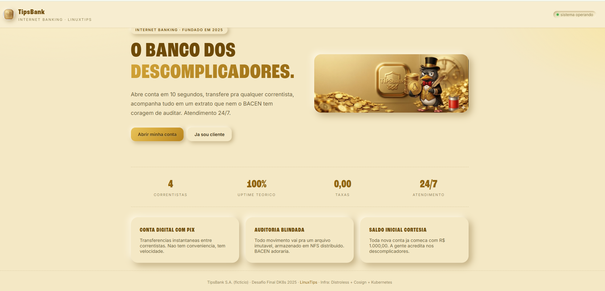

- 🖼️ Dashboard usuário logado: `02-dashboard_user.png`

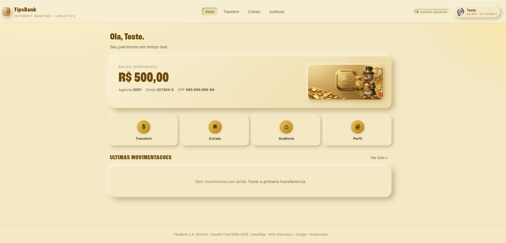

### 3. Criação de Conta

Criação de nova conta via API

- 📄 Log de execução: [07-criar-conta.txt](../evidencias/semana-1/etapa-1.1/07-criar-conta.txt)

### 4. Autenticação

Teste de login (sucesso):

```bash
curl -X POST http://localhost:8081/login \
-H 'content-type: application/json' \
-d '{"documento":"12345678901","senha":"giropops"}'
```

- 📄 Login sucesso: [05-login-sucesso.txt](../evidencias/semana-1/etapa-1.1/05-login-sucesso.txt)

- 📄 Login erro: [06-login-erro.txt](../evidencias/semana-1/etapa-1.1/06-login-erro.txt)

### 5. Listagem de Contas

```bash
curl http://localhost:8081/contas
```

📄 Arquivo: [04-contas.json](../evidencias/semana-1/etapa-1.1/04-contas.json)

### 6. Transferência entre Contas

Execução de transferência no valor de R$ 100,00 entre contas distintas via API

- 📄 Log via curl: [08-transferencia.txt](../evidencias/semana-1/etapa-1.1/08-transferencia.txt)

- 🖼️ Dashboard Transferencias `03-transferencia.png`


### 7. Auditoria de Eventos

- 📄 JSON: [09-auditoria.json](../evidencias/semana-1/etapa-1.1/09-auditoria.json)

- 🖼️ Dashboard Auditoria `04-Auditoria.png`

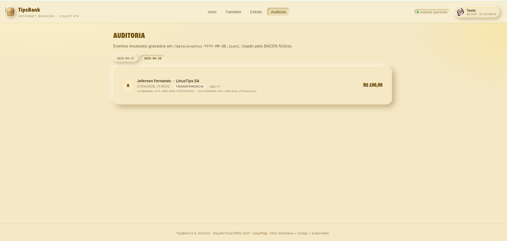

### 8. Validação de Healthcheck das APIs

- 📄 Log via curl: 
[03-health-checks.txt](../evidencias/semana-1/etapa-1.1/03-health-checks.txt)

### 9. Execução de Testes Automatizados

- 📄Script Shell: [valida1.1.sh](../scripts/valida1.1.sh)

### Conclusão

- ✔ Ambiente provisionado com sucesso via Docker Compose  
- ✔ Frontend (SPA) acessível e integrado aos serviços backend  
- ✔ APIs de contas e autenticação validadas (HTTP 200 / 401, bcrypt)  
- ✔ Listagem de contas funcional sem exposição de dados sensíveis  
- ✔ Transferências realizadas com consistência de saldo  
- ✔ Eventos de auditoria gerados e persistidos em `.json`  
- ✔ Healthchecks indicando serviços disponíveis e saudáveis  
- ✔ Testes automatizados executados com sucesso  
- ✔ Fluxo de ponta a ponta validado entre frontend e microserviços  

### **Etapa 1.2 Build Distroless, Scan com Trivy e Assinatura Cosign**

### Objetivo da Etapa

Construir 4 imagens de container do projeto TipsBank, sendo 3 APIs utilizando runtime Distroless e 1 frontend utilizando nginx-unprivileged nonroot, garantindo:

- Zero vulnerabilidades HIGH/CRITICAL no Trivy
- Imagens assinadas com Cosign
- Execução com usuário não-root
- Tamanho final dentro dos critérios definidos

### 1. Build das Imagens

Foi realizado o build das imagens das aplicações TipsBank:

- `api-contas`
- `api-transacoes`
- `auditoria`
- `web`

As APIs utilizam Dockerfile multi-stage, separando a etapa de build da etapa de runtime. No builder é utilizada uma imagem Python com ferramentas de compilação, enquanto no runtime é utilizada imagem Distroless, reduzindo a superfície de ataque.

- 📄 Log: [build-cosing.txt](../evidencias/semana-1/etapa-1.2/build-cosing.txt)

### 2. Justificativa Técnica do Uso de Distroless

As imagens Distroless reduzem vulnerabilidades porque removem componentes desnecessários do sistema operacional, como shell, gerenciadores de pacotes e ferramentas administrativas.

No caso das APIs Python, o build utiliza `pip install --target=/packages` em vez de ambiente virtual (`venv`). Isso evita problemas no runtime Distroless, onde o binário `python3` está em caminho diferente. A aplicação passa a utilizar:

```bash
PYTHONPATH=/packages
PATH=/packages/bin:$PATH
```

### 3. Scan de Vulnerabilidades com Trivy

Inicialmente, foi realizado o scan de vulnerabilidades nas imagens construídas utilizando base Distroless padrão.

```bash
trivy image --severity HIGH,CRITICAL <imagem>
```

- 📄 API Contas: [trivy-api-contas.txt](../evidencias/semana-1/etapa-1.2/06-trivy-api-contas.txt)
- 📄 API Transações: [trivy-api-transacoes.txt](../evidencias/semana-1/etapa-1.2/07-trivy-api-transacoes.txt)
- 📄 Auditoria: [trivy-auditoria.txt](../evidencias/semana-1/etapa-1.2/08-trivy-auditoria.txt)
- 📄 Web: [trivy-web.txt](../evidencias/semana-1/etapa-1.2/09-trivy-web.txt)

Resultado (primeira execução):

✖ Foram identificadas vulnerabilidades HIGH e/ou CRITICAL nas imagens iniciais
✖ Critério de aceite ainda não atendido

### 4. Mitigação de Vulnerabilidades (Uso de Imagens Chainguard)

Para atender ao requisito de segurança da etapa (0 vulnerabilidades HIGH/CRITICAL), foi realizada a substituição das imagens base por imagens da Chainguard (Wolfi), conhecidas por:

- Ciclo rápido de atualização de segurança
- Redução de CVEs conhecidas
- Imagens minimalistas e voltadas para segurança

As imagens foram reconstruídas utilizando essa nova base.

### 5. Novo Scan com Trivy (Imagens Chainguard)

Após a substituição das imagens base, foi executado um novo scan com Trivy.

- 📄 API Contas: [trivy-api-contas-chainguard.txt](../evidencias/semana-1/etapa-1.2/trivy-api-contas-chainguard.txt)
- 📄 API Transações: [trivy-api-transacoes-chainguard.txt](../evidencias/semana-1/etapa-1.2/trivy-api-transacoes-chaiguard.txt)
- 📄 Auditoria: [trivy-auditoria-chainguard.txt](../evidencias/semana-1/etapa-1.2/trivy-auditoria-chainguard.txt)
- 📄 Web: [trivy-web-chainguard.txt](../evidencias/semana-1/etapa-1.2/trivy-web-chaiguard.txt)

- 🖼️ Scan no trivy apresentando 0 erros de vulnerabilidades

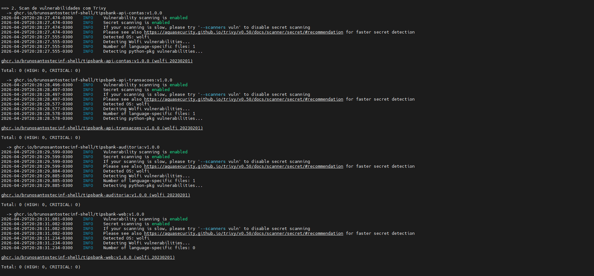

### 6. Validação de Usuário Não-Root

```bash
docker inspect <imagem>
```

- 📄 [docker-inspect-usuarios.txt](../evidencias/semana-1/etapa-1.2/02-docker-inspect-usuarios.txt)

### 7. Validação do Tamanho das Imagens

Critério esperado:
- Imagens Python: menores que 150 MB
- Imagem Web: menor que 30 MB

- 📄 [tamanho-imagens.txt](../evidencias/semana-1/etapa-1.2/03-tamanho-imagens.txt)

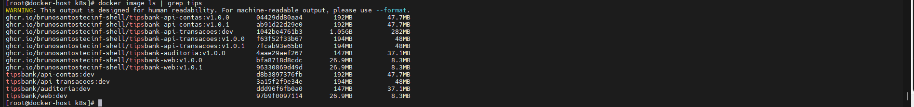

### 8. Assinatura das Imagens com Cosign e Verificação das Assinaturas

```bash
cosign sign <imagem>
cosign verify <imagem>
```

Após o build e publicação das imagens, foi realizada a assinatura utilizando Cosign.

Evidência:
- 📄 Log de assinatura: [build-cosign.txt](../evidencias/semana-1/etapa-1.2/build-cosing.txt)

- 🖼️ Execuçao do script [build-e-assinar.sh](../scripts/build-e-assinar.sh)
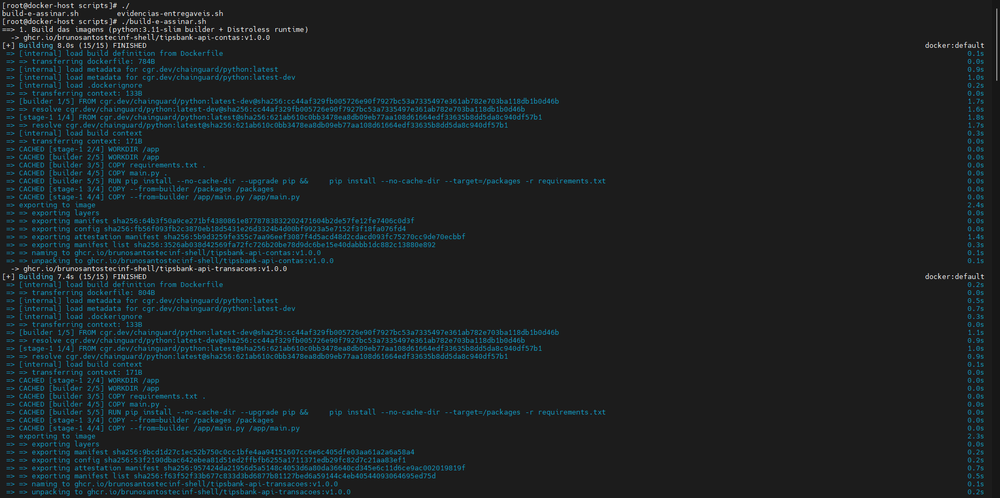
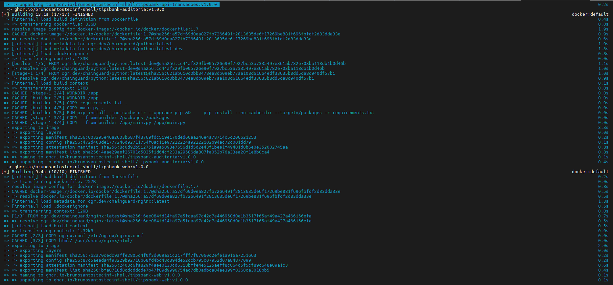

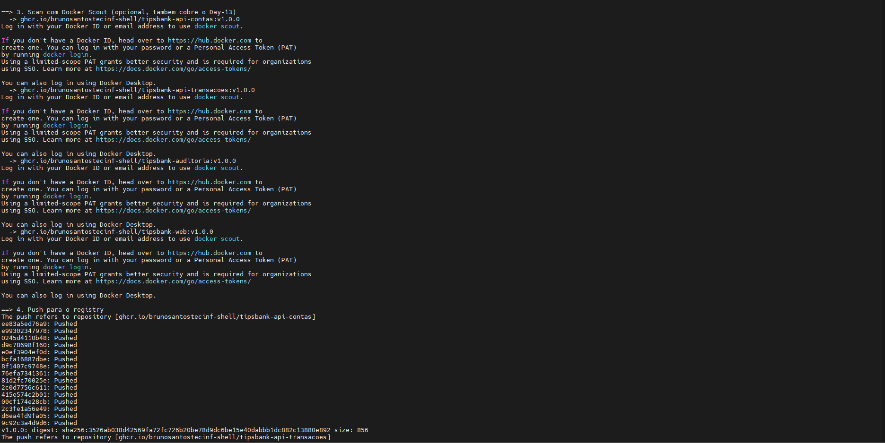
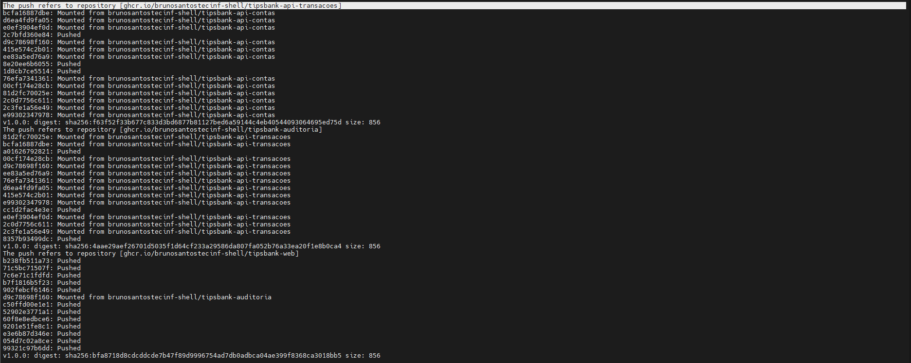
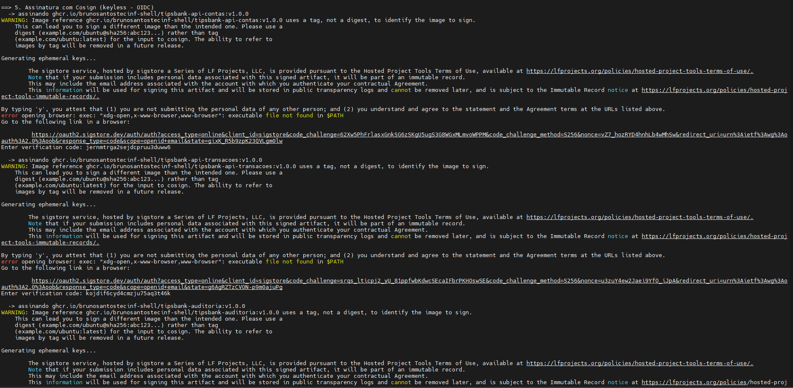
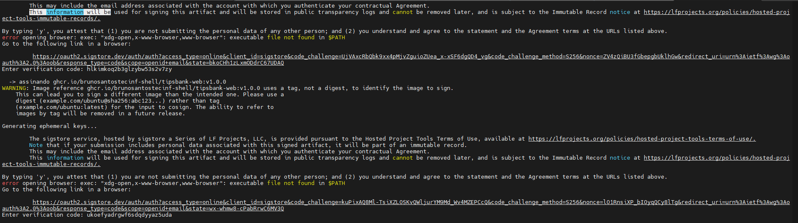
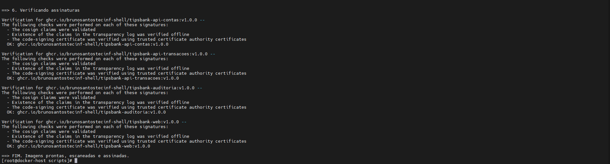

### 9. Execução de Testes Automatizados

- 📄Script Shell: [valida1.2.sh](../scripts/valida1.2.sh)

### Conclusão

- ✔ Build das 4 imagens do projeto (api-contas, api-transacoes, auditoria e web) utilizando Docker multi-stage
- ✔ Utilização de runtime Distroless para redução da superfície de ataque
- ✔ Ajuste técnico no build Python utilizando pip install --target=/packages (compatível com Distroless)
- ✔ Execução inicial do Trivy, identificando vulnerabilidades HIGH/CRITICAL nas imagens base
- ✔ Adoção de imagens Chainguard (Wolfi) para mitigação de vulnerabilidades
- ✔ Rebuild completo das imagens com base Chainguard
- ✔ Novo scan com Trivy validando 0 vulnerabilidades HIGH e 0 CRITICAL
- ✔ Assinatura das imagens utilizando Cosign
- ✔ Verificação das assinaturas com cosign verify
- ✔ Execução das aplicações com usuário não-root (UID 65532 / 101)
- ✔ Validação do tamanho das imagens dentro dos limites definidos

---

### **Etapa 1.3 — Cluster Kubernetes kubeadm multi-node**

### Objetivo da Etapa

Provisionar um cluster Kubernetes com:

- 1 nó control-plane
- 2 nós workers
- Runtime containerd
- CNI funcional

Garantindo o funcionamento do cluster e a capacidade de agendamento de workloads.

### 1. Provisionamento das Máquinas

Foram provisionadas 3 máquinas Linux (Ubuntu 24.10), sendo:

- 1 nó control-plane
- 2 nós workers

### 2. Instalação dos Componentes Kubernetes

Em todos os nós foram instalados:

- containerd (runtime de containers)
- kubeadm
- kubelet
- kubectl

Também foram aplicadas configurações obrigatórias:

- Desabilitação do swap
- Configuração do containerd
- Ajustes de sysctl para networking

### 3. Inicialização do Control-Plane

Comando executado:

```bash
kubeadm init --pod-network-cidr=<CIDR_DO_CNI>
```

- 🖼️  Inicialização do cluster: `init-cluster.png`

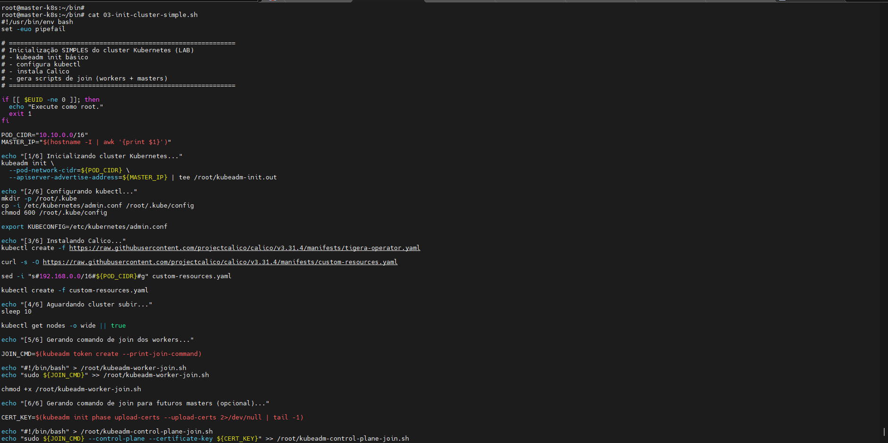

### 4. Join dos Workers ao Cluster

🖼️ Join worker 01: `join-worker01.png`

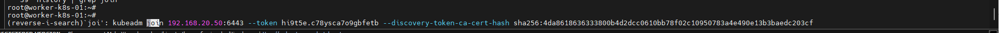

🖼️ Join worker 02: `join-worker02.png`

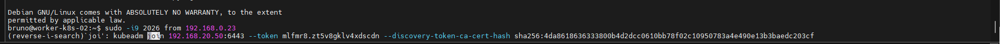

### 5. Instalação do CNI (Container Network Interface)

Foi instalado o plugin de rede Calico para habilitar comunicação entre pods.

- 🖼️ Instalação calico CNI cluster K8S

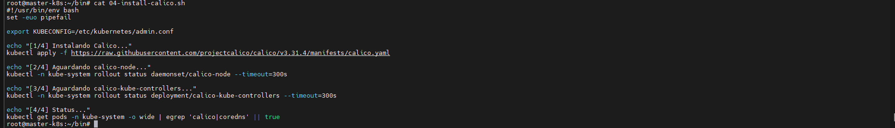

### 6. Validação dos Nós

```bash
kubectl get nodes -o wide
```

- 🖼️ Validação dos nodes do cluster K8S

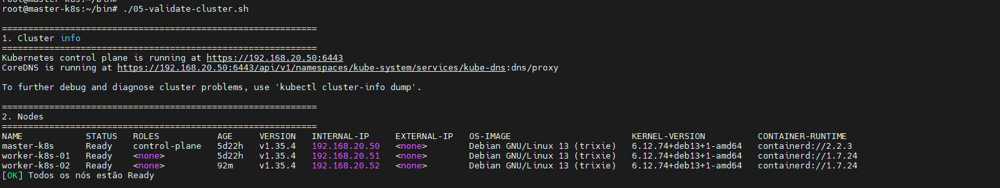

### 7. Validação dos Pods do Sistema

- 🖼️ Validação dos pods do cluster K8S

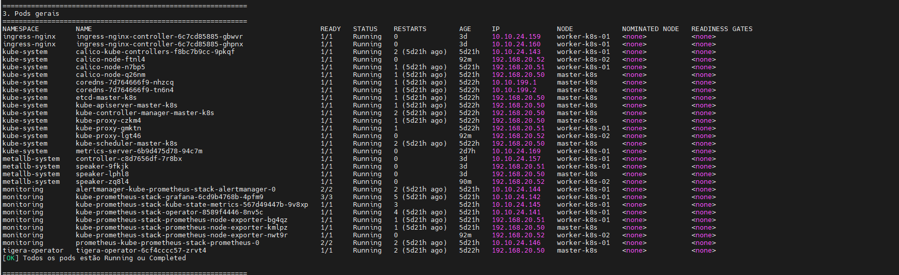

### 8. Teste de Agendamento de Pod

- 🖼️ Agendamento de pods do cluster K8S

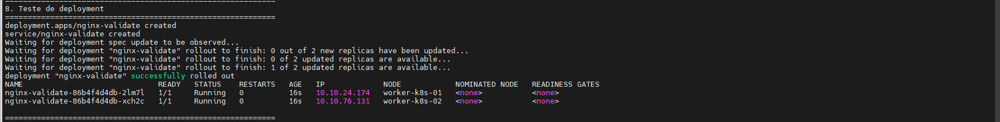

### 9. Validações Finais do Cluster K8S

- 🖼️ Execução de testes do cluster K8S

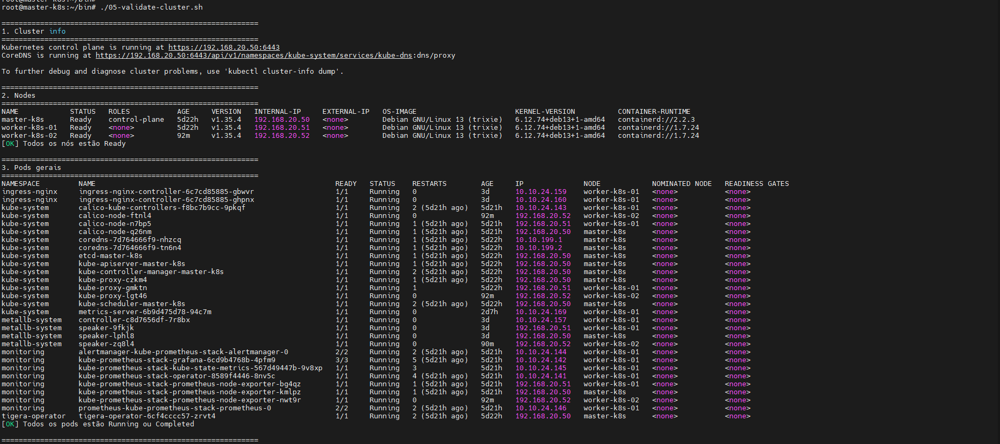

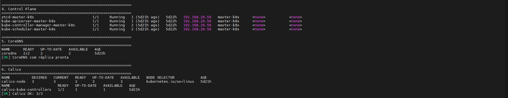

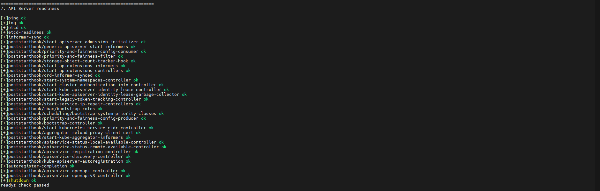

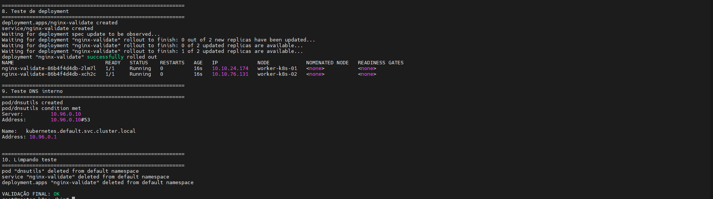

## Conclusão

O cluster Kubernetes foi provisionado com sucesso utilizando kubeadm, composto por 1 control-plane e 2 workers.

Foram validados:
- Inicialização do cluster
- Comunicação entre nós
- Funcionamento da rede (CNI)
- Execução e agendamento de workloads

---

### **Etapa 1.4 — Namespaces, Deployments iniciais e Services**

### Objetivo da Etapa

Implantar os componentes da aplicação TipsBank no Kubernetes utilizando:

- Namespaces separados por domínio
- Deployments para APIs e frontend
- StatefulSet para o banco de dados (Postgres)
- Services internos (ClusterIP)
- Acesso temporário via port-forward (sem ingress)

### 1. Criação dos Namespaces

Foram criados namespaces separados para organização dos componentes da aplicação:

- tipsbank-contas  
- tipsbank-transacoes  
- tipsbank-auditoria  
- tipsbank-web  


```bash
kubectl create ns tipsbank-contas
kubectl create ns tipsbank-transacoes
kubectl create ns tipsbank-auditoria
kubectl create ns tipsbank-web
```

- 🖼️ Namespaces criados: `namespaces.png`

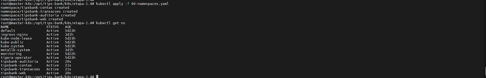

- 📄Log evidencias-01-namespaces.txt [evidencias-01-namespaces.txt](../evidencias/semana-1/etapa1.4/evidencias-01-namespaces.txt)


### 2. Configuração de Secret e ConfigMap

Foram configurados:

- Secret (Opaque) para credenciais do banco de dados (DB)
- ConfigMap para variáveis de configuração e URLs das APIs

- 🖼️ Secret criado: `secret-db.png`

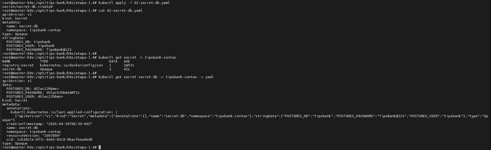

- 🖼️ ConfigMap aplicado: `configmap-app.png`

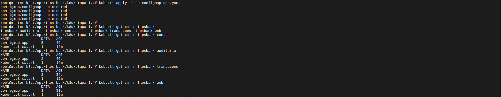

- 🖼️ Describe do Configmap:

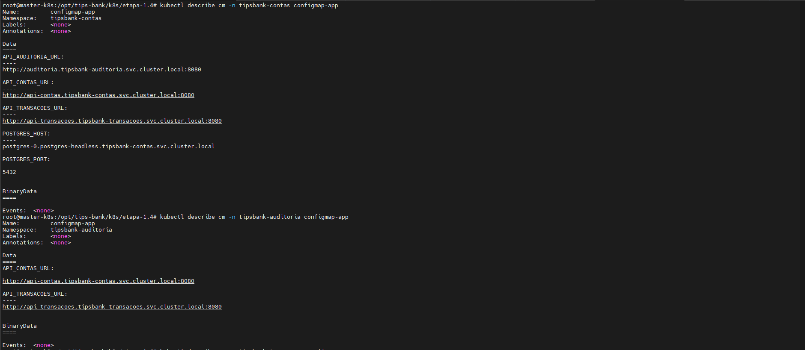
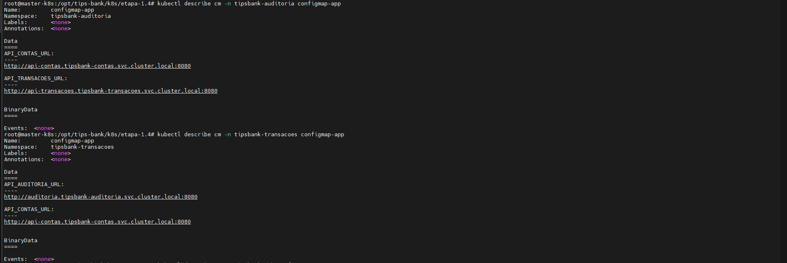
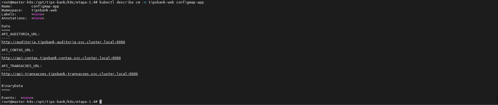

### 3. Deploy do Postgres (StatefulSet)

O banco de dados foi implantado como StatefulSet no namespace tipsbank-contas com:

- 1 réplica
- PVC de 2Gi
- Headless Service
- Script init.sql montado via ConfigMap em /docker-entrypoint-initdb.d/

- 🖼️ StatefulSet Postgres: postgres-sts.png

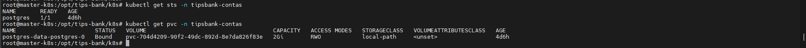

### 4. Deploy das Aplicações (APIs + Frontend)

Foram implantadas as aplicações do TipsBank utilizando Deployments com 2 réplicas cada:

- api-contas (namespace: tipsbank-contas)  
- api-transacoes (namespace: tipsbank-transacoes)  
- auditoria (namespace: tipsbank-auditoria)  
- web (namespace: tipsbank-web)  

Todas as aplicações foram expostas via Services do tipo ClusterIP.

O frontend (nginx) foi configurado com proxy reverso para comunicação com as APIs utilizando FQDN interno entre namespaces:

- api-contas.tipsbank-contas.svc.cluster.local:8080  
- api-transacoes.tipsbank-transacoes.svc.cluster.local:8080  
- auditoria.tipsbank-auditoria.svc.cluster.local:8080  

- 🖼️ Pods das APIs: pods-apis.png

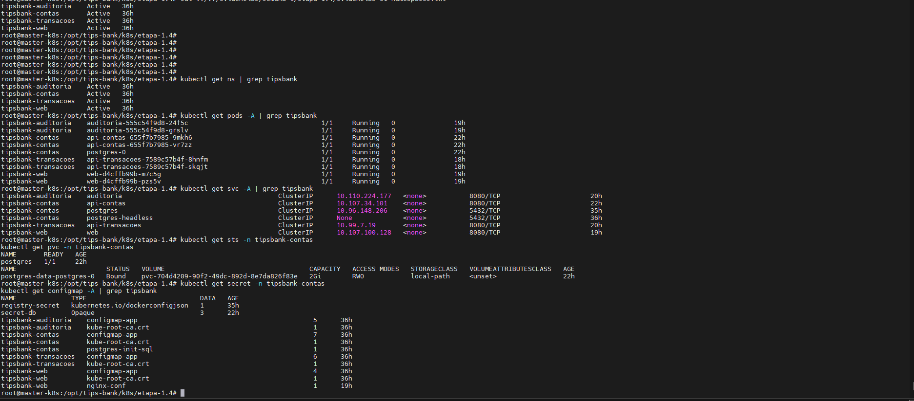

Comando usado pra validar os pods do tipsbank

```bash
kubectl get pods -A | grep tipsbank
```

### 5. Validação de Acesso via Port-Forward

Foi utilizado o recurso de `port-forward` para validar o acesso às APIs e ao frontend diretamente a partir do ambiente local.


```bash
kubectl port-forward -n tipsbank-transacoes svc/api-transacoes 8080:8080

kubectl port-forward -n tipsbank-web svc/web 8080:8080
```

- 🖼️ Teste da API via port-forward:

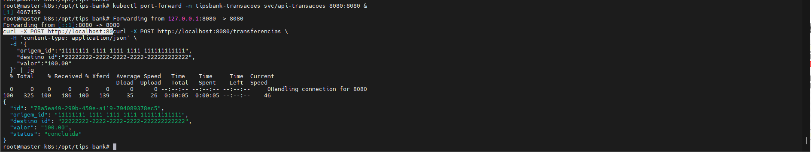

- 🖼️ SPA acessível via navegador:

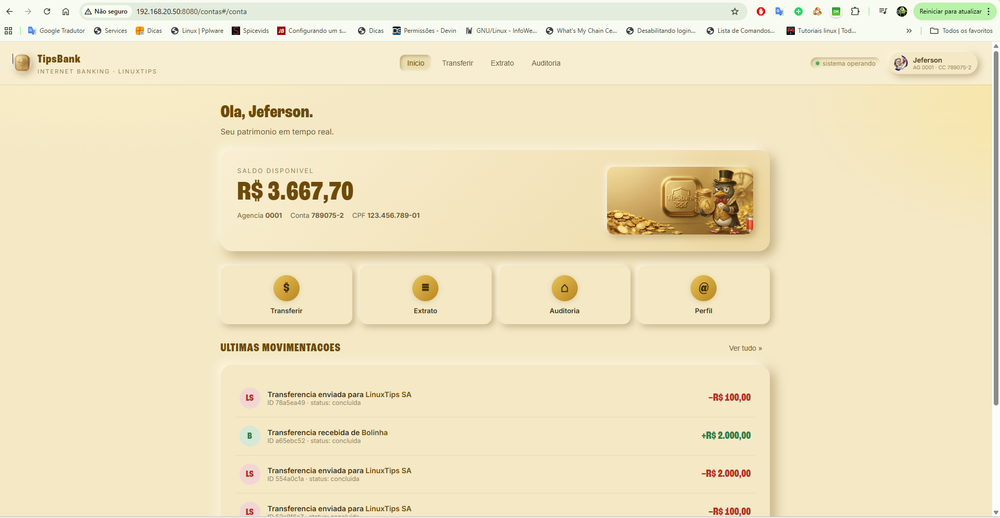

- 🖼️ Auditoria via frontend:

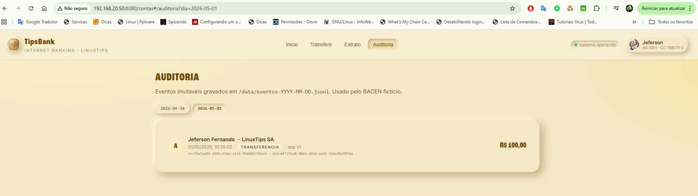

### 6. Validação de imagePullSecrets

Foi validado o uso de `imagePullSecrets` para autenticação em registry privado durante o pull das imagens.

```bash
kubectl get secret -n tipsbank-contas
kubectl describe pod <pod> -n tipsbank-contas
```
- 🖼️ ImagePull Secret:

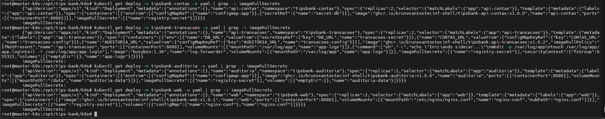

[imagepullsecrets-pods.txt](../evidencias/semana-1/etapa1.4/imagepullsecrets-pods.txt)

### 7. Referência dos Manifestos Kubernetes (YAML)

Os seguintes manifestos foram utilizados na configuração desta etapa:

- [00-namespaces.yaml](../k8s/etapa-1.4/00-namespaces.yaml) 
- [01-registry-secret.sh](../k8s/etapa-1.4/01-registry-secret.sh) 
- [02-secret-db.yaml](../k8s/etapa-1.4/02-secret-db.yaml) 
- [03-configmap-app.yaml](../k8s/etapa-1.4/03-configmap-app.yaml) 
- [04-postgres.yaml](../k8s/etapa-1.4/04-postgres.yaml) 
- [05-api-contas.yaml](../k8s/etapa-1.4/05-api-contas.yaml) 
- [06-api-transacoes.yaml](../k8s/etapa-1.4/06-api-transacoes.yaml) 
- [07-auditoria.yaml](../k8s/etapa-1.4/07-auditoria.yaml) 
- [08-web.yaml](../k8s/etapa-1.4/08-web.yaml)

### Conclusão

- ✔ Estrutura do ambiente organizada por namespaces, garantindo isolamento lógico entre os domínios da aplicação  
- ✔ Banco de dados implantado via StatefulSet com persistência (PVC) e inicialização automatizada via script `init.sql`  
- ✔ APIs e frontend implantados com Deployments escaláveis (2 réplicas), assegurando alta disponibilidade  
- ✔ Serviços expostos via ClusterIP com comunicação interna validada através de DNS do Kubernetes (Service Discovery)  
- ✔ Integração entre frontend e backend validada por meio de proxy reverso (nginx) utilizando FQDN inter-namespace  
- ✔ Acesso externo temporário realizado com sucesso via port-forward para APIs e aplicação web  
- ✔ Funcionalidades da aplicação validadas ponta a ponta (login, transferência e auditoria)  
- ✔ Externalização de configurações e credenciais aplicada corretamente via ConfigMap e Secret  
- ✔ Autenticação com registry privado validada através de `imagePullSecrets`  
- ✔ Ambiente validado com todos os pods em estado Running e réplicas conforme esperado 

---

### **Etapa 1.5 — ConfigMap, Secret e Pod Multicontainer**

### Objetivo da Etapa

Transformar a aplicação `api-transacoes` em um pod multicontainer, utilizando:

- Container principal (API)
- Sidecar de logs
- Volume compartilhado (emptyDir)
- ConfigMap para configurações
- Secret para dados sensíveis

### 1. Configuração de Variáveis via ConfigMap e Secret

Foram separadas as configurações da aplicação em:

- **ConfigMap**
  - URLs de serviços (CONTAS_URL, AUDITORIA_URL)

- **Secret (Opaque)**
  - Credenciais sensíveis (DB_URL)

As variáveis foram injetadas no container via:

- `configMapKeyRef`
- `secretKeyRef`

- 🖼️ Variáveis no pod: `env-config-secret.png`

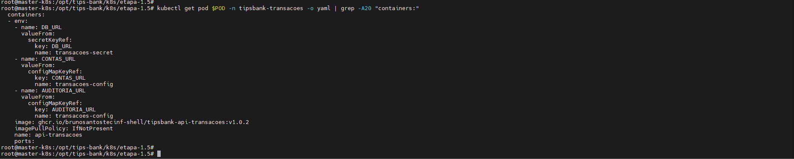

### 2. Implementação do Pod Multicontainer

O pod `api-transacoes` foi configurado com dois containers:

- **Container principal**
  - Responsável pela API
- **Container sidecar (log-forwarder)**
  - Responsável por ler e exibir logs da aplicação

- 🖼️ Pods Multicontainer : `pod-multicontainer.png`

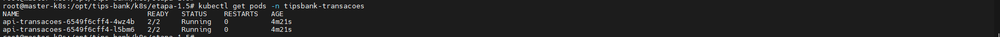

### 3. Configuração do Volume Compartilhado (emptyDir)

Foi criado um volume `emptyDir` compartilhado entre os containers:

- Montado em `/var/log/app`
- Utilizado para persistência temporária de logs

Foi necessário alterar o código da aplicação (`main.py`) para que os logs fossem gravados em arquivo, além do stdout.

A aplicação passou a utilizar:

- `StreamHandler` → saída padrão (kubectl logs)
- `FileHandler` → arquivo `/var/log/app/app.log` (consumido pelo sidecar)

- 🖼️ Código ajustado: `main-logging.png`

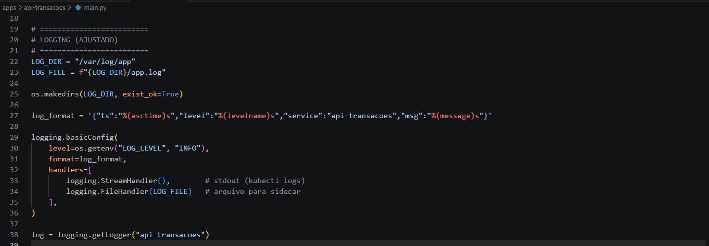

- API escreve logs em `/var/log/app/app.log`
- Sidecar lê o mesmo arquivo com `tail -F`

### 4. Implementação do Sidecar de Logs

Foi adicionado um container sidecar utilizando imagem (busybox), executando:

```bash
tail -F /var/log/app/app.log
```

🖼️ Logs do sidecar: `sidecar-log.png`
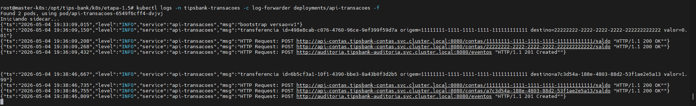

### 5. Validação do Deployment

```bash
kubectl get pods -n tipsbank-transacoes
```

- 🖼️ Pods em execução: `pod-multicontainer.png`


### 6. Validação Funcional (Aplicação)


Foi realizada uma operação de transferência via aplicação para validar:

- Escrita de logs
- Funcionamento do sidecar
- Integração entre serviços

- 🖼️ Transferência realizada: `transferencia-ok.png`

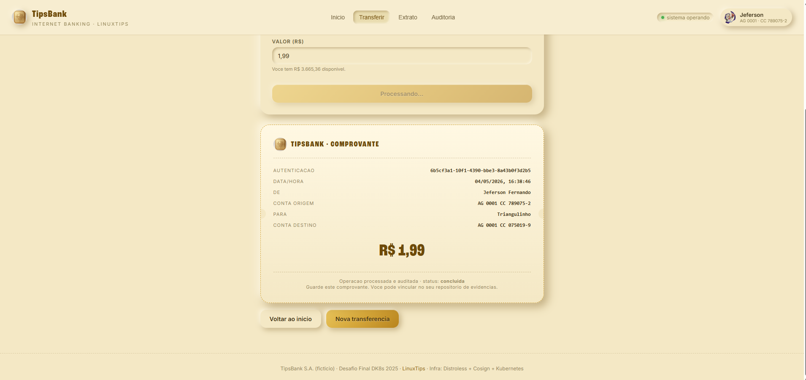

- 🖼️ Logs da aplicação: `logs-app.png`


### 7. Referência dos Manifestos Kubernetes (YAML)

Os seguintes manifestos foram utilizados na configuração desta etapa:

- 📄 ConfigMap:
[01-configmap-transacoes](../k8s/etapa-1.5/01-configmap-transacoes.yaml)
- 📄 Secret: [02-secret-transacoes.yaml](../k8s/etapa-1.5/02-secret-transacoes.yaml)
- 📄 Deployment:
[03-api-transacoes-multicontainer.yaml](../k8s/etapa-1.5/03-api-transacoes-multicontainer.yaml)

## Conclusão

- ✔ Configuração de variáveis externalizada via ConfigMap e Secret  
- ✔ Nenhuma informação sensível exposta no Deployment  
- ✔ Pod configurado em arquitetura multicontainer (API + sidecar)  
- ✔ Volume compartilhado (emptyDir) implementado com sucesso  
- ✔ Ajuste na aplicação para gravação de logs em arquivo (`/var/log/app/app.log`)  
- ✔ Logs disponíveis via stdout e via arquivo compartilhado  
- ✔ Pods em estado Running com todos containers ativos  
- ✔ Fluxo funcional validado (transferência executada com sucesso)  
- ✔ Logs da aplicação capturados corretamente pelo sidecar 

---

### **Etapa 1.6 — Persistência com NFS (ReadWriteMany) para Auditoria**

## Objetivo da Etapa

Configurar persistência compartilhada para o serviço de auditoria utilizando NFS, permitindo que múltiplas réplicas escrevam simultaneamente em um mesmo volume (RWX).

### 1. Provisionamento do Servidor NFS

Foi provisionado um servidor NFS para disponibilizar armazenamento compartilhado dentro do cluster.

### 2. Criação do PersistentVolume (PV)

Foi criado um PersistentVolume do tipo NFS apontando para o servidor configurado.

### 3. Criação do PersistentVolumeClaim (PVC)

Foi criado um PVC no namespace `tipsbank-auditoria` com suporte a múltiplos writers:

- accessModes: ReadWriteMany

### 4. Atualização do Deployment da Auditoria

O Deployment da auditoria foi atualizado para:

- Montar o PVC em `/data`
- Permitir persistência compartilhada entre réplicas

Além disso, o Deployment foi escalado para 3 réplicas.

- 🖼️ Deployment atualizado: `deployment-auditoria.png`

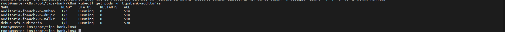

### 5. Execução de Testes de Escrita Concorrente

Foram realizadas múltiplas transferências para gerar eventos simultâneos.

Os arquivos foram inspecionados em múltiplos pods.

```bash
kubectl exec -n tipsbank-auditoria <pod-1> -- ls /data
kubectl exec -n tipsbank-auditoria <pod-2> -- ls /data
```

Como as imagens Chainguard (latest) não possuem shell (sh), foi necessário utilizar kubectl debug para execução de comandos interativos:

Para aprofundamento, foi utilizada a documentação oficial da Chainguard:

- 📚 https://edu.chainguard.dev/chainguard/chainguard-images/troubleshooting/kubectl_cdebug/

As imagens `latest` não possuem utilitários interativos (como `/bin/sh`), sendo necessário utilizar imagens `-dev` para debug, como:

```bash
kubectl debug -it -n tipsbank-auditoria \
--image cgr.dev/chainguard/python:latest-dev \
--target auditoria \
pod/<pod> -- /bin/sh
```

- 🖼️ Acesso via debug: `debug-container-chainguard.png`

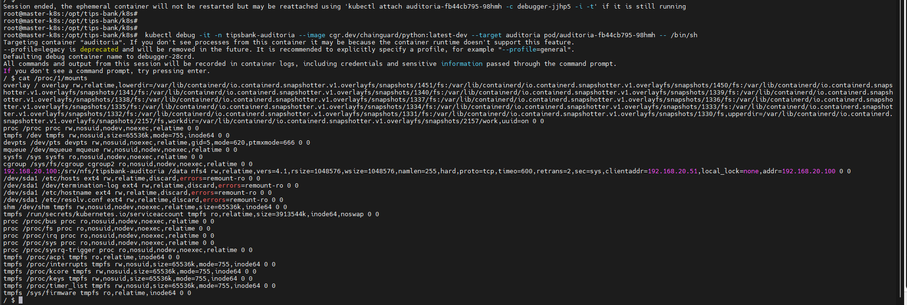

- 🖼️ Arquivos em /data: `nfs-files.png`

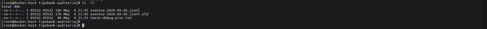

### 6. Validação de Consistência dos Eventos

Foram realizadas aproximadamente 50 transferências para validar concorrência atraves do script [valida-transferencias-nfs.sh](../scripts/valida-transferencias-nfs.sh)

```bash
 kubectl port-forward -n tipsbank-auditoria svc/auditoria 8083:8080 &

for i in $(seq -w 1 50); do
  UUID_TX=$(uuidgen)
  VALOR=$(awk -v min=0.10 -v max=5 'BEGIN{srand(); printf "%.2f", min+rand()*(max-min)}')

  curl -s -X POST http://localhost:8083/eventos \
    -H "Content-Type: application/json" \
    -d "{
      \"tipo\":\"transferencia\",
      \"transacao_id\":\"$i-$UUID_TX\",
      \"origem_id\":\"22222222-2222-2222-2222-222222222222\",
      \"destino_id\":\"11111111-1111-1111-1111-111111111111\",
      \"valor\":\"$VALOR\",
      \"versao_app\":\"v1\"
    }" &

done

kill -9 %1
```

- 🖼️ Auditoria na dashboard web: `auditoria-web.png`

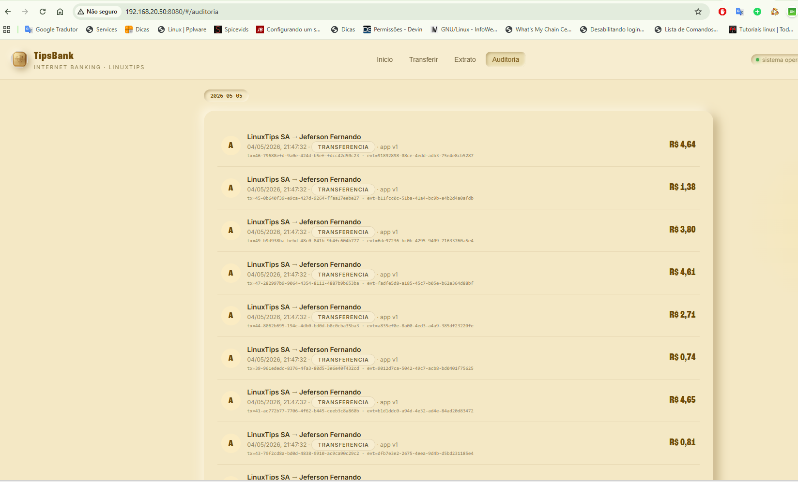

Contagem de linhas no arquivo /data/eventos-YYYY-MM-DD.jsonl

- 🖼️ Validação dos dados no NFS-SERVER: `auditoria-nfs-server.png`

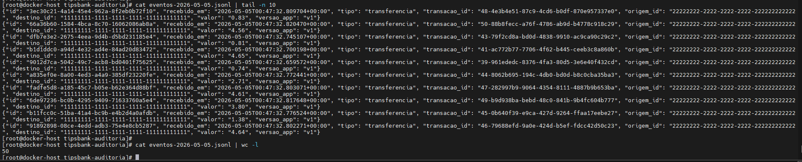

### 7. Considerações sobre Locking (NFS)

A aplicação realiza escrita com open("a"), o que depende de suporte a locking no NFS.


### 8. Validação de PV e PVC

```bash
kubectl get pv,pvc -A
```

- 🖼️ PV e PVC: `pv-pvc-bound.png`

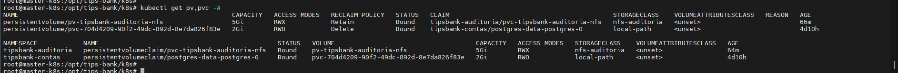

### 9. Referência dos Manifestos Kubernetes (YAML)
- 📄 PV: [pv-auditoria-nfs.yaml](../k8s/etapa-1.6/pv-auditoria-nfs.yaml)
- 📄 PVC: [pvc-auditoria-nfs.yaml](../k8s/etapa-1.6/pvc-auditoria-nfs.yaml)
- 📄 Deployment atualizado: [auditoria-nfs.yaml](../k8s/etapa-1.6/auditoria-nfs.yaml)

### Ajuste de permissões no NFS

Durante os testes, foi identificado que a aplicação de auditoria executa dentro do container com usuário não-root, utilizando UID `65532`.

Para permitir a escrita dos eventos no volume compartilhado, foi necessário ajustar as permissões do diretório exportado pelo NFS para o mesmo UID/GID utilizado pelo container.

### Ajuste aplicado no servidor NFS:

```bash
chown -R 65532:65532 /opt/WORKLOADS
```

## Conclusão

- ✔ Persistência compartilhada implementada com sucesso utilizando NFS (ReadWriteMany)  
- ✔ Volume montado simultaneamente em múltiplas réplicas da aplicação de auditoria  
- ✔ Escrita concorrente validada, com múltiplos pods registrando eventos no mesmo arquivo  
- ✔ Consistência dos dados confirmada após execução de múltiplas transações  
- ✔ PV e PVC corretamente configurados e em estado Bound  
- ✔ Integração do armazenamento com o Deployment da auditoria validada  
- ✔ Uso de `kubectl debug` aplicado para inspeção interna dos containers devido à ausência de shell em imagens distroless  
- ✔ Nenhum conflito de escrita observado, indicando suporte adequado a locking no NFS utilizado  
- ✔ Permissões do NFS ajustadas para o UID/GID `65532`, permitindo escrita segura por containers não-root  

## Checkpoint — Semana 1

- ✔ Cluster Kubernetes provisionado com kubeadm (1 control-plane + 2 workers) em estado Ready  

- ✔ Imagens de container construídas com padrão Distroless  
  - 0 vulnerabilidades HIGH/CRITICAL (validadas com Trivy)  
  - Assinadas com Cosign  

- ✔ Aplicação implantada em Kubernetes com arquitetura distribuída:  
  - 4 Deployments (api-contas, api-transacoes, auditoria, web)  
  - 1 StatefulSet (Postgres)  
  - Organização em 4 namespaces isolados  

- ✔ Configuração externalizada e segura:  
  - Uso de ConfigMap e Secret  
  - Pod multicontainer com sidecar de logs  
  - Volume EmptyDir para compartilhamento interno  

- ✔ Persistência avançada implementada:  
  - NFS configurado como armazenamento compartilhado (RWX)  
  - Auditoria escrevendo simultaneamente a partir de múltiplas réplicas  
  - Consistência dos dados validada em cenário de concorrência  

---


